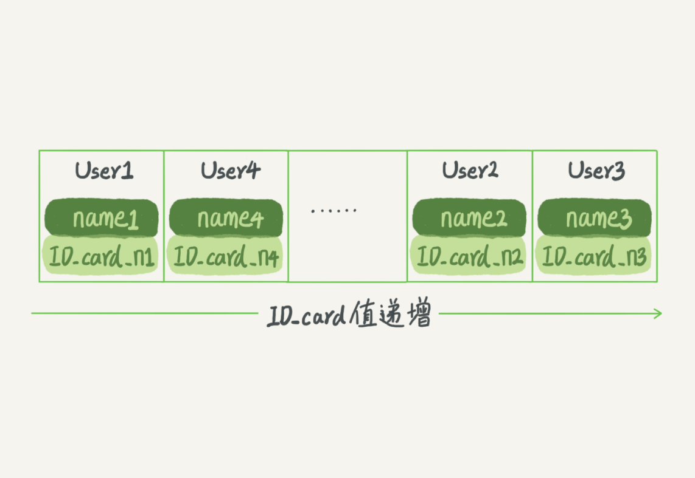
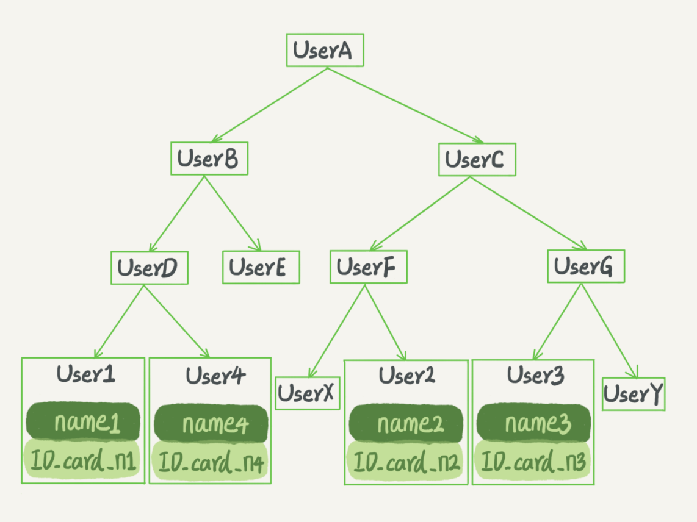

## 01 | 基础架构

### mysql逻辑架构
MySQL 可以分为 Server 层和存储引擎层两部分。
Server 层包括连接器、查询缓存、分析器、优化器、执行器等，涵盖 MySQL 的大多数核心服务功能，以及所有的内置函数（如日期、时间、数学和加密函数等），所有跨存储引擎的功能都在这一层实现，比如存储过程、触发器、视图等。

存储引擎层负责数据的存储和提取。其架构模式是插件式的，支持 InnoDB、MyISAM、Memory 等多个存储引擎。现在最常用的存储引擎是 InnoDB，它从 MySQL 5.5.5 版本开始成为了默认存储引擎。不同存储引擎的表数据存取方式不同，支持的功能也不同

### 一条SQL查询语句是如何执行的

#### 连接数据库

第一步，连接器负责跟客户端建立连接、获取权限、维持和管理连接
mysql -h$ip -P$port -u$user -p
TCP握手->认证身份->获取权限
之后，这个连接里面的权限判断逻辑，都将依赖于此时读到的权限。用户的权限修改，不会影响已经存在连接的权限。修改完成后，只有再新建的连接才会使用新的权限设置

连接完成后，如果你没有后续的动作，这个连接就处于空闲状态，你可以在 show processlist 命令中看到它。
show processlist 的结果，其中的 Command 列显示为“Sleep”的这一行，就表示现在系统里面有一个空闲连接
客户端如果太长时间没动静，连接器就会自动将它断开。这个时间是由参数 wait_timeout 控制的，默认值是 8 小时。如果在连接被断开之后，客户端再次发送请求的话，就会收到一个错误提醒： Lost connection to MySQL server during query。这时候如果你要继续，就需要重连，然后再执行请求了。

数据库里面，长连接是指连接成功后，如果客户端持续有请求，则一直使用同一个连接。

短连接则是指每次执行完很少的几次查询就断开连接，下次查询再。建立一个建立连接的过程通常是比较复杂的，尽量减少建立连接的动作，也就是尽量使用长连接。

但是全部使用长连接后，你可能会发现，有些时候 MySQL 占用内存涨得特别快，这是因为 MySQL 在执行过程中临时使用的内存是管理在连接对象里面的。这些资源会在连接断开的时候才释放。所以如果长连接累积下来，可能导致内存占用太大，被系统强行杀掉（OOM），从现象看就是 MySQL 异常重启了。

怎么解决这个问题呢？可以考虑以下两种方案。
定期断开长连接。使用一段时间，或者程序里面判断执行过一个占用内存的大查询后，断开连接，之后要查询再重连。
 MySQL 5.7 或更新版本，可以在每次执行一个比较大的操作后，通过执行 mysql_reset_connection 来重新初始化连接资源。这个过程不需要重连和重新做权限验证，但是会将连接恢复到刚刚创建完时的状态。

#### 查询缓存

MySQL 拿到一个查询请求后，会先到查询缓存看看，之前是不是执行过这条语句。之前执行过的语句及其结果可能会以 key-value 对的形式，被直接缓存在内存中。key 是查询的语句，value 是查询的结果。如果你的查询能够直接在这个缓存中找到 key，那么这个 value 就会被直接返回给客户端。
如果语句不在查询缓存中，就会继续后面的执行阶段。执行完成后，执行结果会被存入查询缓存中。你可以看到，如果查询命中缓存，MySQL 不需要执行后面的复杂操作，就可以直接返回结果，这个效率会很高。

但是大多数情况下我会建议你不要使用查询缓存，为什么呢？
因为查询缓存往往弊大于利。查询缓存的失效非常频繁，只要有对一个表的更新，这个表上所有的查询缓存都会被清空。因此很可能你费劲地把结果存起来，还没使用呢，就被一个更新全清空了。对于更新压力大的数据库来说，查询缓存的命中率会非常低。除非你的业务就是有一张静态表，很长时间才会更新一次。比如，一个系统配置表，那这张表上的查询才适合使用查询缓存。

好在 MySQL 也提供了这种“按需使用”的方式。你可以将参数 query_cache_type 设置成 DEMAND，这样对于默认的 SQL 语句都不使用查询缓存。而对于你确定要使用查询缓存的语句，可以用 SQL_CACHE 显式指定，像下面这个语句一样

mysql> select SQL_CACHE * from T where ID=10；
MySQL 8.0 版本直接将查询缓存的整块功能删掉了，也就是说 8.0 开始彻底没有这个功能了。

#### 分析器

如果没有命中查询缓存，就要开始真正执行语句了。对 SQL 语句做解析。
分析器先会做“词法分析”。你输入的是由多个字符串和空格组成的一条 SQL 语句，MySQL 需要识别出里面的字符串分别是什么，代表什么
做“语法分析”。根据词法分析的结果，语法分析器会根据语法规则，判断你输入的这个 SQL 语句是否满足 MySQL 语法。

#### 优化器

在开始执行之前，还要先经过优化器的处理。
优化器是在表里面有多个索引的时候，决定使用哪个索引；或者在一个语句有多表关联（join）的时候，决定各个表的连接顺序

#### 执行器

开始执行的时候，要先判断一下你对这个表 T 有没有执行查询的权限，如果没有，就会返回没有权限的错误，如下所示 (在工程实现上，如果命中查询缓存，会在查询缓存返回结果的时候，做权限验证。查询也会在优化器之前调用 precheck 验证权限)。

如果有权限，就打开表继续执行。打开表的时候，执行器就会根据表的引擎定义，去使用这个引擎提供的接口。

## 02 | 日志系统

首先，可以确定的说，查询语句的那一套流程，更新语句也是同样会走一遍。与查询流程不一样的是，更新流程还涉及两个重要的日志模块，它们正是我们今天要讨论的主角：redo log（重做日志）和 binlog（归档日志）

### redo log

如果每一次的更新操作都需要写进磁盘，然后磁盘也要找到对应的那条记录，然后再更新，整个过程 IO 成本、查找成本都很高。
MySQL 里经常说到的 WAL 技术，WAL 的全称是 Write-Ahead Logging，它的关键点就是先写日志，再写磁盘
具体来说，当有一条记录需要更新的时候，InnoDB 引擎就会先把记录写到 redo log里面，并更新内存，这个时候更新就算完成了。同时，InnoDB 引擎会在适当的时候，将这个操作记录更新到磁盘里面，而这个更新往往是在系统比较空闲的时候做，
InnoDB 的 redo log 是固定大小的，比如可以配置为一组 4 个文件，每个文件的大小是 1GB，那么总共就可以记录 4GB 的操作。从头开始写，写到末尾就又回到开头循环写，如下面这个图所示。

write pos 是当前记录的位置，一边写一边后移，写到第 3 号文件末尾后就回到 0 号文件开头。checkpoint 是当前要擦除的位置，也是往后推移并且循环的，擦除记录前要把记录更新到数据文件。write pos 和 checkpoint 之间的是还空着的部分，可以用来记录新的操作。如果 write pos 追上 checkpoint，这时候不能再执行新的更新，得停下来先擦掉一些记录，把 checkpoint 推进一下。
有了 redo log，InnoDB 就可以保证即使数据库发生异常重启，之前提交的记录都不会丢失，这个能力称为 crash-safe。

### binlog

MySQL 整体来看，其实就有两块：一块是 Server 层，它主要做的是 MySQL 功能层面的事情；还有一块是引擎层，负责存储相关的具体事宜。

 redo log 是 InnoDB 引擎特有的日志，而 Server 层也有自己的日志，称为 binlog（归档日志）。
为什么会有两份日志呢？因为最开始 MySQL 里并没有 InnoDB 引擎。MySQL 自带的引擎是 MyISAM，但是 MyISAM 没有 crash-safe 的能力，binlog 日志只能用于归档。而 InnoDB 是另一个公司以插件形式引入 MySQL 的，既然只依靠 binlog 是没有 crash-safe 能力的，所以 InnoDB 使用另外一套日志系统——也就是 redo log 来实现 crash-safe 能力

### redo log 和 binlog的区别

这两种日志有以下三点不同。redo log 是 InnoDB 引擎特有的；binlog 是 MySQL 的 Server 层实现的，所有引擎都可以使用。redo log 是物理日志，记录的是“在某个数据页上做了什么修改”；binlog 是逻辑日志，记录的是这个语句的原始逻辑，比如“给 ID=2 这一行的 c 字段加 1 ”。redo log 是循环写的，空间固定会用完；binlog 是可以追加写入的。“追加写”是指 binlog 文件写到一定大小后会切换到下一个，并不会覆盖以前的日志。

执行器和 InnoDB 引擎在执行这个简单的 update 语句时的内部流程。执行器先找引擎取 ID=2 这一行。ID 是主键，引擎直接用树搜索找到这一行。如果 ID=2 这一行所在的数据页本来就在内存中，就直接返回给执行器；否则，需要先从磁盘读入内存，然后再返回。执行器拿到引擎给的行数据，把这个值加上 1，比如原来是 N，现在就是 N+1，得到新的一行数据，再调用引擎接口写入这行新数据。引擎将这行新数据更新到内存中，同时将这个更新操作记录到 redo log 里面，此时 redo log 处于 prepare 状态。然后告知执行器执行完成了，随时可以提交事务。执行器生成这个操作的 binlog，并把 binlog 写入磁盘。执行器调用引擎的提交事务接口，引擎把刚刚写入的 redo log 改成提交（commit）状态，更新完成。
最后三步看上去有点“绕”，将 redo log 的写入拆成了两个步骤：prepare 和 commit，这就是"两阶段提交"。

### 两阶段提交
为什么必须有“两阶段提交”呢？这是为了让两份日志之间的逻辑一致
为什么日志需要“两阶段提交”。这里不妨用反证法来进行解释。由于 redo log 和 binlog 是两个独立的逻辑，如果不用两阶段提交，要么就是先写完 redo log 再写 binlog，或者采用反过来的顺序。我们看看这两种方式会有什么问题
先写 redo log 后写 binlog。假设在 redo log 写完，binlog 还没有写完的时候，MySQL 进程异常重启。由于我们前面说过的，redo log 写完之后，系统即使崩溃，仍然能够把数据恢复回来，所以恢复后这一行 c 的值是 1。但是由于 binlog 没写完就 crash 了，这时候 binlog 里面就没有记录这个语句。因此，之后备份日志的时候，存起来的 binlog 里面就没有这条语句。然后你会发现，如果需要用这个 binlog 来恢复临时库的话，由于这个语句的 binlog 丢失，这个临时库就会少了这一次更新，恢复出来的这一行 c 的值就是 0，与原库的值不同。先写 binlog 后写 redo log。如果在 binlog 写完之后 crash，由于 redo log 还没写，崩溃恢复以后这个事务无效，所以这一行 c 的值是 0。但是 binlog 里面已经记录了“把 c 从 0 改成 1”这个日志。所以，在之后用 binlog 来恢复的时候就多了一个事务出来，恢复出来的这一行 c 的值就是 1，与原库的值不同。

可以看到，如果不使用“两阶段提交”，那么数据库的状态就有可能和用它的日志恢复出来的库的状态不一致。
你可能会说，这个概率是不是很低，平时也没有什么动不动就需要恢复临时库的场景呀？其实不是的，不只是误操作后需要用这个过程来恢复数据。当你需要扩容的时候，也就是需要再多搭建一些备库来增加系统的读能力的时候，现在常见的做法也是用全量备份加上应用 binlog 来实现的，这个“不一致”就会导致你的线上出现主从数据库不一致的情况。简单说，redo log 和 binlog 都可以用于表示事务的提交状态，而两阶段提交就是让这两个状态保持逻辑上的一致。

redo log 用于保证 crash-safe 能力。innodb_flush_log_at_trx_commit 这个参数设置成 1 的时候，表示每次事务的 redo log 都直接持久化到磁盘。这个参数我建议你设置成 1，这样可以保证 MySQL 异常重启之后数据不丢失。sync_binlog 这个参数设置成 1 的时候，表示每次事务的 binlog 都持久化到磁盘。这个参数我也建议你设置成 1，这样可以保证 MySQL 异常重启之后 binlog 不丢失。

## 03 | 事务隔离

简单来说，事务就是要保证一组数据库操作，要么全部成功，要么全部失败。在 MySQL 中，事务支持是在引擎层实现的。你现在知道，MySQL 是一个支持多引擎的系统，但并不是所有的引擎都支持事务。比如 MySQL 原生的 MyISAM 引擎就不支持事务，这也是 MyISAM 被 InnoDB 取代的重要原因之一

###  隔离性与隔离级别

SQL 标准的事务隔离级别包括：读未提交（read uncommitted）、读提交（read committed）、可重复读（repeatable read）和串行化（serializable ）。

读未提交是指，一个事务还没提交时，它做的变更就能被别的事务看到。

读提交是指，一个事务提交之后，它做的变更才会被其他事务看到。

可重复读是指，一个事务执行过程中看到的数据，总是跟这个事务在启动时看到的数据是一致的。当然在可重复读隔离级别下，未提交变更对其他事务也是不可见的。

串行化，顾名思义是对于同一行记录，“写”会加“写锁”，“读”会加“读锁”。当出现读写锁冲突的时候，后访问的事务必须等前一个事务执行完成，才能继续执行


在实现上，数据库里面会创建一个视图，访问的时候以视图的逻辑结果为准。

在“可重复读”隔离级别下，这个视图是在事务启动时创建的，整个事务存在期间都用这个视图。

在“读提交”隔离级别下，这个视图是在每个 SQL 语句开始执行的时候创建的。这里需要注意的是，“读未提交”隔离级别下直接返回记录上的最新值，没有视图概念；

而“串行化”隔离级别下直接用加锁的方式来避免并行访问。


我们可以看到在不同的隔离级别下，数据库行为是有所不同的。Oracle 数据库的默认隔离级别其实就是“读提交”，因此对于一些从 Oracle 迁移到 MySQL 的应用，为保证数据库隔离级别的一致，你一定要记得将 MySQL 的隔离级别设置为“读提交”。配置的方式是，将启动参数 transaction-isolation 的值设置成 READ-COMMITTED。你可以用 show variables 来查看当前的值。

总结来说，存在即合理，每种隔离级别都有自己的使用场景，你要根据自己的业务情况来定。

### 事务隔离的实现

在 MySQL 中，实际上每条记录在更新的时候都会同时记录一条回滚操作。记录上的最新值，通过回滚操作，都可以得到前一个状态的值

假设一个值从 1 被按顺序改成了 2、3、4，在回滚日志里面就会有类似下面的记录


当前值是 4，但是在查询这条记录的时候，不同时刻启动的事务会有不同的 read-view。如图中看到的，在视图 A、B、C 里面，这一个记录的值分别是 1、2、4，同一条记录在系统中可以存在多个版本，就是数据库的多版本并发控制（MVCC）。对于 read-view A，要得到 1，就必须将当前值依次执行图中所有的回滚操作得到。同时你会发现，即使现在有另外一个事务正在将 4 改成 5，这个事务跟 read-view A、B、C 对应的事务是不会冲突的。

你一定会问，回滚日志总不能一直保留吧，什么时候删除呢？答案是，在不需要的时候才删除。也就是说，系统会判断，当没有事务再需要用到这些回滚日志时，回滚日志会被删除。什么时候才不需要了呢？就是当系统里没有比这个回滚日志更早的 read-view 的时候

基于上面的说明，我们来讨论一下为什么建议你尽量不要使用长事务。长事务意味着系统里面会存在很老的事务视图。由于这些事务随时可能访问数据库里面的任何数据，所以这个事务提交之前，数据库里面它可能用到的回滚记录都必须保留，这就会导致大量占用存储空间。

在 MySQL 5.5 及以前的版本，回滚日志是跟数据字典一起放在 ibdata 文件里的，即使长事务最终提交，回滚段被清理，文件也不会变小。我见过数据只有 20GB，而回滚段有 200GB 的库。最终只好为了清理回滚段，重建整个库。除了对回滚段的影响，长事务还占用锁资源，也可能拖垮整个库

### 事务的启动方式

MySQL 的事务启动方式有以下几种：

显式启动事务语句， begin 或 start transaction。配套的提交语句是 commit，回滚语句是 rollback。

set autocommit=0，这个命令会将这个线程的自动提交关掉。意味着如果你只执行一个 select 语句，这个事务就启动了，而且并不会自动提交。这个事务持续存在直到你主动执行 commit 或 rollback 语句，或者断开连接。

有些客户端连接框架会默认连接成功后先执行一个 set autocommit=0 的命令。这就导致接下来的查询都在事务中，如果是长连接，就导致了意外的长事务。因此，我会建议你总是使用 set autocommit=1, 通过显式语句的方式来启动事务。

但是有的开发同学会纠结“多一次交互”的问题。对于一个需要频繁使用事务的业务，第二种方式每个事务在开始时都不需要主动执行一次 “begin”，减少了语句的交互次数。如果你也有这个顾虑，我建议你使用 commit work and chain 语法。在 autocommit 为 1 的情况下，用 begin 显式启动的事务，如果执行 commit 则提交事务。如果执行 commit work and chain，则是提交事务并自动启动下一个事务，这样也省去了再次执行 begin 语句的开销。同时带来的好处是从程序开发的角度明确地知道每个语句是否处于事务中。

你可以在 information_schema 库的 innodb_trx 这个表中查询长事务，比如下面这个语句，用于查找持续时间超过 60s 的事务。

select * from information_schema.innodb_trx where TIME_TO_SEC(timediff(now(),trx_started))>60

### 如何避免长事务对业务的影响？

首先，从应用开发端来看：确认是否使用了 set autocommit=0。这个确认工作可以在测试环境中开展，把 MySQL 的 general_log 开起来，然后随便跑一个业务逻辑，通过 general_log 的日志来确认。一般框架如果会设置这个值，也就会提供参数来控制行为，你的目标就是把它改成 1。确认是否有不必要的只读事务。有些框架会习惯不管什么语句先用 begin/commit 框起来。我见过有些是业务并没有这个需要，但是也把好几个 select 语句放到了事务中。这种只读事务可以去掉。业务连接数据库的时候，根据业务本身的预估，通过 SET MAX_EXECUTION_TIME 命令，来控制每个语句执行的最长时间，避免单个语句意外执行太长时间。（为什么会意外？在后续的文章中会提到这类案例）

其次，从数据库端来看：监控 information_schema.Innodb_trx 表，设置长事务阈值，超过就报警 / 或者 kill；Percona 的 pt-kill 这个工具不错，推荐使用；在业务功能测试阶段要求输出所有的 general_log，分析日志行为提前发现问题；如果使用的是 MySQL 5.6 或者更新版本，把 innodb_undo_tablespaces 设置成 2（或更大的值）。如果真的出现大事务导致回滚段过大，这样设置后清理起来更方便。


## 04 | 深入浅出索引（上）

一句话简单来说，索引的出现其实就是为了提高数据查询的效率，就像书的目录一样

### 索引的常见模型

索引的出现是为了提高查询效率，但是实现索引的方式却有很多种，所以这里也就引入了索引模型的概念。可以用于提高读写效率的数据结构很多，这里我先给你介绍三种常见、也比较简单的数据结构，它们分别是哈希表、有序数组和搜索树。

#### 哈希表

哈希表是一种以键 - 值（key-value）存储数据的结构，我们只要输入待查找的键即 key，就可以找到其对应的值即 Value。哈希的思路很简单，把值放在数组里，用一个哈希函数把 key 换算成一个确定的位置，然后把 value 放在数组的这个位置。不可避免地，多个 key 值经过哈希函数的换算，会出现同一个值的情况。处理这种情况的一种方法是，拉出一个链表。

假设，你现在维护着一个身份证信息和姓名的表，需要根据身份证号查找对应的名字，这时对应的哈希索引的示意图如下所示：


图中，User2 和 User4 根据身份证号算出来的值都是 N，但没关系，后面还跟了一个链表。假设，这时候你要查 ID_card_n2 对应的名字是什么，处理步骤就是：首先，将 ID_card_n2 通过哈希函数算出 N；然后，按顺序遍历，找到 User2。

需要注意的是，图中四个 ID_card_n 的值并不是递增的，这样做的好处是增加新的 User 时速度会很快，只需要往后追加。但缺点是，因为不是有序的，所以哈希索引做区间查询的速度是很慢的。如果你现在要找身份证号在[ID_card_X, ID_card_Y]这个区间的所有用户，就必须全部扫描一遍了。

所以，哈希表这种结构适用于只有等值查询的场景，比如 Memcached 及其他一些 NoSQL 引擎。

#### 有序数组

而有序数组在等值查询和范围查询场景中的性能就都非常优秀。



这里我们假设身份证号没有重复，这个数组就是按照身份证号递增的顺序保存的。这时候如果你要查 ID_card_n2 对应的名字，用二分法就可以快速得到，这个时间复杂度是 O(log(N))。

同时很显然，这个索引结构支持范围查询。你要查身份证号在[ID_card_X, ID_card_Y]区间的 User，可以先用二分法找到 ID_card_X（如果不存在 ID_card_X，就找到大于 ID_card_X 的第一个 User），然后向右遍历，直到查到第一个大于 ID_card_Y 的身份证号，退出循环。

如果仅仅看查询效率，有序数组就是最好的数据结构了。但是，在需要更新数据的时候就麻烦了，你往中间插入一个记录就必须得挪动后面所有的记录，成本太高。

有序数组索引只适用于静态存储引擎，

#### 搜索树

二叉搜索树也是课本里的经典数据结构了



二叉搜索树的特点是：父节点左子树所有结点的值小于父节点的值，右子树所有结点的值大于父节点的值。这样如果你要查 ID_card_n2 的话，按照图中的搜索顺序就是按照 UserA -> UserC -> UserF -> User2 这个路径得到。这个时间复杂度是 O(log(N))。

当然为了维持 O(log(N)) 的查询复杂度，你就需要保持这棵树是平衡二叉树。为了做这个保证，更新的时间复杂度也是 O(log(N))。

树可以有二叉，也可以有多叉。多叉树就是每个节点有多个儿子，儿子之间的大小保证从左到右递增。二叉树是搜索效率最高的，但是实际上大多数的数据库存储却并不使用二叉树。其原因是，索引不止存在内存中，还要写到磁盘上。

你可以想象一下一棵 100 万节点的平衡二叉树，树高 20。一次查询可能需要访问 20 个数据块。在机械硬盘时代，从磁盘随机读一个数据块需要 10 ms 左右的寻址时间。也就是说，对于一个 100 万行的表，如果使用二叉树来存储，单独访问一个行可能需要 20 个 10 ms 的时间，这个查询可真够慢的。

为了让一个查询尽量少地读磁盘，就必须让查询过程访问尽量少的数据块。那么，我们就不应该使用二叉树，而是要使用“N 叉”树。这里，“N 叉”树中的“N”取决于数据块的大小。

以 InnoDB 的一个整数字段索引为例，这个 N 差不多是 1200。这棵树高是 4 的时候，就可以存 1200 的 3 次方个值，这已经 17 亿了。考虑到树根的数据块总是在内存中的，一个 10 亿行的表上一个整数字段的索引，查找一个值最多只需要访问 3 次磁盘。其实，树的第二层也有很大概率在内存中，那么访问磁盘的平均次数就更少了。

N 叉树由于在读写上的性能优点，以及适配磁盘的访问模式，已经被广泛应用在数据库引擎中了。

不管是哈希还是有序数组，或者 N 叉树，它们都是不断迭代、不断优化的产物或者解决方案。数据库技术发展到今天，跳表、LSM 树等数据结构也被用于引擎设计中

你心里要有个概念，数据库底层存储的核心就是基于这些数据模型的。每碰到一个新数据库，我们需要先关注它的数据模型，这样才能从理论上分析出这个数据库的适用场景

在 MySQL 中，索引是在存储引擎层实现的，所以并没有统一的索引标准，即不同存储引擎的索引的工作方式并不一样。而即使多个存储引擎支持同一种类型的索引，其底层的实现也可能不同

### InnoDB 的索引模型

在 InnoDB 中，表都是根据主键顺序以索引的形式存放的，这种存储方式的表称为索引组织表。又因为前面我们提到的，InnoDB 使用了 B+ 树索引模型，所以数据都是存储在 B+ 树中的。

每一个索引在 InnoDB 里面对应一棵 B+ 树。

假设，我们有一个主键列为 ID 的表，表中有字段 k，并且在 k 上有索引。这个表的建表语句是：

```

mysql> create table T(
id int primary key, 
k int not null, 
name varchar(16),
index (k))engine=InnoDB;
```

表中 R1~R5 的 (ID,k) 值分别为 (100,1)、(200,2)、(300,3)、(500,5) 和 (600,6)，两棵树的示例示意图如下。


从图中不难看出，根据叶子节点的内容，索引类型分为主键索引和非主键索引。

主键索引的叶子节点存的是整行数据。在 InnoDB 里，主键索引也被称为聚簇索引（clustered index）。

非主键索引的叶子节点内容是主键的值。在 InnoDB 里，非主键索引也被称为二级索引（secondary index）。


根据上面的索引结构说明，我们来讨论一个问题：基于主键索引和普通索引的查询有什么区别？

如果语句是 select * from T where ID=500，即主键查询方式，则只需要搜索 ID 这棵 B+ 树；

如果语句是 select * from T where k=5，即普通索引查询方式，则需要先搜索 k 索引树，得到 ID 的值为 500，再到 ID 索引树搜索一次。这个过程称为回表。

也就是说，基于非主键索引的查询需要多扫描一棵索引树。因此，我们在应用中应该尽量使用主键查询。


### 索引维护

B+ 树为了维护索引有序性，在插入新值的时候需要做必要的维护。以上面这个图为例，如果插入新的行 ID 值为 700，则只需要在 R5 的记录后面插入一个新记录。如果新插入的 ID 值为 400，就相对麻烦了，需要逻辑上挪动后面的数据，空出位置。

而更糟的情况是，如果 R5 所在的数据页已经满了，根据 B+ 树的算法，这时候需要申请一个新的数据页，然后挪动部分数据过去。这个过程称为页分裂。在这种情况下，性能自然会受影响。

除了性能外，页分裂操作还影响数据页的利用率。原本放在一个页的数据，现在分到两个页中，整体空间利用率降低大约 50%。

当然有分裂就有合并。当相邻两个页由于删除了数据，利用率很低之后，会将数据页做合并。合并的过程，可以认为是分裂过程的逆过程。

#### 建表语句里一定要有自增主键吗

你可能在一些建表规范里面见到过类似的描述，要求建表语句里一定要有自增主键。当然事无绝对，我们来分析一下哪些场景下应该使用自增主键，而哪些场景下不应该。

自增主键的插入数据模式，正符合了我们前面提到的递增插入的场景。每次插入一条新记录，都是追加操作，都不涉及到挪动其他记录，也不会触发叶子节点的分裂。

而有业务逻辑的字段做主键，则往往不容易保证有序插入，这样写数据成本相对较高。


除了考虑性能外，我们还可以从存储空间的角度来看。假设你的表中确实有一个唯一字段，比如字符串类型的身份证号，那应该用身份证号做主键，还是用自增字段做主键呢？

由于每个非主键索引的叶子节点上都是主键的值。如果用身份证号做主键，那么每个二级索引的叶子节点占用约 20 个字节，而如果用整型做主键，则只要 4 个字节，如果是长整型（bigint）则是 8 个字节。

显然，主键长度越小，普通索引的叶子节点就越小，普通索引占用的空间也就越小。

所以，从性能和存储空间方面考量，自增主键往往是更合理的选择


有没有什么场景适合用业务字段直接做主键的呢？还是有的。比如，有些业务的场景需求是这样的：

只有一个索引；该索引必须是唯一索引。

由于没有其他索引，所以也就不用考虑其他索引的叶子节点大小的问题。这时候我们就要优先考虑上一段提到的“尽量使用主键查询”原则，直接将这个索引设置为主键，可以避免每次查询需要搜索两棵树。

## 05 | 深入浅出索引（下）

### 覆盖索引

回到主键索引树搜索的过程，我们称为回表。由于查询结果所需要的数据只在主键索引上有，所以不得不回表。那么，有没有可能经过索引优化，避免回表过程呢？

由于覆盖索引可以减少树的搜索次数，显著提升查询性能，所以使用覆盖索引是一个常用的性能优化手段。（索引里头已经包含了我们需要查回的字段了）

基于上面覆盖索引的说明，我们来讨论一个问题：在一个市民信息表上，是否有必要将身份证号和名字建立联合索引？我们知道，身份证号是市民的唯一标识。也就是说，如果有根据身份证号查询市民信息的需求，我们只要在身份证号字段上建立索引就够了。而再建立一个（身份证号、姓名）的联合索引，是不是浪费空间？如果现在有一个高频请求，要根据市民的身份证号查询他的姓名，这个联合索引就有意义了。它可以在这个高频请求上用到覆盖索引，不再需要回表查整行记录，减少语句的执行时间。当然，索引字段的维护总是有代价的。因此，在建立冗余索引来支持覆盖索引时就需要权衡考虑了。这正是业务 DBA，或者称为业务数据架构师的工作。

### 最左前缀原则

看到这里你一定有一个疑问，如果为每一种查询都设计一个索引，索引是不是太多了。如果我现在要按照市民的身份证号去查他的家庭地址呢？虽然这个查询需求在业务中出现的概率不高，但总不能让它走全表扫描吧？反过来说，单独为一个不频繁的请求创建一个（身份证号，地址）的索引又感觉有点浪费。应该怎么做呢？

我先和你说结论吧。B+ 树这种索引结构，可以利用索引的“最左前缀”，来定位记录。

为了直观地说明这个概念，我们用（name，age）这个联合索引来分析。索引项是按照索引定义里面出现的字段顺序排序的。当你的逻辑需求是查到所有名字是“张三”的人时，可以快速定位到 ID4，然后向后遍历得到所有需要的结果。如果你要查的是所有名字第一个字是“张”的人，你的 SQL 语句的条件是"where name like ‘张 %’"。这时，你也能够用上这个索引，查找到第一个符合条件的记录是 ID3，然后向后遍历，直到不满足条件为止。

可以看到，不只是索引的全部定义，只要满足最左前缀，就可以利用索引来加速检索。这个最左前缀可以是联合索引的最左 N 个字段，也可以是字符串索引的最左 M 个字符。


基于上面对最左前缀索引的说明，我们来讨论一个问题：在建立联合索引的时候，如何安排索引内的字段顺序。

这里我们的评估标准是，索引的复用能力。因为可以支持最左前缀，所以当已经有了 (a,b) 这个联合索引后，一般就不需要单独在 a 上建立索引了。因此，第一原则是，如果通过调整顺序，可以少维护一个索引，那么这个顺序往往就是需要优先考虑采用的。

那么，如果既有联合查询，又有基于 a、b 各自的查询呢？查询条件里面只有 b 的语句，是无法使用 (a,b) 这个联合索引的，这时候你不得不维护另外一个索引，也就是说你需要同时维护 (a,b)、(b) 这两个索引。这时候，我们要考虑的原则就是空间了。比如上面这个市民表的情况，name 字段是比 age 字段大的 ，那我就建议你创建一个（name,age) 的联合索引和一个 (age) 的单字段索引。（既然反正都要建一个联合索引和单独索引，那么选择单独建age比单独建name省空间）

### 索引下推

上一段我们说到满足最左前缀原则的时候，最左前缀可以用于在索引中定位记录。这时，你可能要问，那些不符合最左前缀的部分，会怎么样呢？

我们还是以市民表的联合索引（name, age）为例。如果现在有一个需求：检索出表中“名字第一个字是张，而且年龄是 10 岁的所有男孩”你已经知道了前缀索引规则，所以这个语句在搜索索引树的时候，只能用 “张”，找到第一个满足条件的记录 ID3。当然，这还不错，总比全表扫描要好。然后呢？当然是判断其他条件是否满足。

在 MySQL 5.6 之前，只能从 ID3 开始一个个回表。到主键索引上找出数据行，再对比字段值。

而 MySQL 5.6 引入的索引下推优化（index condition pushdown)， 可以在索引遍历过程中，对索引中包含的字段先做判断，直接过滤掉不满足条件的记录，减少回表次数。InnoDB 在 (name,age) 索引内部就判断了 age 是否等于 10，对于不等于 10 的记录，直接判断并跳过。

### 索引重建问题

为什么要重建索引。我们文章里面有提到，索引可能因为删除，或者页分裂等原因，导致数据页有空洞，重建索引的过程会创建一个新的索引，把数据按顺序插入，这样页面的利用率最高，也就是索引更紧凑、更省空间

```
这两个重建索引的作法，说出你的理解。如果有不合适的，为什么
mysql> create table T(
id int primary key, 
k int not null, 
name varchar(16),
index (k))engine=InnoDB;
-----------------------------------------
如果你要重建索引 k
alter table T drop index k;
alter table T add index(k);
-----------------------------------
如果你要重建主键索引
alter table T drop primary key;
alter table T add primary key(id);
重建索引 k 的做法是合理的，可以达到省空间的目的。但是，重建主键的过程不合理。不论是删除主键还是创建主键，都会将整个表重建，所以连着执行这两个语句的话，第一个语句就白做了。这两个语句，你可以用这个语句代替 ： alter table T engine=InnoDB。


-----------------------------------------------------------------------------------------------

CREATE TABLE `geek` (
  `a` int(11) NOT NULL,
  `b` int(11) NOT NULL,
  `c` int(11) NOT NULL,
  `d` int(11) NOT NULL,
  PRIMARY KEY (`a`,`b`),
  KEY `c` (`c`),
  KEY `ca` (`c`,`a`),
  KEY `cb` (`c`,`b`)
) ENGINE=InnoDB;
既然主键包含了 a、b 这两个字段，那意味着单独在字段 c 上创建一个索引，就已经包含了三个字段了呀，为什么要创建“ca”“cb”这两个索引？
同事告诉他，是因为他们的业务里面有这样的两种语句：

select * from geek where c=N order by a limit 1;
select * from geek where c=N order by b limit 1;
这位同事的解释对吗，为了这两个查询模式，这两个索引是否都是必须的？为什么呢？

主键 a，b 的聚簇索引组织顺序相当于 order by a,b ，也就是先按 a 排序，再按 b 排序，c 无序。索引 ca 的组织是先按 c 排序，再按 a 排序，同时记录主键，索引 cb 的组织是先按 c 排序，在按 b 排序，同时记录主键
所以，结论是 ca 可以去掉，cb 需要保留。


```

## 06 | 全局锁和表锁 ：给表加个字段怎么有这么多阻碍？

根据加锁的范围，MySQL 里面的锁大致可以分成全局锁、表级锁和行锁三类

### 全局锁

全局锁就是对整个数据库实例加锁。MySQL 提供了一个加全局读锁的方法，命令是 Flush tables with read lock (FTWRL)。当你需要让整个库处于只读状态的时候，可以使用这个命令，之后其他线程的以下语句会被阻塞：数据更新语句（数据的增删改）、数据定义语句（包括建表、修改表结构等）和更新类事务的提交语句。

全局锁的典型使用场景是，做全库逻辑备份。也就是把整库每个表都 select 出来存成文本。以前有一种做法，是通过 FTWRL 确保不会有其他线程对数据库做更新，然后对整个库做备份。注意，在备份过程中整个库完全处于只读状态。不加锁的话，备份系统备份的得到的库不是一个逻辑时间点，这个视图是逻辑不一致的。

官方自带的逻辑备份工具是 mysqldump。当 mysqldump 使用参数–single-transaction 的时候，导数据之前就会启动一个事务，来确保拿到一致性视图。而由于 MVCC 的支持，这个过程中数据是可以正常更新的。

你一定在疑惑，有了这个功能，为什么还需要 FTWRL 呢？一致性读是好，但前提是引擎要支持这个隔离级别。比如，对于 MyISAM 这种不支持事务的引擎，如果备份过程中有更新，总是只能取到最新的数据，那么就破坏了备份的一致性。这时，我们就需要使用 FTWRL 命令了。


你也许会问，既然要全库只读，为什么不使用 set global readonly=true 的方式呢？确实 readonly 方式也可以让全库进入只读状态，但我还是会建议你用 FTWRL 方式，主要有两个原因：一是，在有些系统中，readonly 的值会被用来做其他逻辑，比如用来判断一个库是主库还是备库。因此，修改 global 变量的方式影响面更大，我不建议你使用。二是，在异常处理机制上有差异。如果执行 FTWRL 命令之后由于客户端发生异常断开，那么 MySQL 会自动释放这个全局锁，整个库回到可以正常更新的状态。而将整个库设置为 readonly 之后，如果客户端发生异常，则数据库就会一直保持 readonly 状态，这样会导致整个库长时间处于不可写状态，风险较高。

### 表级锁

MySQL 里面表级别的锁有两种：一种是表锁，一种是元数据锁（meta data lock，MDL)。

表锁的语法是 lock tables … read/write。与 FTWRL 类似，可以用 unlock tables 主动释放锁，也可以在客户端断开的时候自动释放。需要注意，lock tables 语法除了会限制别的线程的读写外，也限定了本线程接下来的操作对象。

举个例子, 如果在某个线程 A 中执行 lock tables t1 read, t2 write; 这个语句，则其他线程写 t1、读写 t2 的语句都会被阻塞。同时，线程 A 在执行 unlock tables 之前，也只能执行读 t1、读写 t2 的操作。连写 t1 都不允许，自然也不能访问其他表。

在还没有出现更细粒度的锁的时候，表锁是最常用的处理并发的方式。而对于 InnoDB 这种支持行锁的引擎，一般不使用 lock tables 命令来控制并发，毕竟锁住整个表的影响面还是太大。

另一类表级的锁是 MDL（metadata lock)。MDL 不需要显式使用，在访问一个表的时候会被自动加上。MDL 的作用是，保证读写的正确性。你可以想象一下，如果一个查询正在遍历一个表中的数据，而执行期间另一个线程对这个表结构做变更，删了一列，那么查询线程拿到的结果跟表结构对不上，肯定是不行的。

因此，在 MySQL 5.5 版本中引入了 MDL，当对一个表做增删改查操作的时候，加 MDL 读锁；当要对表做结构变更操作的时候，加 MDL 写锁。读锁之间不互斥，因此你可以有多个线程同时对一张表增删改查。读写锁之间、写锁之间是互斥的，用来保证变更表结构操作的安全性。因此，如果有两个线程要同时给一个表加字段，其中一个要等另一个执行完才能开始执行。


你肯定知道，给一个表加字段，或者修改字段，或者加索引，需要扫描全表的数据。在对大表操作的时候，你肯定会特别小心，以免对线上服务造成影响。而实际上，即使是小表，操作不慎也会出问题。事务中的 MDL 锁，在语句执行开始时申请，但是语句结束后并不会马上释放，而会等到整个事务提交后再释放。（如果sessionA在查询，后面又有其他session要进行ddl操作，那会block住，如果客户端一直重试，那连接数会很快用完）


基于上面的分析，我们来讨论一个问题，如何安全地给小表加字段

首先我们要解决长事务，事务不提交，就会一直占着 MDL 锁。在 MySQL 的 information_schema 库的 innodb_trx 表中，你可以查到当前执行中的事务。如果你要做 DDL 变更的表刚好有长事务在执行，要考虑先暂停 DDL，或者 kill 掉这个长事务。

但考虑一下这个场景。如果你要变更的表是一个热点表，虽然数据量不大，但是上面的请求很频繁，而你不得不加个字段，你该怎么做呢？这时候 kill 可能未必管用，因为新的请求马上就来了。比较理想的机制是，在 alter table 语句里面设定等待时间，如果在这个指定的等待时间里面能够拿到 MDL 写锁最好，拿不到也不要阻塞后面的业务语句，先放弃。之后开发人员或者 DBA 再通过重试命令重复这个过程。

```
ALTER TABLE tbl_name NOWAIT add column ...
ALTER TABLE tbl_name WAIT N add column ... 
```

全局锁主要用在逻辑备份过程中。对于全部是 InnoDB 引擎的库，我建议你选择使用–single-transaction 参数，对应用会更友好。表锁一般是在数据库引擎不支持行锁的时候才会被用到的。如果你发现你的应用程序里有 lock tables 这样的语句，你需要追查一下，比较可能的情况是：要么是你的系统现在还在用 MyISAM 这类不支持事务的引擎，那要安排升级换引擎；要么是你的引擎升级了，但是代码还没升级。我见过这样的情况，最后业务开发就是把 lock tables 和 unlock tables 改成 begin 和 commit，问题就解决了。MDL 会直到事务提交才释放，在做表结构变更的时候，你一定要小心不要导致锁住线上查询和更新。


## 07 | 行锁功过：怎么减少行锁对性能的影响？
MySQL 的行锁是在引擎层由各个引擎自己实现的。但并不是所有的引擎都支持行锁，
MyISAM 引擎就不支持行锁。不支持行锁意味着并发控制只能使用表锁，对于这种引擎的表，同一张表上任何时刻只能有一个更新在执行，这就会影响到业务并发度。InnoDB 是支持行锁的，这也是 MyISAM 被 InnoDB 替代的重要原因之一。
，在 InnoDB 事务中，行锁是在需要的时候才加上的，但并不是不需要了就立刻释放，而是要等到事务结束时才释放。这个就是两阶段锁协议.(一个事务里多行更新，那这些行都会锁定。直到事务结束)
如果你的事务中需要锁多个行，要把最可能造成锁冲突、最可能影响并发度的锁尽量往后放

假设你负责实现一个电影票在线交易业务，顾客 A 要在影院 B 购买电影票。我们简化一点，这个业务需要涉及到以下操作：从顾客 A 账户余额中扣除电影票价；给影院 B 的账户余额增加这张电影票价；记录一条交易日志。也就是说，要完成这个交易，我们需要 update 两条记录，并 insert 一条记录。当然，为了保证交易的原子性，我们要把这三个操作放在一个事务中。那么，你会怎样安排这三个语句在事务中的顺序呢？试想如果同时有另外一个顾客 C 要在影院 B 买票，那么这两个事务冲突的部分就是语句 2 了。因为它们要更新同一个影院账户的余额，需要修改同一行数据。根据两阶段锁协议，不论你怎样安排语句顺序，所有的操作需要的行锁都是在事务提交的时候才释放的。所以，如果你把语句 2 安排在最后，比如按照 3、1、2 这样的顺序，那么影院账户余额这一行的锁时间就最少。这就最大程度地减少了事务之间的锁等待，提升了并发度。

事务 A 和事务 B 在互相等待对方的资源释放，就是进入了死锁状态 当出现死锁以后，有两种策略：
一种策略是，直接进入等待，直到超时。这个超时时间可以通过参数 innodb_lock_wait_timeout 来设置。
另一种策略是，发起死锁检测，发现死锁后，主动回滚死锁链条中的某一个事务，让其他事务得以继续执行。将参数 innodb_deadlock_detect 设置为 on，表示开启这个逻辑

在 InnoDB 中，innodb_lock_wait_timeout 的默认值是 50s，意味着如果采用第一个策略，当出现死锁以后，第一个被锁住的线程要过 50s 才会超时退出，然后其他线程才有可能继续执行。对于在线服务来说，这个等待时间往往是无法接受的。但是，我们又不可能直接把这个时间设置成一个很小的值，比如 1s。这样当出现死锁的时候，确实很快就可以解开，但如果不是死锁，而是简单的锁等待呢？所以，超时时间设置太短的话，会出现很多误伤。

所以，正常情况下我们还是要采用第二种策略，即：主动死锁检测，而且 innodb_deadlock_detect 的默认值本身就是 on。主动死锁检测在发生死锁的时候，是能够快速发现并进行处理的，但是它也是有额外负担的。你可以想象一下这个过程：每当一个事务被锁的时候，就要看看它所依赖的线程有没有被别人锁住，如此循环，最后判断是否出现了循环等待，也就是死锁。那如果是我们上面说到的所有事务都要更新同一行的场景呢？每个新来的被堵住的线程，都要判断会不会由于自己的加入导致了死锁，这是一个时间复杂度是 O(n) 的操作。假设有 1000 个并发线程要同时更新同一行，那么死锁检测操作就是 100 万这个量级的。虽然最终检测的结果是没有死锁，但是这期间要消耗大量的 CPU 资源。因此，你就会看到 CPU 利用率很高，但是每秒却执行不了几个事务。
怎么解决由这种热点行更新导致的性能问题呢？问题的症结在于，死锁检测要耗费大量的 CPU 资源。
一种头痛医头的方法，就是如果你能确保这个业务一定不会出现死锁，可以临时把死锁检测关掉。但是这种操作本身带有一定的风险，因为业务设计的时候一般不会把死锁当做一个严重错误，毕竟出现死锁了，就回滚，然后通过业务重试一般就没问题了，这是业务无损的。而关掉死锁检测意味着可能会出现大量的超时，这是业务有损的。
另一个思路是控制并发度。根据上面的分析，你会发现如果并发能够控制住，比如同一行同时最多只有 10 个线程在更新，那么死锁检测的成本很低，就不会出现这个问题。一个直接的想法就是，在客户端做并发控制。但是，你会很快发现这个方法不太可行，因为客户端很多。我见过一个应用，有 600 个客户端，这样即使每个客户端控制到只有 5 个并发线程，汇总到数据库服务端以后，峰值并发数也可能要达到 3000。
因此，这个并发控制要做在数据库服务端。如果你有中间件，可以考虑在中间件实现；如果你的团队有能修改 MySQL 源码的人，也可以做在 MySQL 里面。基本思路就是，对于相同行的更新，在进入引擎之前排队。这样在 InnoDB 内部就不会有大量的死锁检测工作了。

能不能从设计上优化这个问题呢？
你可以考虑通过将一行改成逻辑上的多行来减少锁冲突。还是以影院账户为例，可以考虑放在多条记录上，比如 10 个记录，影院的账户总额等于这 10 个记录的值的总和。这样每次要给影院账户加金额的时候，随机选其中一条记录来加。这样每次冲突概率变成原来的 1/10，可以减少锁等待个数，也就减少了死锁检测的 CPU 消耗。这个方案看上去是无损的，但其实这类方案需要根据业务逻辑做详细设计。如果账户余额可能会减少，比如退票逻辑，那么这时候就需要考虑当一部分行记录变成 0 的时候，代码要有特殊处理。

```
如果你要删除一个表里面的前 10000 行数据，有以下三种方法可以做到：第一种，直接执行 delete from T limit 10000;第二种，在一个连接中循环执行 20 次 delete from T limit 500;第三种，在 20 个连接中同时执行 delete from T limit 500。你会选择哪一种方法呢？为什么呢？
第二种方式是相对较好的。第一种方式（即：直接执行 delete from T limit 10000）里面，单个语句占用时间长，锁的时间也比较长；而且大事务还会导致主从延迟。第三种方式（即：在 20 个连接中同时执行 delete from T limit 500），会人为造成锁冲突。
```

## 08 | 事务到底是隔离的还是不隔离的？
我们需要注意的是事务的启动时机
begin/start transaction 命令并不是一个事务的起点，在执行到它们之后的第一个操作 InnoDB 表的语句，事务才真正启动。如果你想要马上启动一个事务，可以使用 start transaction with consistent snapshot 这个命令。
在 MySQL 里，有两个“视图”的概念：一个是 view。它是一个用查询语句定义的虚拟表，在调用的时候执行查询语句并生成结果。创建视图的语法是 create view … ，而它的查询方法与表一样。另一个是 InnoDB 在实现 MVCC 时用到的一致性读视图，即 consistent read view，用于支持 RC（Read Committed，读提交）和 RR（Repeatable Read，可重复读）隔离级别的实现。它没有物理结构，作用是事务执行期间用来定义“我能看到什么数据”。
### “快照”在 MVCC 里是怎么工作的？
在可重复读隔离级别下，事务在启动的时候就“拍了个快照”。注意，这个快照是基于整库的。
这时，你会说这看上去不太现实啊。如果一个库有 100G，那么我启动一个事务，MySQL 就要拷贝 100G 的数据出来，这个过程得多慢啊。可是，我平时的事务执行起来很快啊。实际上，我们并不需要拷贝出这 100G 的数据。我们先来看看这个快照是怎么实现的。
InnoDB 里面每个事务有一个唯一的事务 ID，叫作 transaction id。它是在事务开始的时候向 InnoDB 的事务系统申请的，是按申请顺序严格递增的。而每行数据也都是有多个版本的。每次事务更新数据的时候，都会生成一个新的数据版本，并且把 transaction id 赋值给这个数据版本的事务 ID，记为 row trx_id。同时，旧的数据版本要保留，并且在新的数据版本中，能够有信息可以直接拿到它。也就是说，数据表中的一行记录，其实可能有多个版本 (row)，每个版本有自己的 row trx_id。

在实现上， InnoDB 为每个事务构造了一个数组，用来保存这个事务启动瞬间，当前正在“活跃”的所有事务 ID。“活跃”指的就是，启动了但还没提交
数组里面事务 ID 的最小值记为低水位，当前系统里面已经创建过的事务 ID 的最大值加 1 记为高水位。
这个视图数组和高水位，就组成了当前事务的一致性视图（read-view）。而数据版本的可见性规则，就是基于数据的 row trx_id 和这个一致性视图的对比结果得到的
低水位之前为已提交事务，高水位之后为未开始事务，中间部分即为未提交事务的集合

对于当前事务的启动瞬间来说，一个数据版本的 row trx_id，有以下几种可能：如果落在绿色部分，表示这个版本是已提交的事务或者是当前事务自己生成的，这个数据是可见的；如果落在红色部分，表示这个版本是由将来启动的事务生成的，是肯定不可见的；如果落在黄色部分，那就包括两种情况a. 若 row trx_id 在数组中，表示这个版本是由还没提交的事务生成的，不可见；b. 若 row trx_id 不在数组中，表示这个版本是已经提交了的事务生成的，可见

一个数据版本，对于一个事务视图来说，除了自己的更新总是可见以外，有三种情况：版本未提交，不可见；版本已提交，但是是在视图创建后提交的，不可见；版本已提交，而且是在视图创建前提交的，可见。

更新数据都是先读后写的，而这个读，只能读当前的值，称为“当前读”（current read）。

事务的可重复读的能力是怎么实现的？可重复读的核心就是一致性读（consistent read）；而事务更新数据的时候，只能用当前读。如果当前的记录的行锁被其他事务占用的话，就需要进入锁等待。

而读提交的逻辑和可重复读的逻辑类似，它们最主要的区别是：在可重复读隔离级别下，只需要在事务开始的时候创建一致性视图，之后事务里的其他查询都共用这个一致性视图；在读提交隔离级别下，每一个语句执行前都会重新算出一个新的视图

## 09 | 普通索引和唯一索引，应该怎么选择？
从性能的角度考虑，你选择唯一索引还是普通索引呢？选择的依据是什么呢？
假设，执行查询的语句是 select id from T where k=5。这个查询语句在索引树上查找的过程，先是通过 B+ 树从树根开始，按层搜索到叶子节点，也就是图中右下角的这个数据页，然后可以认为数据页内部通过二分法来定位记录。对于普通索引来说，查找到满足条件的第一个记录 (5,500) 后，需要查找下一个记录，直到碰到第一个不满足 k=5 条件的记录。对于唯一索引来说，由于索引定义了唯一性，查找到第一个满足条件的记录后，就会停止继续检索。那么，这个不同带来的性能差距会有多少呢？答案是，微乎其微。
InnoDB 的数据是按数据页为单位来读写的。也就是说，当需要读一条记录的时候，并不是将这个记录本身从磁盘读出来，而是以页为单位，将其整体读入内存。在 InnoDB 中，每个数据页的大小默认是 16KB。
因为引擎是按页读写的，所以说，当找到 k=5 的记录的时候，它所在的数据页就都在内存里了。那么，对于普通索引来说，要多做的那一次“查找和判断下一条记录”的操作，就只需要一次指针寻找和一次计算。当然，如果 k=5 这个记录刚好是这个数据页的最后一个记录，那么要取下一个记录，必须读取下一个数据页，这个操作会稍微复杂一些。但是，我们之前计算过，对于整型字段，一个数据页可以放近千个 key，因此出现这种情况的概率会很低。所以，我们计算平均性能差异时，仍可以认为这个操作成本对于现在的 CPU 来说可以忽略不计。
当需要更新一个数据页时，如果数据页在内存中就直接更新，而如果这个数据页还没有在内存中的话，在不影响数据一致性的前提下，InnoDB 会将这些更新操作缓存在 change buffer 中，这样就不需要从磁盘中读入这个数据页了。在下次查询需要访问这个数据页的时候，将数据页读入内存，然后执行 change buffer 中与这个页有关的操作。通过这种方式就能保证这个数据逻辑的正确性。需要说明的是，虽然名字叫作 change buffer，实际上它是可以持久化的数据。也就是说，change buffer 在内存中有拷贝，也会被写入到磁盘上。
将 change buffer 中的操作应用到原数据页，得到最新结果的过程称为 merge。除了访问这个数据页会触发 merge 外，系统有后台线程会定期 merge。在数据库正常关闭（shutdown）的过程中，也会执行 merge 操作。显然，如果能够将更新操作先记录在 change buffer，减少读磁盘，语句的执行速度会得到明显的提升。而且，数据读入内存是需要占用 buffer pool 的，所以这种方式还能够避免占用内存，提高内存利用率。

什么条件下可以使用 change buffer 呢？对于唯一索引来说，所有的更新操作都要先判断这个操作是否违反唯一性约束。比如，要插入 (4,400) 这个记录，就要先判断现在表中是否已经存在 k=4 的记录，而这必须要将数据页读入内存才能判断。如果都已经读入到内存了，那直接更新内存会更快，就没必要使用 change buffer 了。因此，唯一索引的更新就不能使用 change buffer，实际上也只有普通索引可以使用。
change buffer 用的是 buffer pool 里的内存，因此不能无限增大。change buffer 的大小，可以通过参数 innodb_change_buffer_max_size 来动态设置。这个参数设置为 50 的时候，表示 change buffer 的大小最多只能占用 buffer pool 的 50%。

如果要在这张表中插入一个新记录 (4,400) 的话，InnoDB 的处理流程是怎样的。
第一种情况是，这个记录要更新的目标页在内存中。这时，InnoDB 的处理流程如下：对于唯一索引来说，找到 3 和 5 之间的位置，判断到没有冲突，插入这个值，语句执行结束；对于普通索引来说，找到 3 和 5 之间的位置，插入这个值，语句执行结束。这样看来，普通索引和唯一索引对更新语句性能影响的差别，只是一个判断，只会耗费微小的 CPU 时间。
第二种情况是，这个记录要更新的目标页不在内存中。这时，InnoDB 的处理流程如下：对于唯一索引来说，需要将数据页读入内存，判断到没有冲突，插入这个值，语句执行结束；对于普通索引来说，则是将更新记录在 change buffer，语句执行就结束了。将数据从磁盘读入内存涉及随机 IO 的访问，是数据库里面成本最高的操作之一。change buffer 因为减少了随机磁盘访问，所以对更新性能的提升是会很明显的。

普通索引的所有场景，使用 change buffer 都可以起到加速作用吗？
因为 merge 的时候是真正进行数据更新的时刻，而 change buffer 的主要目的就是将记录的变更动作缓存下来，所以在一个数据页做 merge 之前，change buffer 记录的变更越多（也就是这个页面上要更新的次数越多），收益就越大。因此，对于写多读少的业务来说，页面在写完以后马上被访问到的概率比较小，此时 change buffer 的使用效果最好。这种业务模型常见的就是账单类、日志类的系统。
反过来，假设一个业务的更新模式是写入之后马上会做查询，那么即使满足了条件，将更新先记录在 change buffer，但之后由于马上要访问这个数据页，会立即触发 merge 过程。这样随机访问 IO 的次数不会减少，反而增加了 change buffer 的维护代价。所以，对于这种业务模式来说，change buffer 反而起到了副作用。

普通索引和唯一索引应该怎么选择。其实，这两类索引在查询能力上是没差别的，主要考虑的是对更新性能的影响。所以，我建议你尽量选择普通索引。如果所有的更新后面，都马上伴随着对这个记录的查询，那么你应该关闭 change buffer。而在其他情况下，change buffer 都能提升更新性能。在实际使用中，你会发现，普通索引和 change buffer 的配合使用，对于数据量大的表的更新优化还是很明显的。

## 10 | MySQL为什么有时候会选错索引？
```
set long_query_time=0;
select * from t where a between 10000 and 20000; /*Q1*/
select * from t force index(a) where a between 10000 and 20000;/*Q2*/
第一句，是将慢查询日志的阈值设置为 0，表示这个线程接下来的语句都会被记录入慢查询日志中；第二句，Q1 是 session B 原来的查询；第三句，Q2 是加了 force index(a) 来和 session B 原来的查询语句执行情况对比。
```

选择索引是优化器的工作。而优化器选择索引的目的，是找到一个最优的执行方案，并用最小的代价去执行语句。在数据库里面，扫描行数是影响执行代价的因素之一。扫描的行数越少，意味着访问磁盘数据的次数越少，消耗的 CPU 资源越少。当然，扫描行数并不是唯一的判断标准，优化器还会结合是否使用临时表、是否排序等因素进行综合判断。

扫描行数是怎么判断的？
MySQL 在真正开始执行语句之前，并不能精确地知道满足这个条件的记录有多少条，而只能根据统计信息来估算记录数。这个统计信息就是索引的“区分度”。显然，一个索引上不同的值越多，这个索引的区分度就越好。而一个索引上不同的值的个数，我们称之为“基数”（cardinality）。也就是说，这个基数越大，索引的区分度越好。
```sql
show index from t_test;

analyze table t 
```

MySQL 是怎样得到索引的基数的呢？
把整张表取出来一行行统计，虽然可以得到精确的结果，但是代价太高了，所以只能选择“采样统计”。
采样统计的时候，InnoDB 默认会选择 N 个数据页，统计这些页面上的不同值，得到一个平均值，然后乘以这个索引的页面数，就得到了这个索引的基数。而数据表是会持续更新的，索引统计信息也不会固定不变。所以，当变更的数据行数超过 1/M 的时候，会自动触发重新做一次索引统计

MySQL 中，有两种存储索引统计的方式，可以通过设置参数 innodb_stats_persistent 的值来选择：设置为 on 的时候，表示统计信息会持久化存储。这时，默认的 N 是 20，M 是 10。设置为 off 的时候，表示统计信息只存储在内存中。这时，默认的 N 是 8，M 是 16。

对于由于索引统计信息不准确导致的问题，你可以用 analyze table 来解决。而对于其他优化器误判的情况，你可以在应用端用 force index 来强行指定索引，也可以通过修改语句来引导优化器，还可以通过增加或者删除索引来绕过这个问题。

## 11 | 怎么给字符串字段加索引？
```
mysql> alter table SUser add index index1(email);
或
mysql> alter table SUser add index index2(email(6));
```
第一个语句创建的 index1 索引里面，包含了每个记录的整个字符串；而第二个语句创建的 index2 索引里面，对于每个记录都是只取前 6 个字节。

由于 email(6) 这个索引结构中每个邮箱字段都只取前 6 个字节（即：zhangs），所以占用的空间会更小，这就是使用前缀索引的优势。但，这同时带来的损失是，可能会增加额外的记录扫描次数。

使用前缀索引后，可能会导致查询语句读数据的次数变多。
用前缀索引，定义好长度，就可以做到既节省空间，又不用额外增加太多的查询成本。
我们在建立索引时关注的是区分度，区分度越高越好。因为区分度越高，意味着重复的键值越少。因此，我们可以通过统计索引上有多少个不同的值来判断要使用多长的前缀。
```
使用下面这个语句，算出这个列上有多少个不同的值
mysql> select count(distinct email) as L from SUser;
依次选取不同长度的前缀来看这个值
mysql> select 
  count(distinct left(email,4)）as L4,
  count(distinct left(email,5)）as L5,
  count(distinct left(email,6)）as L6,
  count(distinct left(email,7)）as L7,
from SUser;
```
使用前缀索引很可能会损失区分度，所以你需要预先设定一个可以接受的损失比例，比如 5%。然后，在返回的 L4~L7 中，找出不小于 L * 95% 的值，假设这里 L6、L7 都满足，你就可以选择前缀长度为 6。
使用前缀索引就用不上覆盖索引对查询性能的优化了，这也是你在选择是否使用前缀索引时需要考虑的一个因素。

如果我们能够确定业务需求里面只有按照身份证进行等值查询的需求，还有没有别的处理方法呢？这种方法，既可以占用更小的空间，也能达到相同的查询效率
第一种方式是使用倒序存储。如果你存储身份证号的时候把它倒过来存，每次查询的时候，你可以这么写：

mysql> select field_list from t where id_card = reverse('input_id_card_string');
身份证号的最后 6 位没有地址码这样的重复逻辑，所以最后这 6 位很可能就提供了足够的区分度。当然了，实践中你不要忘记使用 count(distinct) 方法去做个验证。

第二种方式是使用 hash 字段。你可以在表上再创建一个整数字段，来保存身份证的校验码，同时在这个字段上创建索引

mysql> alter table t add id_card_crc int unsigned, add index(id_card_crc);
然后每次插入新记录的时候，都同时用 crc32() 这个函数得到校验码填到这个新字段。由于校验码可能存在冲突，也就是说两个不同的身份证号通过 crc32() 函数得到的结果可能是相同的，所以你的查询语句 where 部分要判断 id_card 的值是否精确相同。

mysql> select field_list from t where id_card_crc=crc32('input_id_card_string') and id_card='input_id_card_string'
使用倒序存储和使用 hash 字段这两种方法的异同点。首先，它们的相同点是，都不支持范围查询。倒序存储的字段上创建的索引是按照倒序字符串的方式排序的，已经没有办法利用索引方式查出身份证号码在[ID_X, ID_Y]的所有市民了。同样地，hash 字段的方式也只能支持等值查询
从占用的额外空间来看，倒序存储方式在主键索引上，不会消耗额外的存储空间，而 hash 字段方法需要增加一个字段。当然，倒序存储方式使用 4 个字节的前缀长度应该是不够的，如果再长一点，这个消耗跟额外这个 hash 字段也差不多抵消了。在 CPU 消耗方面，倒序方式每次写和读的时候，都需要额外调用一次 reverse 函数，而 hash 字段的方式需要额外调用一次 crc32() 函数。如果只从这两个函数的计算复杂度来看的话，reverse 函数额外消耗的 CPU 资源会更小些。从查询效率上看，使用 hash 字段方式的查询性能相对更稳定一些。因为 crc32 算出来的值虽然有冲突的概率，但是概率非常小，可以认为每次查询的平均扫描行数接近 1。而倒序存储方式毕竟还是用的前缀索引的方式，也就是说还是会增加扫描行数

字符串字段创建索引的场景。我们来回顾一下，你可以使用的方式有：直接创建完整索引，这样可能比较占用空间；创建前缀索引，节省空间，但会增加查询扫描次数，并且不能使用覆盖索引；倒序存储，再创建前缀索引，用于绕过字符串本身前缀的区分度不够的问题；创建 hash 字段索引，查询性能稳定，有额外的存储和计算消耗，跟第三种方式一样，都不支持范围扫描。在实际应用中，你要根据业务字段的特点选择使用哪种方式。

## 12 | 为什么我的MySQL会“抖”一下？
当内存数据页跟磁盘数据页内容不一致的时候，我们称这个内存页为“脏页”。内存数据写入到磁盘后，内存和磁盘上的数据页的内容就一致了，称为“干净页”。
平时执行很快的更新操作，其实就是在写内存和日志，而 MySQL 偶尔“抖”一下的那个瞬间，可能就是在刷脏页（flush）把内存里的数据写入磁盘的过程，术语就是 flush。
第一种场景是，InnoDB 的 redo log 写满了。这时候系统会停止所有更新操作，把 checkpoint 往前推进，redo log 留出空间可以继续写
第二种场景是，系统内存不足。当需要新的内存页，而内存不够用的时候，就要淘汰一些数据页，空出内存给别的数据页使用。如果淘汰的是“脏页”，就要先将脏页写到磁盘。
你一定会说，这时候难道不能直接把内存淘汰掉，下次需要请求的时候，从磁盘读入数据页，然后拿 redo log 出来应用不就行了？这里其实是从性能考虑的。如果刷脏页一定会写盘，就保证了每个数据页有两种状态：一种是内存里存在，内存里就肯定是正确的结果，直接返回；另一种是内存里没有数据，就可以肯定数据文件上是正确的结果，读入内存后返回。这样的效率最高。
第三种场景是，MySQL 认为系统“空闲”的时候。见缝插针地找时间，只要有机会就刷一点“脏页”。
第四种场景是，MySQL 正常关闭的情况。这时候，MySQL 会把内存的脏页都 flush 到磁盘上，这样下次 MySQL 启动的时候，就可以直接从磁盘上读数据，启动速度会很快。

上面四种场景对性能的影响
第三种情况是属于 MySQL 空闲时的操作，这时系统没什么压力，而第四种场景是数据库本来就要关闭了。这两种情况下，你不会太关注“性能”问题。所以这里，我们主要来分析一下前两种场景下的性能问题。
第一种是“redo log 写满了，要 flush 脏页”，这种情况是 InnoDB 要尽量避免的。因为出现这种情况的时候，整个系统就不能再接受更新了，所有的更新都必须堵住。如果你从监控上看，这时候更新数会跌为 0。
第二种是“内存不够用了，要先将脏页写到磁盘”，这种情况其实是常态。InnoDB 用缓冲池（buffer pool）管理内存，缓冲池中的内存页有三种状态：第一种是，还没有使用的；第二种是，使用了并且是干净页；第三种是，使用了并且是脏页。InnoDB 的策略是尽量使用内存，因此对于一个长时间运行的库来说，未被使用的页面很少。
刷脏页虽然是常态，但是出现以下这两种情况，都是会明显影响性能的：一个查询要淘汰的脏页个数太多，会导致查询的响应时间明显变长；日志写满，更新全部堵住，写性能跌为 0，这种情况对敏感业务来说，是不能接受的。所以，InnoDB 需要有控制脏页比例的机制，来尽量避免上面的这两种情况。

### InnoDB 刷脏页的控制策略
innodb_io_capacity 这个参数了，它会告诉 InnoDB 你的磁盘能力。这个值我建议你设置成磁盘的 IOPS。磁盘的 IOPS 可以通过 fio 这个工具来测试，下面的语句是我用来测试磁盘随机读写的命令

 fio -filename=$filename -direct=1 -iodepth 1 -thread -rw=randrw -ioengine=psync -bs=16k -size=500M -numjobs=10 -runtime=10 -group_reporting -name=mytest 

InnoDB 的刷盘速度就是要参考这两个因素：一个是脏页比例，一个是 redo log 写盘速度。
参数 innodb_max_dirty_pages_pct 是脏页比例上限，默认值是 75%。InnoDB 会根据当前的脏页比例（假设为 M），算出一个范围在 0 到 100 之间的数字计算这个数字的伪代码类似这样：

F1(M)
{
  if M>=innodb_max_dirty_pages_pct then
      return 100;
  return 100*M/innodb_max_dirty_pages_pct;
}

InnoDB 每次写入的日志都有一个序号，当前写入的序号跟 checkpoint 对应的序号之间的差值，我们假设为 N。InnoDB 会根据这个 N 算出一个范围在 0 到 100 之间的数字，这个计算公式可以记为 F2(N)。F2(N) 算法比较复杂，你只要知道 N 越大，算出来的值越大就好了。然后，根据上述算得的 F1(M) 和 F2(N) 两个值，取其中较大的值记为 R，之后引擎就可以按照 innodb_io_capacity 定义的能力乘以 R% 来控制刷脏页的速度。
InnoDB 会在后台刷脏页，而刷脏页的过程是要将内存页写入磁盘。所以，无论是你的查询语句在需要内存的时候可能要求淘汰一个脏页，还是由于刷脏页的逻辑会占用 IO 资源并可能影响到了你的更新语句，都可能是造成你从业务端感知到 MySQL“抖”了一下的原因。要尽量避免这种情况，你就要合理地设置 innodb_io_capacity 的值，并且平时要多关注脏页比例，不要让它经常接近 75%。

一旦一个查询请求需要在执行过程中先 flush 掉一个脏页时，这个查询就可能要比平时慢了。而 MySQL 中的一个机制，可能让你的查询会更慢：在准备刷一个脏页的时候，如果这个数据页旁边的数据页刚好是脏页，就会把这个“邻居”也带着一起刷掉；而且这个把“邻居”拖下水的逻辑还可以继续蔓延，也就是对于每个邻居数据页，如果跟它相邻的数据页也还是脏页的话，也会被放到一起刷。在 InnoDB 中，innodb_flush_neighbors 参数就是用来控制这个行为的，值为 1 的时候会有上述的“连坐”机制，值为 0 时表示不找邻居，自己刷自己的。找“邻居”这个优化在机械硬盘时代是很有意义的，可以减少很多随机 IO。机械硬盘的随机 IOPS 一般只有几百，相同的逻辑操作减少随机 IO 就意味着系统性能的大幅度提升。而如果使用的是 SSD 这类 IOPS 比较高的设备的话，我就建议你把 innodb_flush_neighbors 的值设置成 0。因为这时候 IOPS 往往不是瓶颈，而“只刷自己”，就能更快地执行完必要的刷脏页操作，减少 SQL 语句响应时间。在 MySQL 8.0 中，innodb_flush_neighbors 参数的默认值已经是 0 了


## 13 | 为什么表数据删掉一半，表文件大小不变？
一个 InnoDB 表包含两部分，即：表结构定义和数据。在 MySQL 8.0 版本以前，表结构是存在以.frm 为后缀的文件里。而 MySQL 8.0 版本，则已经允许把表结构定义放在系统数据表中了。因为表结构定义占用的空间很小，所以我们今天主要讨论的是表数据。

表数据既可以存在共享表空间里，也可以是单独的文件。这个行为是由参数 innodb_file_per_table 控制的：这个参数设置为 OFF 表示的是，表的数据放在系统共享表空间，也就是跟数据字典放在一起；这个参数设置为 ON 表示的是，每个 InnoDB 表数据存储在一个以 .ibd 为后缀的文件中。从 MySQL 5.6.6 版本开始，它的默认值就是 ON 了。我建议你不论使用 MySQL 的哪个版本，都将这个值设置为 ON。因为，一个表单独存储为一个文件更容易管理，而且在你不需要这个表的时候，通过 drop table 命令，系统就会直接删除这个文件。而如果是放在共享表空间中，即使表删掉了，空间也是不会回收的

delete 命令其实只是把记录的位置，或者数据页标记为了“可复用”，但磁盘文件的大小是不会变的。也就是说，通过 delete 命令是不能回收表空间的。这些可以复用，而没有被使用的空间，看起来就像是“空洞”。
不止是删除数据会造成空洞，插入数据也会。如果数据是按照索引递增顺序插入的，那么索引是紧凑的。但如果数据是随机插入的，就可能造成索引的数据页分裂
也就是说，经过大量增删改的表，都是可能是存在空洞的。所以，如果能够把这些空洞去掉，就能达到收缩表空间的目的。而重建表，就可以达到这样的目的

你可以使用 alter table A engine=InnoDB 命令来重建表。在 MySQL 5.5 版本之前，这个命令的执行流程跟我们前面描述的差不多，区别只是这个临时表 B 不需要你自己创建，MySQL 会自动完成转存数据、交换表名、删除旧表的操作。
MySQL 5.6 版本开始引入的 Online DDL，对这个操作流程做了优化。我给你简单描述一下引入了 Online DDL 之后，重建表的流程：建立一个临时文件，扫描表 A 主键的所有数据页；用数据页中表 A 的记录生成 B+ 树，存储到临时文件中；生成临时文件的过程中，将所有对 A 的操作记录在一个日志文件（row log）中，对应的是图中 state2 的状态；临时文件生成后，将日志文件中的操作应用到临时文件，得到一个逻辑数据上与表 A 相同的数据文件，对应的就是图中 state3 的状态；用临时文件替换表 A 的数据文件
由于日志文件记录和重放操作这个功能的存在，这个方案在重建表的过程中，允许对表 A 做增删改操作。这也就是 Online DDL 名字的来源

，DDL 之前是要拿 MDL 写锁的，这样还能叫 Online DDL 吗？确实，图 4 的流程中，alter 语句在启动的时候需要获取 MDL 写锁，但是这个写锁在真正拷贝数据之前就退化成读锁了。为什么要退化呢？为了实现 Online，MDL 读锁不会阻塞增删改操作。那为什么不干脆直接解锁呢？为了保护自己，禁止其他线程对这个表同时做 DDL。而对于一个大表来说，Online DDL 最耗时的过程就是拷贝数据到临时表的过程，这个步骤的执行期间可以接受增删改操作。所以，相对于整个 DDL 过程来说，锁的时间非常短。对业务来说，就可以认为是 Online 的。需要补充说明的是，上述的这些重建方法都会扫描原表数据和构建临时文件。对于很大的表来说，这个操作是很消耗 IO 和 CPU 资源的。因此，如果是线上服务，你要很小心地控制操作时间。如果想要比较安全的操作的话，我推荐你使用 GitHub 开源的 gh-ost 来做。

根据表 A 重建出来的数据是放在“tmp_file”里的，这个临时文件是 InnoDB 在内部创建出来的。整个 DDL 过程都在 InnoDB 内部完成。对于 server 层来说，没有把数据挪动到临时表，是一个“原地”操作，这就是“inplace”名称的来源

我们重建表的这个语句 alter table t engine=InnoDB，其实隐含的意思是

alter table t engine=innodb,ALGORITHM=inplace;
跟 inplace 对应的就是拷贝表的方式了，用法是：

alter table t engine=innodb,ALGORITHM=copy;

如果说这两个逻辑之间的关系是什么的话，可以概括为：DDL 过程如果是 Online 的，就一定是 inplace 的；反过来未必，也就是说 inplace 的 DDL，有可能不是 Online 的。截止到 MySQL 8.0，添加全文索引（FULLTEXT index）和空间索引 (SPATIAL index) 就属于这种情况。

optimize table、analyze table 和 alter table 这三种方式重建表的区别。这里，我顺便再简单和你解释一下。从 MySQL 5.6 版本开始，alter table t engine = InnoDB（也就是 recreate）默认的就是上面图 4 的流程了；analyze table t 其实不是重建表，只是对表的索引信息做重新统计，没有修改数据，这个过程中加了 MDL 读锁；optimize table t 等于 recreate+analyze。

如果要收缩一个表，只是 delete 掉表里面不用的数据的话，表文件的大小是不会变的，你还要通过 alter table 命令重建表，才能达到表文件变小的目的。我跟你介绍了重建表的两种实现方式，Online DDL 的方式是可以考虑在业务低峰期使用的，而 MySQL 5.5 及之前的版本，这个命令是会阻塞 DML 的，这个你需要特别小心。

## 14 | count(*)这么慢，我该怎么办？
在不同的 MySQL 引擎中，count(*) 有不同的实现方式。MyISAM 引擎把一个表的总行数存在了磁盘上，因此执行 count(*) 的时候会直接返回这个数，效率很高；而 InnoDB 引擎就麻烦了，它执行 count(*) 的时候，需要把数据一行一行地从引擎里面读出来，然后累积计数。里讨论的是没有过滤条件的 count(*)，如果加了 where 条件的话，MyISAM 表也是不能返回得这么快的

为什么 InnoDB 不跟 MyISAM 一样，也把数字存起来呢？这是因为即使是在同一个时刻的多个查询，由于多版本并发控制（MVCC）的原因，InnoDB 表“应该返回多少行”也是不确定的

InnoDB 是索引组织表，主键索引树的叶子节点是数据，而普通索引树的叶子节点是主键值。所以，普通索引树比主键索引树小很多。对于 count(*) 这样的操作，遍历哪个索引树得到的结果逻辑上都是一样的。因此，MySQL 优化器会找到最小的那棵树来遍历。在保证逻辑正确的前提下，尽量减少扫描的数据量，是数据库系统设计的通用法则之一。
小结一下：MyISAM 表虽然 count(*) 很快，但是不支持事务；show table status 命令虽然返回很快，但是不准确；InnoDB 表直接 count(*) 会遍历全表，虽然结果准确，但会导致性能问题。

如果你现在有一个页面经常要显示交易系统的操作记录总数，到底应该怎么办呢？答案是，我们只能自己计数。
### 用缓存系统保存计数
你可以用一个 Redis 服务来保存这个表的总行数。这个表每被插入一行 Redis 计数就加 1，每被删除一行 Redis 计数就减 1。这种方式下，读和更新操作都很快，但你再想一下这种方式存在什么问题吗？没错，缓存系统可能会丢失更新。
Redis 的数据不能永久地留在内存里，所以你会找一个地方把这个值定期地持久化存储起来。但即使这样，仍然可能丢失更新。试想如果刚刚在数据表中插入了一行，Redis 中保存的值也加了 1，然后 Redis 异常重启了，重启后你要从存储 redis 数据的地方把这个值读回来，而刚刚加 1 的这个计数操作却丢失了。当然了，这还是有解的。比如，Redis 异常重启以后，到数据库里面单独执行一次 count(*) 获取真实的行数，再把这个值写回到 Redis 里就可以了。异常重启毕竟不是经常出现的情况，这一次全表扫描的成本，还是可以接受的。但实际上，将计数保存在缓存系统中的方式，还不只是丢失更新的问题。即使 Redis 正常工作，这个值还是逻辑上不精确的。
你可以设想一下有这么一个页面，要显示操作记录的总数，同时还要显示最近操作的 100 条记录。那么，这个页面的逻辑就需要先到 Redis 里面取出计数，再到数据表里面取数据记录。我们是这么定义不精确的：一种是，查到的 100 行结果里面有最新插入记录，而 Redis 的计数里还没加 1；另一种是，查到的 100 行结果里没有最新插入的记录，而 Redis 的计数里已经加了 1。这两种情况，都是逻辑不一致的
### 在数据库保存计数
虽然会话 B 的读操作仍然是在 T3 执行的，但是因为这时候更新事务还没有提交，所以计数值加 1 这个操作对会话 B 还不可见。因此，会话 B 看到的结果里， 查计数值和“最近 100 条记录”看到的结果，逻辑上就是一致的。

### 不同的 count 用法
count() 是一个聚合函数，对于返回的结果集，一行行地判断，如果 count 函数的参数不是 NULL，累计值就加 1，否则不加。最后返回累计值。
所以，count(*)、count(主键 id) 和 count(1) 都表示返回满足条件的结果集的总行数；而 count(字段），则表示返回满足条件的数据行里面，参数“字段”不为 NULL 的总个数

至于分析性能差别的时候，你可以记住这么几个原则：server 层要什么就给什么；InnoDB 只给必要的值；现在的优化器只优化了 count(*) 的语义为“取行数”，其他“显而易见”的优化并没有做。
对于 count(主键 id) 来说，InnoDB 引擎会遍历整张表，把每一行的 id 值都取出来，返回给 server 层。server 层拿到 id 后，判断是不可能为空的，就按行累加。
对于 count(1) 来说，InnoDB 引擎遍历整张表，但不取值。server 层对于返回的每一行，放一个数字“1”进去，判断是不可能为空的，按行累加。
单看这两个用法的差别的话，你能对比出来，count(1) 执行得要比 count(主键 id) 快。因为从引擎返回 id 会涉及到解析数据行，以及拷贝字段值的操作
对于 count(字段) 来说：如果这个“字段”是定义为 not null 的话，一行行地从记录里面读出这个字段，判断不能为 null，按行累加；如果这个“字段”定义允许为 null，那么执行的时候，判断到有可能是 null，还要把值取出来再判断一下，不是 null 才累加。也就是前面的第一条原则，server 层要什么字段，InnoDB 就返回什么字段。
但是 count(*) 是例外，并不会把全部字段取出来，而是专门做了优化，不取值。count(*) 肯定不是 null，按行累加。
按照效率排序的话，count(字段)<count(主键 id)<count(1)≈count(*)，所以我建议你，尽量使用 count(*)。

，用一个计数表记录一个业务表的总行数，在往业务表插入数据的时候，需要给计数值加 1。逻辑实现上是启动一个事务，执行两个语句：insert into 数据表；update 计数表，计数值加 1。从系统并发能力的角度考虑，怎么安排这两个语句的顺序。

并发系统性能的角度考虑，应该先插入操作记录，再更新计数表。因为更新计数表涉及到行锁的竞争，先插入再更新能最大程度地减少事务之间的锁等待，提升并发度。(根据两阶段锁协议，不论你怎样安排语句顺序，所有的操作需要的行锁都是在事务提交的时候才释放的)

## 16 | “order by”是怎么工作的？
用 explain 命令来看看这个语句的执行情况,Extra 这个字段中的“Using filesort”表示的就是需要排序，MySQL 会给每个线程分配一块内存用于排序，称为 sort_buffer。
按 name 排序”这个动作，可能在内存中完成，也可能需要使用外部排序，这取决于排序所需的内存和参数 sort_buffer_size。sort_buffer_size，就是 MySQL 为排序开辟的内存（sort_buffer）的大小。如果要排序的数据量小于 sort_buffer_size，排序就在内存中完成。但如果排序数据量太大，内存放不下，则不得不利用磁盘临时文件辅助排序。

你可以用下面介绍的方法，来确定一个排序语句是否使用了临时文件
```
/* 打开optimizer_trace，只对本线程有效 */
SET optimizer_trace='enabled=on'; 

/* @a保存Innodb_rows_read的初始值 */
select VARIABLE_VALUE into @a from  performance_schema.session_status where variable_name = 'Innodb_rows_read';

/* 执行语句 */
select city, name,age from t where city='杭州' order by name limit 1000; 

/* 查看 OPTIMIZER_TRACE 输出 */
SELECT * FROM `information_schema`.`OPTIMIZER_TRACE`\G

/* @b保存Innodb_rows_read的当前值 */
select VARIABLE_VALUE into @b from performance_schema.session_status where variable_name = 'Innodb_rows_read';

/* 计算Innodb_rows_read差值 */
select @b-@a;
```
这个方法是通过查看 OPTIMIZER_TRACE 的结果来确认的，你可以从 number_of_tmp_files 中看到是否使用了临时文件.number_of_tmp_files 表示的是，排序过程中使用的临时文件数。你一定奇怪，为什么需要 12 个文件？内存放不下时，就需要使用外部排序，外部排序一般使用归并排序算法。可以这么简单理解，MySQL 将需要排序的数据分成 12 份，每一份单独排序后存在这些临时文件中。然后把这 12 个有序文件再合并成一个有序的大文件。

如果 sort_buffer_size 超过了需要排序的数据量的大小，number_of_tmp_files 就是 0，表示排序可以直接在内存中完成。否则就需要放在临时文件中排序。sort_buffer_size 越小，需要分成的份数越多，number_of_tmp_files 的值就越大。

examined_rows=4000，表示参与排序的行数是 4000 行。sort_mode 里面的 packed_additional_fields 的意思是，排序过程对字符串做了“紧凑”处理。即使 name 字段的定义是 varchar(16)，在排序过程中还是要按照实际长度来分配空间的。同时，最后一个查询语句 select @b-@a 的返回结果是 4000，表示整个执行过程只扫描了 4000 行。

在上面这个算法过程里面，只对原表的数据读了一遍，剩下的操作都是在 sort_buffer 和临时文件中执行的。但这个算法有一个问题，就是如果查询要返回的字段很多的话，那么 sort_buffer 里面要放的字段数太多，这样内存里能够同时放下的行数很少，要分成很多个临时文件，排序的性能会很差。所以如果单行很大，这个方法效率不够好。

，如果 MySQL 认为排序的单行长度太大会怎么做呢？
max_length_for_sort_data，是 MySQL 中专门控制用于排序的行数据的长度的一个参数。它的意思是，如果单行的长度超过这个值，MySQL 就认为单行太大，要换一个算法
新的算法放入 sort_buffer 的字段，只有要排序的列（即 name 字段）和主键 id。但这时，排序的结果就因为少了 city 和 age 字段的值，不能直接返回了,rowid 排序多访问了一次表 t 的主键索引(回表查询)最后的“结果集”是一个逻辑概念，实际上 MySQL 服务端从排序后的 sort_buffer 中依次取出 id，然后到原表查到 city、name 和 age 这三个字段的结果，不需要在服务端再耗费内存存储结果，是直接返回给客户端的。

MySQL 实在是担心排序内存太小，会影响排序效率，才会采用 rowid 排序算法，这样排序过程中一次可以排序更多行，但是需要再回到原表去取数据。如果 MySQL 认为内存足够大，会优先选择全字段排序，把需要的字段都放到 sort_buffer 中，这样排序后就会直接从内存里面返回查询结果了，不用再回到原表去取数据。这也就体现了 MySQL 的一个设计思想：如果内存够，就要多利用内存，尽量减少磁盘访问。
对于 InnoDB 表来说，rowid 排序会要求回表多造成磁盘读，因此不会被优先选择。

覆盖索引能避免额外的排序，这里并不是说要为了每个查询能用上覆盖索引，就要把语句中涉及的字段都建上联合索引，毕竟索引还是有维护代价的。这是一个需要权衡的决定

17 | 如何正确地显示随机消息？
、、、
造数
mysql> CREATE TABLE `words` (
  `id` int(11) NOT NULL AUTO_INCREMENT,
  `word` varchar(64) DEFAULT NULL,
  PRIMARY KEY (`id`)
) ENGINE=InnoDB;

delimiter ;;
create procedure idata()
begin
  declare i int;
  set i=0;
  while i<10000 do
    insert into words(word) values(concat(char(97+(i div 1000)), char(97+(i % 1000 div 100)), char(97+(i % 100 div 10)), char(97+(i % 10))));
    set i=i+1;
  end while;
end;;
delimiter ;

call idata();
、、、


## 18 | 为什么这些SQL语句逻辑相同，性能却差异巨大？
### 条件字段函数操作
为什么条件是 where t_modified='2018-7-1’的时候可以用上索引，而改成 where month(t_modified)=7 的时候就不行了？
B+ 树提供的这个快速定位能力，来源于同一层兄弟节点的有序性,对索引字段做函数操作，可能会破坏索引值的有序性，因此优化器就决定放弃走树搜索功能。
key="t_modified"表示的是，使用了 t_modified 这个索引；我在测试表数据中插入了 10 万行数据，rows=100335，说明这条语句扫描了整个索引的所有值；Extra 字段的 Using index，表示的是使用了覆盖索引。也就是说，由于在 t_modified 字段加了 month() 函数操作，导致了全索引扫描。
```

mysql> select count(*) from tradelog where month(t_modified)=7;
为了能够用上索引的快速定位能力，我们就要把 SQL 语句改成基于字段本身的范围查询。按照下面这个写法，优化器就能按照我们预期的，用上 t_modified 索引的快速定位能力了

mysql> select count(*) from tradelog where
    -> (t_modified >= '2016-7-1' and t_modified<'2016-8-1') or
    -> (t_modified >= '2017-7-1' and t_modified<'2017-8-1') or 
    -> (t_modified >= '2018-7-1' and t_modified<'2018-8-1');
```
不过优化器在个问题上确实有“偷懒”行为，即使是对于不改变有序性的函数，也不会考虑使用索引。比如，对于 select * from tradelog where id + 1 = 10000 这个 SQL 语句，这个加 1 操作并不会改变有序性，但是 MySQL 优化器还是不能用 id 索引快速定位到 9999 这一行。所以，需要你在写 SQL 语句的时候，手动改写成 where id = 10000 -1 才可以。
### 隐式类型转换
这里就有两个问题：数据类型转换的规则是什么？为什么有数据类型转换，就需要走全索引扫描？
#### 如何判断类型转换规则？
一个简单的方法，看 select “10” > 9 的结果：如果规则是“将字符串转成数字”，那么就是做数字比较，结果应该是 1；如果规则是“将数字转成字符串”，那么就是做字符串比较，结果应该是 0。在 MySQL 中，字符串和数字做比较的话，是将字符串转换成数字。
隐式类型转换相当于会对索引字段做函数操作，转换为相应的类型，优化器会放弃走树搜索功能。
### 隐式字符编码转换
两个表的字符集不同，一个是 utf8，一个是 utf8mb4，所以做表连接查询的时候用不上关联字段的索引
字符集 utf8mb4 是 utf8 的超集，所以当这两个类型的字符串在做比较的时候，MySQL 内部的操作是，先把 utf8 字符串转成 utf8mb4 字符集，再做比较。相当于
select * from trade_detail  where CONVERT(traideid USING utf8mb4)=$L2.tradeid.value; 又触发了对索引字段做函数操作，优化器会放弃走树搜索功能。
方式一，改表的编码集，
alter table trade_detail modify tradeid varchar(32) CHARACTER SET utf8mb4 default null;
方式二，主动把关联的列进行编码转换
mysql> select d.* from tradelog l , trade_detail d where d.tradeid=CONVERT(l.tradeid USING utf8) and l.id=2; 主动把 l.tradeid 转成 utf8，就避免了被驱动表上的字符编码转换，从 explain 结果可以看到，这次索引走对了

## 19 | 为什么我只查一行的语句，也执行这么慢？
查询结果长时间不返回。
### 查询被堵塞
一般碰到这种情况的话，大概率是表 t 被锁住了。分析原因的时候，一般都是首先执行一下 show processlist 命令，看看当前语句处于什么状态。然后我们再针对每种状态，去分析它们产生的原因、如何复现，以及如何处理。
由于在 show processlist 的结果里面，session A 的 Command 列是“Sleep”，导致查找起来很不方便。不过有了 performance_schema 和 sys 系统库以后，就方便多了。（MySQL 启动时需要设置 performance_schema=on，相比于设置为 off 会有 10% 左右的性能损失)通过查询 sys.schema_table_lock_waits 这张表，我们就可以直接找出造成阻塞的 process id，把这个连接用 kill 命令断开即可。

另一种情况，等 flush。出现 Waiting for table flush 状态的可能情况是：有一个 flush tables 命令被别的语句堵住了，然后它又堵住了我们的 select 语句
MySQL 里面对表做 flush 操作的用法，一般有以下两个：
flush tables t with read lock;
flush tables with read lock;
这两个 flush 语句，如果指定表 t 的话，代表的是只关闭表 t；如果没有指定具体的表名，则表示关闭 MySQL 里所有打开的表。但是正常这两个语句执行起来都很快，除非它们也被别的线程堵住了。

另一种情况。等行锁。怎么查出是谁占着这个写锁。如果你用的是 MySQL 5.7 版本，可以通过 sys.innodb_lock_waits 表查到。
mysql> select * from t sys.innodb_lock_waits where locked_table='`test`.`t`'\G

### 查询慢
作为确认，你可以看一下慢查询日志。注意，这里为了把所有语句记录到 slow log 里，我在连接后先执行了 set long_query_time=0，将慢查询日志的时间阈值设置为 0。
一种特殊的场景，session A 先用 start transaction with consistent snapshot 命令启动了一个事务，之后 session B 才开始执行 update 语句。session B 执行完 100 万次 update 语句后。
mysql> select * from t where id=1；
mysql> select * from t where id=1 lock in share mode；
带 lock in share mode 的 SQL 语句，是当前读，因此会直接读到 1000001 这个结果，所以速度很快；而 select * from t where id=1 这个语句，是一致性读，因此需要从 1000001 开始，依次执行 undo log，执行了 100 万次以后，才将 1 这个结果返回

## 20 | 幻读是什么，幻读有什么问题？
幻读指的是一个事务在前后两次查询同一个范围的时候，后一次查询看到了前一次查询没有看到的行。

在可重复读隔离级别下，普通的查询是快照读，是不会看到别的事务插入的数据的。因此，幻读在“当前读”下才会出现。
上面 session B 的修改结果，被 session A 之后的 select 语句用“当前读”看到，不能称为幻读。幻读仅专指“新插入的行”
这三个查询都是加了 for update，都是当前读。而当前读的规则，就是要能读到所有已经提交的记录的最新值。
### 幻读有什么问题？
首先是语义上的。session A 在 T1 时刻就声明了，“我要把所有 d=5 的行锁住，不准别的事务进行读写操作”。而实际上，这个语义被破坏了。
其次，是数据一致性的问题。

也就是说，即使把所有的记录都加上锁，还是阻止不了新插入的记录，这也是为什么“幻读”会被单独拿出来解决的原因。
### 如何解决幻读？
现在你知道了，产生幻读的原因是，行锁只能锁住行，但是新插入记录这个动作，要更新的是记录之间的“间隙”。因此，为了解决幻读问题，InnoDB 只好引入新的锁，也就是间隙锁 (Gap Lock)。顾名思义，间隙锁，锁的就是两个值之间的空隙。比如文章开头的表 t，初始化插入了 6 个记录，这就产生了 7 个间隙。
这样，当你执行 select * from t where d=5 for update 的时候，就不止是给数据库中已有的 6 个记录加上了行锁，还同时加了 7 个间隙锁。这样就确保了无法再插入新的记录。也就是说这时候，在一行行扫描的过程中，不仅将给行加上了行锁，还给行两边的空隙，也加上了间隙锁。
现在你知道了，数据行是可以加上锁的实体，数据行之间的间隙，也是可以加上锁的实体。但是间隙锁跟我们之前碰到过的锁都不太一样。比如行锁，分成读锁和写锁。下图就是这两种类型行锁的冲突关系


但是间隙锁不一样，跟间隙锁存在冲突关系的，是“往这个间隙中插入一个记录”这个操作。间隙锁之间都不存在冲突关系。

session A 加的是间隙锁 (5,10)。而 session B 也是在这个间隙加的间隙锁。它们有共同的目标，即：保护这个间隙，不允许插入值。但，它们之间是不冲突的。
间隙锁和行锁合称 next-key lock，每个 next-key lock 是前开后闭区间。也就是说，我们的表 t 初始化以后，如果用 select * from t for update 要把整个表所有记录锁起来，就形成了 7 个 next-key lock，分别是 (-∞,0]、(0,5]、(5,10]、(10,15]、(15,20]、(20, 25]、(25, +supremum]。备注：这篇文章中，如果没有特别说明，我们把间隙锁记为开区间，把 next-key lock 记为前开后闭区间。你可能会问说，这个 supremum 从哪儿来的呢？这是因为 +∞是开区间。实现上，InnoDB 给每个索引加了一个不存在的最大值 supremum，这样才符合我们前面说的“都是前开后闭区间”。
间隙锁和 next-key lock 的引入，帮我们解决了幻读的问题，但同时也带来了一些“困扰”。
可能导致死锁。，间隙锁的引入，可能会导致同样的语句锁住更大的范围，这其实是影响了并发度的
在前面的文章中，就有同学提到了这个问题。我把他的问题转述一下，对应到我们这个例子的表来说，业务逻辑这样的：任意锁住一行，如果这一行不存在的话就插入，如果存在这一行就更新它的数据，代码如下：begin;select * from t where id=N for update;/*如果行不存在*/insert into t values(N,N,N);/*如果行存在*/update t set d=N set id=N;commit;可能你会说，这个不是 insert … on duplicate key update 就能解决吗？但其实在有多个唯一键的时候，这个方法是不能满足这位提问同学的需求的。至于为什么，我会在后面的文章中再展开说明。现在，我们就只讨论这个逻辑。这个同学碰到的现象是，这个逻辑一旦有并发，就会碰到死锁。你一定也觉得奇怪，这个逻辑每次操作前用 for update 锁起来，已经是最严格的模式了，怎么还会有死锁呢？这里，我用两个 session 来模拟并发，并假设 N=9。图 8 间隙锁导致的死锁你看到了，其实都不需要用到后面的 update 语句，就已经形成死锁了。我们按语句执行顺序来分析一下：session A 执行 select … for update 语句，由于 id=9 这一行并不存在，因此会加上间隙锁 (5,10);session B 执行 select

间隙锁是在可重复读隔离级别下才会生效的。所以，你如果把隔离级别设置为读提交的话，就没有间隙锁了。但同时，你要解决可能出现的数据和日志不一致问题，需要把 binlog 格式设置为 row。（binlog_format=row）这，也是现在不少公司使用的配置组合。
如果读提交隔离级别够用，也就是说，业务不需要可重复读的保证，这样考虑到读提交下操作数据的锁范围更小（没有间隙锁），这个选择是合理的。配置是否合理，跟业务场景有关，需要具体问题具体分析

## 21 | 为什么我只改一行的语句，锁这么多？


## 26 | 备库为什么会延迟好几个小时？

不论是偶发性的查询压力，还是备份，对备库延迟的影响一般是分钟级的，而且在备库恢复正常以后都能够追上来。但是，如果备库执行日志的速度持续低于主库生成日志的速度，那这个延迟就有可能成了小时级别。而且对于一个压力持续比较高的主库来说，备库很可能永远都追不上主库的节奏。

在主库上，影响并发度的原因就是各种锁了。由于 InnoDB 引擎支持行锁，除了所有并发事务都在更新同一行（热点行）这种极端场景外，它对业务并发度的支持还是很友好的。而日志在备库上的执行，就是图中备库上 sql_thread 更新数据 (DATA) 的逻辑。如果是用单线程的话，就会导致备库应用日志不够快，造成主备延迟。在官方的 5.6 版本之前，MySQL 只支持单线程复制，由此在主库并发高、TPS 高时就会出现严重的主备延迟问题。

在单线程拆分至多线程时，在分发的时候，需要满足以下这两个基本要求：

不能造成更新覆盖。这就要求更新同一行的两个事务，必须被分发到同一个 worker 中。

同一个事务不能被拆开，必须放到同一个 worker 中。


 迭代思路：

按表分发策略：如果两个事务更新不同的表，它们就可以并行。因为数据是存储在表里的，所以按表分发，可以保证两个 worker 不会更新同一行。当然，如果有跨表的事务，还是要把两张表放在一起考虑的。

每个 worker 线程对应一个 hash 表，用于保存当前正在这个 worker 的“执行队列”里的事务所涉及的表。hash 表的 key 是“库名. 表名”，value 是一个数字，表示队列中有多少个事务修改这个表。在有事务分配给 worker 时，事务里面涉及的表会被加到对应的 hash 表中。worker 执行完成后，这个表会被从 hash 表中去掉。图 3 中，hash_table_1 表示，现在 worker_1 的“待执行事务队列”里，有 4 个事务涉及到 db1.t1 表，有 1 个事务涉及到 db2.t2 表；hash_table_2 表示，现在 worker_2 中有一个事务会更新到表 t3 的数据。假设在图中的情况下，coordinator 从中转日志中读入一个新事务 T，这个事务修改的行涉及到表 t1 和 t3。现在我们用事务 T 的分配流程，来看一下分配规则。由于事务 T 中涉及修改表 t1，而 worker_1 队列中有事务在修改表 t1，事务 T 和队列中的某个事务要修改同一个表的数据，这种情况我们说事务 T 和 worker_1 是冲突的。按照这个逻辑，顺序判断事务 T 和每个 worker 队列的冲突关系，会发现事务 T 跟 worker_2 也冲突。事务 T 跟多于一个 worker 冲突，coordinator 线程就进入等待。每个 worker 继续执行，同时修改 hash_table。假设 hash_table_2 里面涉及到修改表 t3 的事务先执行完成，就会从 hash_table_2 中把 db1.t3 这一项去掉。这样 coordinator 会发现跟事务 T 冲突的 worker 只有 worker_1 了，因此就把它分配给 worker_1。coordinator 继续读下一个中转日志，继续分配事务。也就是说，每个事务在分发的时候，跟所有 worker 的冲突关系包括以下三种情况：如果跟所有 worker 都不冲突，coordinator 线程就会把这个事务分配给最空闲的 woker;如果跟多于一个 worker 冲突，coordinator 线程就进入等待状态，直到和这个事务存在冲突关系的 worker 只剩下 1 个；如果只跟一个 worker 冲突，coordinator 线程就会把这个事务分配给这个存在冲

按行分发策略：要解决热点表的并行复制问题，就需要一个按行并行复制的方案。按行复制的核心思路是：如果两个事务没有更新相同的行，它们在备库上可以并行执行。显然，这个模式要求 binlog 格式必须是 row。这时候，我们判断一个事务 T 和 worker 是否冲突，用的就规则就不是“修改同一个表”，而是“修改同一行”。按行复制和按表复制的数据结构差不多，也是为每个 worker，分配一个 hash 表。只是要实现按行分发，这时候的 key，就必须是“库名 + 表名 + 唯一键的值”

基于行的策略，事务 hash 表中还需要考虑唯一键，否则可能报唯一键冲突。即 key 应该是“库名 + 表名 + 索引 a 的名字 +a 的值”。

相比于按表并行分发策略，按行并行策略在决定线程分发的时候，需要消耗更多的计算资源。你可能也发现了，这两个方案其实都有一些约束条件：要能够从 binlog 里面解析出表名、主键值和唯一索引的值。也就是说，主库的 binlog 格式必须是 row；表必须有主键；不能有外键。表上如果有外键，级联更新的行不会记录在 binlog 中，这样冲突检测就不准确。

对比按表分发和按行分发这两个方案的话，按行分发策略的并行度更高。不过，如果是要操作很多行的大事务的话，按行分发的策略有两个问题：耗费内存。比如一个语句要删除 100 万行数据，这时候 hash 表就要记录 100 万个项。耗费 CPU。解析 binlog，然后计算 hash 值，对于大事务，这个成本还是很高的。所以，我在实现这个策略的时候会设置一个阈值，单个事务如果超过设置的行数阈值（比如，如果单个事务更新的行数超过 10 万行），就暂时退化为单线程模式，退化过程的逻辑大概是这样的：coordinator 暂时先 hold 住这个事务；等待所有 worker 都执行完成，变成空队列；coordinator 直接执行这个事务；恢复并行模式。


##  29 | 如何判断一个数据库是不是出问题了

### **select 1 判断**

select 1 成功返回，只能说明这个库的进程还在，并不能说明主库没问题.（可能检测的语句能执行成功，但随后的查询语句执行失败）（例如同时在执行的语句超过了设置的 innodb_thread_concurrency 的值）

#### 理解并发连接和并发查询

 show processlist 的结果里，看到的几千个连接，指的就是并发连接。而“当前正在执行”的语句，才是我们所说的并发查询。并发连接数达到几千个影响并不大，就是多占一些内存而已。我们应该关注的是并发查询，因为并发查询太高才是 CPU 杀手。innodb_thread_concurrency 参数控制并发查询。

在 InnoDB 中，innodb_thread_concurrency 这个参数的默认值是 0，表示不限制并发线程数量。但是，不限制并发线程数肯定是不行的。因为，一个机器的 CPU 核数有限，线程全冲进来，上下文切换的成本就会太高。所以，通常情况下，我们建议把 innodb_thread_concurrency 设置为 64~128 之间的值。

在线程进入锁等待以后，并发线程的计数会减一，也就是说等行锁（也包括间隙锁）的线程是不算在 128 里面的。MySQL 这样设计是非常有意义的。因为，进入锁等待的线程已经不吃 CPU 了；更重要的是，必须这么设计，才能避免整个系统锁死。虽然说等锁的线程不算在并发线程计数里，但如果它在真正地执行查询，就比如我们上面例子中前三个事务中的 select sleep(100) from t，还是要算进并发线程的计数的

同时在执行的语句超过了设置的 innodb_thread_concurrency 的值，这时候系统其实已经不行了，但是通过 select 1 来检测系统，会认为系统还是正常的

### 查表判断

在系统库（mysql 库）里创建一个表，里面只放一行数据，然后定期执行mysql> select * from mysql.health_check; 使用这个方法，我们可以检测出由于并发线程过多导致的数据库不可用的情况

#### 读表检测

空间满了以后，这种方法又会变得不好使。更新事务要写 binlog，而一旦 binlog 所在磁盘的空间占用率达到 100%，那么所有的更新语句和事务提交的 commit 语句就都会被堵住。但是，系统这时候还是可以正常读数据的。

#### 更新表检测

放一个 timestamp 字段，用来表示最后一次执行检测的时间mysql> update mysql.health_check set t_modified=now();

节点可用性的检测都应该包含主库和备库。如果用更新来检测主库的话，那么备库也要进行更新检测。如果主库 A 和备库 B 都用相同的更新命令，就可能出现行冲突，也就是可能会导致主备同步停止

为了让主备之间的更新不产生冲突，我们可以在 mysql.health_check 表上存入多行数据，并用 A、B 的 server_id 做主键。

更新判断存在“判定慢”的问题。这里涉及到的是服务器 IO 资源分配的问题。所有的检测逻辑都需要一个超时时间 N。执行一条 update 语句，超过 N 秒后还不返回，就认为系统不可用。你可以设想一个日志盘的 IO 利用率已经是 100% 的场景。这时候，整个系统响应非常慢，已经需要做主备切换了。但是你要知道，IO 利用率 100% 表示系统的 IO 是在工作的，每个请求都有机会获得 IO 资源，执行自己的任务。而我们的检测使用的 update 命令，需要的资源很少，所以可能在拿到 IO 资源的时候就可以提交成功，并且在超时时间 N 秒未到达之前就返回给了检测系统。但随后的语句其实已经很可能会执行失败了。
