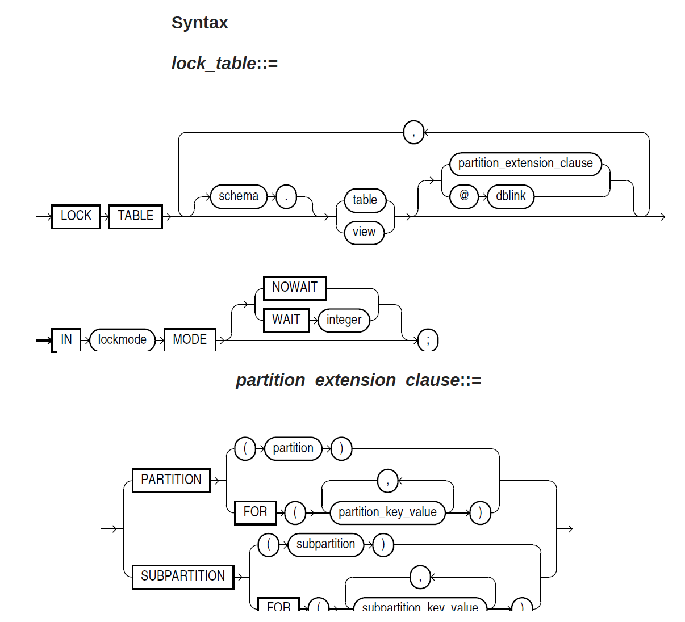

# lock table

## syntax  

| **lock_mode**       | **描述**                                                     |
| ------------------- | ------------------------------------------------------------ |
| ROW SHARE           | 允许同时访问表，但阻止用户锁定整个表以进行独占访问。(可以插入/更新、锁定，但不能锁定为EXCLUSIVE MODE，其他几种可以)，和SHARE UPDATE相同 ROW SHARE permits concurrent access to the locked table but prohibits users from locking the entire table for exclusive access. ROW SHARE is synonymous with SHARE UPDATE, which is included for compatibility with earlier versions of Oracle Database. |
| ROW EXCLUSIVE       | 允许对表进行并发访问，但阻止用户以独占访问方式或共享方式锁定表，SHARE MODE及更高级别的锁都加不了，ROW EXCLUSIVE之下可以。 ROW EXCLUSIVE is the same as ROW SHARE, but it also prohibits locking in SHARE mode. ROW EXCLUSIVE locks are automatically obtained when updating, inserting, or deleting. |
| SHARE UPDATE        | 同ROW SHARE，兼容早期版本 See ROW SHARE.                 |
| SHARE               | 允许并发查询，但其他用户无法更新锁定的表。 SHARE permits concurrent queries but prohibits updates to the locked table. |
| SHARE ROW EXCLUSIVE | 其他用户可以查询但无法更新/插入，无法再加share锁。 SHARE ROW EXCLUSIVE is used to look at a whole table and to allow others to look at rows in the table but to prohibit others from locking the table in SHARE mode or from updating rows. |
| EXCLUSIVE           | 允许查询锁定的表格，但不能进行其他活动。 EXCLUSIVE permits queries on the locked table but prohibits any other activity on it. |

