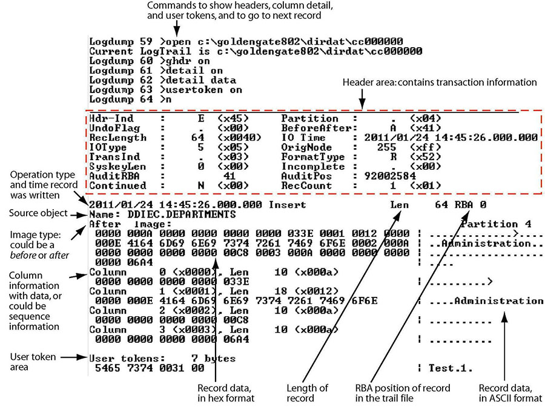

# logdump工具

## running logdump

```
logdump
```

## setting up the view

```
# To view the record header with the data
GHDR ON
# To add column information
DETAIL ON
#To add hex and ASCII data values to the column information
DETAIL DATA
#To view user tokens
USERTOKEN ON
# To view automatically generated tokens:
GGSTOKEN ON
# To control how much record data is displayed
RECLEN length
```

## Opening a Trail File

```
#打开trail文件
OPEN file_name
open /ogg/dirdat/la00000000

#To go to the first record and then move through records in sequence
NEXT
或者N
```



