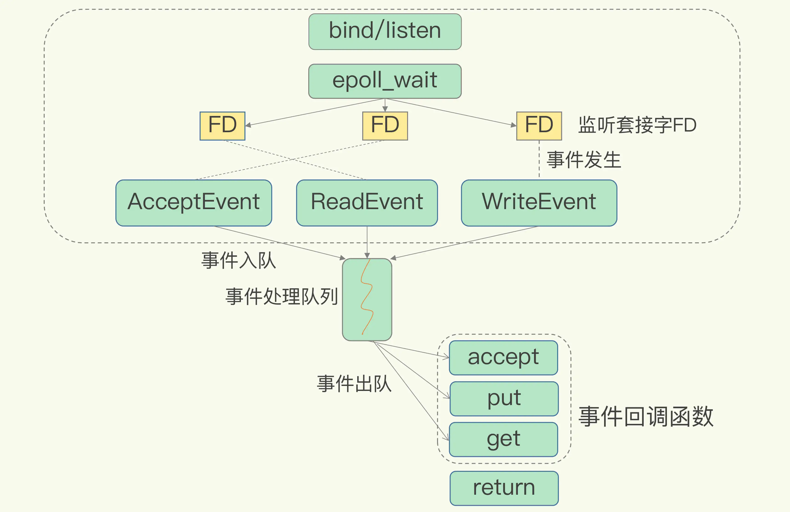

## 01 | 基本架构：一个键值数据库包含什么？

### 可以存哪些数据？

不同键值数据库支持的 key 类型一般差异不大，而 value 类型则有较大差别。我们在对键值数据库进行选型时，一个重要的考虑因素是它支持的 value 类型。例如，Memcached 支持的 value 类型仅为 String 类型，而 Redis 支持的 value 类型包括了 String、哈希表、列表、集合等。Redis 能够在实际业务场景中得到广泛的应用，就是得益于支持多样化类型的 value。从使用的角度来说，不同 value 类型的实现，不仅可以支撑不同业务的数据需求，而且也隐含着不同数据结构在性能、空间效率等方面的差异，从而导致不同的 value 操作之间存在着差异

### 可以对数据做什么操作？
PUT/GET/DELETE/SCAN 是一个键值数据库的基本操作集合。当一个键值数据库的 value 类型多样化时，就需要包含相应的操作接口。不同操作对 Redis 访问效率的影响。 

### 键值对保存在内存还是外存？
保存在内存的好处是读写很快，毕竟内存的访问速度一般都在百 ns 级别。但是，潜在的风险是一旦掉电，所有的数据都会丢失。保存在外存，虽然可以避免数据丢失，但是受限于磁盘的慢速读写（通常在几 ms 级别），键值数据库的整体性能会被拉低。因此，如何进行设计选择，我们通常需要考虑键值数据库的主要应用场景。

### 基本组件
大体来说，一个键值数据库包括了访问框架、索引模块、操作模块和存储模块四部分

### 采用什么访问模式？

访问模式通常有两种：一种是通过函数库调用的方式供外部应用使用，另一种是通过网络框架以 Socket 通信的形式对外提供键值对操作，这种形式可以提供广泛的键值存储服务。不同的键值数据库服务器和客户端交互的协议并不相同，我们在对键值数据库进行二次开发、新增功能时，必须要了解和掌握键值数据库的通信协议，这样才能开发出兼容的客户端。

通过网络框架提供键值存储服务，一方面扩大了键值数据库的受用面，但另一方面，也给键值数据库的性能、运行模型提供了不同的设计选择，带来了一些潜在的问题。我们会遇到一个系统设计上的问题，简单来说，就是网络连接的处理、网络请求的解析，以及数据存取的处理，是用一个线程、多个线程，还是多个进程来交互处理呢？该如何进行设计和取舍呢？我们一般把这个问题称为 I/O 模型设计。不同的 I/O 模型对键值数据库的性能和可扩展性会有不同的影响。

### 如何定位键值对的位置？

索引的作用是让键值数据库根据 key 找到相应 value 的存储位置，进而执行操作。索引的类型有很多，常见的有哈希表、B+ 树、字典树等。不同的索引结构在性能、空间消耗、并发控制等方面具有不同的特征。如果你看过其他键值数据库，就会发现，不同键值数据库采用的索引并不相同，例如，Memcached 和 Redis 采用哈希表作为 key-value 索引，而 RocksDB 则采用跳表作为内存中 key-value 的索引。一般而言，内存键值数据库（例如 Redis）采用哈希表作为索引，很大一部分原因在于，其键值数据基本都是保存在内存中的，而内存的高性能随机访问特性可以很好地与哈希表 O(1) 的操作复杂度相匹配。

### 不同操作的具体逻辑是怎样的？

对于 GET/SCAN 操作而言，此时根据 value 的存储位置返回 value 值即可；对于 PUT 一个新的键值对数据而言，SimpleKV 需要为该键值对分配内存空间；对于 DELETE 操作，SimpleKV 需要删除键值对，并释放相应的内存空间，这个过程由分配器完成。

### 如何实现重启后快速提供服务？

SimpleKV 采用了常用的内存分配器 glibc 的 malloc 和 free，因此，SimpleKV 并不需要特别考虑内存空间的管理问题。但是，键值数据库的键值对通常大小不一，glibc 的分配器在处理随机的大小内存块分配时，表现并不好。一旦保存的键值对数据规模过大，就可能会造成较严重的内存碎片问题。因此，分配器是键值数据库中的一个关键因素

### 持久化,何时将内存中的键值数据保存

一种方式是，对于每一个键值对，SimpleKV 都对其进行落盘保存，这虽然让 SimpleKV 的数据更加可靠，但是，因为每次都要写盘，SimpleKV 的性能会受到很大影响。另一种方式是，SimpleKV 只是周期性地把内存中的键值数据保存到文件中，这样可以避免频繁写盘操作的性能影响。但是，一个潜在的代价是 SimpleKV 的数据仍然有丢失的风险。

### 架构对比和思考

Redis 主要通过网络框架进行访问，而不再是动态库了，这也使得 Redis 可以作为一个基础性的网络服务进行访问，扩大了 Redis 的应用范围。

Redis 数据模型中的 value 类型很丰富，因此也带来了更多的操作接口，例如面向列表的 LPUSH/LPOP，面向集合的 SADD/SREM 等。

Redis 的持久化模块能支持两种方式：日志（AOF）和快照（RDB），这两种持久化方式具有不同的优劣势，影响到 Redis 的访问性能和可靠性。

SimpleKV 是个简单的单机键值数据库，但是，Redis 支持高可靠集群和高可扩展集群，因此，Redis 中包含了相应的集群功能支撑模块。

## 02 | 数据结构：快速的Redis有哪些慢操作？

数据库这么多，为啥 Redis 能有这么突出的表现呢？一方面，这是因为它是内存数据库，所有操作都在内存上完成，内存的访问速度本身就很快。另一方面，这要归功于它的数据结构。

简单来说，底层数据结构一共有 6 种，分别是简单动态字符串、双向链表、压缩列表、哈希表、跳表和整数数组。它们和数据类型的对应关系如下图所示：

### 键和值用什么结构组织？

为了实现从键到值的快速访问，Redis 使用了一个哈希表来保存所有键值对。一个哈希表，其实就是一个数组，数组的每个元素称为一个哈希桶。所以，我们常说，一个哈希表是由多个哈希桶组成的，每个哈希桶中保存了键值对数据。不管值是 String，还是集合类型，哈希桶中的元素都是指向它们的指针。

哈希桶中的 entry 元素中保存了*key和*value指针，分别指向了实际的键和值，这样一来，即使值是一个集合，也可以通过*value指针被查找到。

哈希表的最大好处很明显，就是让我们可以用 O(1) 的时间复杂度来快速查找到键值对——我们只需要计算键的哈希值，就可以知道它所对应的哈希桶位置，然后就可以访问相应的 entry 元素。这个查找过程主要依赖于哈希计算，和数据量的多少并没有直接关系。

如果你只是了解了哈希表的 O(1) 复杂度和快速查找特性，那么，当你往 Redis 中写入大量数据后，就可能发现操作有时候会突然变慢了。这其实是因为你忽略了一个潜在的风险点，那就是哈希表的冲突问题和 rehash 可能带来的操作阻塞。

### 为什么哈希表操作变慢了？

哈希桶的个数通常要少于 key 的数量，这也就是说，难免会有一些 key 的哈希值对应到了同一个哈希桶中。Redis 解决哈希冲突的方式，就是链式哈希。链式哈希也很容易理解，就是指同一个哈希桶中的多个元素用一个链表来保存，它们之间依次用指针连接。

这里依然存在一个问题，哈希冲突链上的元素只能通过指针逐一查找再操作。如果哈希表里写入的数据越来越多，哈希冲突可能也会越来越多，这就会导致某些哈希冲突链过长，进而导致这个链上的元素查找耗时长，效率降低。

rehash 也就是增加现有的哈希桶数量，让逐渐增多的 entry 元素能在更多的桶之间分散保存，减少单个桶中的元素数量，从而减少单个桶中的冲突。

为了使 rehash 操作更高效，Redis 默认使用了两个全局哈希表：哈希表 1 和哈希表 2。一开始，当你刚插入数据时，默认使用哈希表 1，此时的哈希表 2 并没有被分配空间。随着数据逐步增多，Redis 开始执行 rehash，这个过程分为三步：给哈希表 2 分配更大的空间，例如是当前哈希表 1 大小的两倍；把哈希表 1 中的数据重新映射并拷贝到哈希表 2 中；释放哈希表 1 的空间。

这个过程看似简单，但是第二步涉及大量的数据拷贝，如果一次性把哈希表 1 中的数据都迁移完，会造成 Redis 线程阻塞，无法服务其他请求。此时，Redis 就无法快速访问数据了。为了避免这个问题，Redis 采用了渐进式 rehash。

简单来说就是在第二步拷贝数据时，Redis 仍然正常处理客户端请求，每处理一个请求时，从哈希表 1 中的第一个索引位置开始，顺带着将这个索引位置上的所有 entries 拷贝到哈希表 2 中；等处理下一个请求时，再顺带拷贝哈希表 1 中的下一个索引位置的 entries。如下图所示：

这样就巧妙地把一次性大量拷贝的开销，分摊到了多次处理请求的过程中，避免了耗时操作，保证了数据的快速访问。

### 集合数据操作效率

对于集合类型来说，即使找到哈希桶了，还要在集合中再进一步操作

和 String 类型不同，一个集合类型的值，第一步是通过全局哈希表找到对应的哈希桶位置，第二步是在集合中再增删改查。那么，集合的操作效率和哪些因素相关呢？首先，与集合的底层数据结构有关。例如，使用哈希表实现的集合，要比使用链表实现的集合访问效率更高。其次，操作效率和这些操作本身的执行特点有关，比如读写一个元素的操作要比读写所有元素的效率高。

哈希表的操作特点我们刚刚已经学过了；整数数组和双向链表也很常见，它们的操作特征都是顺序读写，也就是通过数组下标或者链表的指针逐个元素访问，操作复杂度基本是 O(N)，操作效率比较低；压缩列表和跳表我们平时接触得可能不多，但它们也是 Redis 重要的数据结构，所以我来重点解释一下。压缩列表实际上类似于一个数组，数组中的每一个元素都对应保存一个数据。和数组不同的是，压缩列表在表头有三个字段 zlbytes、zltail 和 zllen，分别表示列表长度、列表尾的偏移量和列表中的 entry 个数；压缩列表在表尾还有一个 zlend，表示列表结束

在压缩列表中，如果我们要查找定位第一个元素和最后一个元素，可以通过表头三个字段的长度直接定位，复杂度是 O(1)。而查找其他元素时，就没有这么高效了，只能逐个查找，此时的复杂度就是 O(N) 了。

有序链表只能逐一查找元素，导致操作起来非常缓慢，于是就出现了跳表。具体来说，跳表在链表的基础上，增加了多级索引，通过索引位置的几个跳转，实现数据的快速定位

如果我们要在链表中查找 33 这个元素，只能从头开始遍历链表，查找 6 次，直到找到 33 为止。此时，复杂度是 O(N)，查找效率很低。为了提高查找速度，我们来增加一级索引：从第一个元素开始，每两个元素选一个出来作为索引。这些索引再通过指针指向原始的链表。例如，从前两个元素中抽取元素 1 作为一级索引，从第三、四个元素中抽取元素 11 作为一级索引。此时，我们只需要 4 次查找就能定位到元素 33 了。如果我们还想再快，可以再增加二级索引：从一级索引中，再抽取部分元素作为二级索引。例如，从一级索引中抽取 1、27、100 作为二级索引，二级索引指向一级索引。这样，我们只需要 3 次查找，就能定位到元素 33 了。可以看到，这个查找过程就是在多级索引上跳来跳去，最后定位到元素。这也正好符合“跳”表的叫法。当数据量很大时，跳表的查找复杂度就是 O(logN)。

### 不同操作的复杂度

单元素操作是基础；范围操作非常耗时；统计操作通常高效；例外情况只有几个。

第一，单元素操作，是指每一种集合类型对单个数据实现的增删改查操作。例如，Hash 类型的 HGET、HSET 和 HDEL，Set 类型的 SADD、SREM、SRANDMEMBER 等。这些操作的复杂度由集合采用的数据结构决定，例如，HGET、HSET 和 HDEL 是对哈希表做操作，所以它们的复杂度都是 O(1)；Set 类型用哈希表作为底层数据结构时，它的 SADD、SREM、SRANDMEMBER 复杂度也是 O(1)。这里，有个地方你需要注意一下，集合类型支持同时对多个元素进行增删改查，例如 Hash 类型的 HMGET 和 HMSET，Set 类型的 SADD 也支持同时增加多个元素。此时，这些操作的复杂度，就是由单个元素操作复杂度和元素个数决定的。例如，HMSET 增加 M 个元素时，复杂度就从 O(1) 变成 O(M) 了。第二，范围操作，是指集合类型中的遍历操作，可以返回集合中的所有数据，比如 Hash 类型的 HGETALL 和 Set 类型的 SMEMBERS，或者返回一个范围内的部分数据，比如 List 类型的 LRANGE 和 ZSet 类型的 ZRANGE。这类操作的复杂度一般是 O(N)，比较耗时，我们应该尽量避免。不过，Redis 从 2.8 版本开始提供了 SCAN 系列操作（包括 HSCAN，SSCAN 和 ZSCAN），这类操作实现了渐进式遍历，每次只返回有限数量的数据。这样一来，相比于 HGETALL、SMEMBERS 这类操作来说，就避免了一次性返回所有元素而导致的 Redis 阻塞。第三，统计操作，是指集合类型对集合中所有元素个数的记录，例如 LLEN 和 SCARD。这类操作复杂度只有 O(1)，这是因为当集合类型采用压缩列表、双向链表、整数数组这些数据结构时，这些结构中专门记录了元素的个数统计，因此可以高效地完成相关操作。第四，例外情况，是指某些数据结构的特殊记录，例如压缩列表和双向链表都会记录表头和表尾的偏移量。这样一来，对于 List 类型的 LPOP、RPOP、LPUSH、RPUSH 这四个操作来说，它们是在列表的头尾增删元素，这就可以通过偏移量直接定位，所以它们的复杂度也只有 O(1)，可以实现快速操作。

Redis 之所以能快速操作键值对，一方面是因为 O(1) 复杂度的哈希表被广泛使用，包括 String、Hash 和 Set，它们的操作复杂度基本由哈希表决定，另一方面，Sorted Set 也采用了 O(logN) 复杂度的跳表。不过，集合类型的范围操作，因为要遍历底层数据结构，复杂度通常是 O(N)。这里，我的建议是：用其他命令来替代，例如可以用 SCAN 来代替，避免在 Redis 内部产生费时的全集合遍历操作。当然，我们不能忘了复杂度较高的 List 类型，它的两种底层实现结构：双向链表和压缩列表的操作复杂度都是 O(N)。因此，我的建议是：因地制宜地使用 List 类型。例如，既然它的 POP/PUSH 效率很高，那么就将它主要用于 FIFO 队列场景，而不是作为一个可以随机读写的集合。Redis 数据类型丰富，每个类型的操作繁多，我们通常无法一下子记住所有操作的复杂度。所以，最好的办法就是掌握原理，以不变应万变。这里，你可以看到，一旦掌握了数据结构基本原理，你可以从原理上推断不同操作的复杂度，即使这个操作你不一定熟悉。这样一来，你不用死记硬背，也能快速合理地做出选择了。

## 03 | 高性能IO模型：为什么单线程Redis能那么快？

我们通常说，Redis 是单线程，主要是指 Redis 的网络 IO 和键值对读写是由一个线程来完成的，这也是 Redis 对外提供键值存储服务的主要流程。但 Redis 的其他功能，比如持久化、异步删除、集群数据同步等，其实是由额外的线程执行的。

要弄明白这个问题，我们就要深入地学习下 Redis 的单线程设计机制以及多路复用机制。之后你在调优 Redis 性能时，也能更有针对性地避免会导致 Redis 单线程阻塞的操作，例如执行复杂度高的命令。

### Redis 为什么用单线程？

多线程编程模式面临的共享资源的并发访问控制问题。如果没有精细的设计，比如说，只是简单地采用一个粗粒度互斥锁，就会出现不理想的结果：即使增加了线程，大部分线程也在等待获取访问共享资源的互斥锁，并行变串行，系统吞吐率并没有随着线程的增加而增加。而且，采用多线程开发一般会引入同步原语来保护共享资源的并发访问，这也会降低系统代码的易调试性和可维护性

### 单线程 Redis 为什么那么快？

一方面，Redis 的大部分操作在内存上完成，再加上它采用了高效的数据结构，例如哈希表和跳表，这是它实现高性能的一个重要原因。另一方面，就是 Redis 采用了多路复用机制，使其在网络 IO 操作中能并发处理大量的客户端请求，实现高吞吐率

### 基本 IO 模型与阻塞点

在这里的网络 IO 操作中，有潜在的阻塞点，分别是 accept() 和 recv()。当 Redis 监听到一个客户端有连接请求，但一直未能成功建立起连接时，会阻塞在 accept() 函数这里，导致其他客户端无法和 Redis 建立连接。类似的，当 Redis 通过 recv() 从一个客户端读取数据时，如果数据一直没有到达，Redis 也会一直阻塞在 recv()。这就导致 Redis 整个线程阻塞，无法处理其他客户端请求，效率很低。不过，幸运的是，socket 网络模型本身支持非阻塞模式。

### 非阻塞模式

Socket 网络模型的非阻塞模式设置，主要体现在三个关键的函数调用上，如果想要使用 socket 非阻塞模式，就必须要了解这三个函数的调用返回类型和设置模式

在 socket 模型中，不同操作调用后会返回不同的套接字类型。socket() 方法会返回主动套接字，然后调用 listen() 方法，将主动套接字转化为监听套接字，此时，可以监听来自客户端的连接请求。最后，调用 accept() 方法接收到达的客户端连接，并返回已连接套接字

针对监听套接字，我们可以设置非阻塞模式：当 Redis 调用 accept() 但一直未有连接请求到达时，Redis 线程可以返回处理其他操作，而不用一直等待。但是，你要注意的是，调用 accept() 时，已经存在监听套接字了。虽然 Redis 线程可以不用继续等待，但是总得有机制继续在监听套接字上等待后续连接请求，并在有请求时通知 Redis。类似的，我们也可以针对已连接套接字设置非阻塞模式：Redis 调用 recv() 后，如果已连接套接字上一直没有数据到达，Redis 线程同样可以返回处理其他操作。我们也需要有机制继续监听该已连接套接字，并在有数据达到时通知 Redis。这样才能保证 Redis 线程，既不会像基本 IO 模型中一直在阻塞点等待，也不会导致 Redis 无法处理实际到达的连接请求或数据。到此，Linux 中的 IO 多路复用机制就要登场了。

### 基于多路复用的高性能 I/O 模型

Linux 中的 IO 多路复用机制是指一个线程处理多个 IO 流，就是我们经常听到的 select/epoll 机制。简单来说，在 Redis 只运行单线程的情况下，该机制允许内核中，同时存在多个监听套接字和已连接套接字。内核会一直监听这些套接字上的连接请求或数据请求。一旦有请求到达，就会交给 Redis 线程处理，这就实现了一个 Redis 线程处理多个 IO 流的效果。

下图就是基于多路复用的 Redis IO 模型。图中的多个 FD 就是刚才所说的多个套接字。Redis 网络框架调用 epoll 机制，让内核监听这些套接字。此时，Redis 线程不会阻塞在某一个特定的监听或已连接套接字上，也就是说，不会阻塞在某一个特定的客户端请求处理上。正因为此，Redis 可以同时和多个客户端连接并处理请求，从而提升并发性

为了在请求到达时能通知到 Redis 线程，select/epoll 提供了基于事件的回调机制，即针对不同事件的发生，调用相应的处理函数。那么，回调机制是怎么工作的呢？其实，select/epoll 一旦监测到 FD 上有请求到达时，就会触发相应的事件。这些事件会被放进一个事件队列，Redis 单线程对该事件队列不断进行处理。这样一来，Redis 无需一直轮询是否有请求实际发生，这就可以避免造成 CPU 资源浪费。同时，Redis 在对事件队列中的事件进行处理时，会调用相应的处理函数，这就实现了基于事件的回调。因为 Redis 一直在对事件队列进行处理，所以能及时响应客户端请求，提升 Redis 的响应性能。

## 04 | AOF日志：宕机了，Redis如何避免数据丢失？

Redis 的持久化主要有两大机制，即 AOF（Append Only File）日志和 RDB 快照。

### AOF 日志是如何实现的？

说到日志，我们比较熟悉的是数据库的写前日志（Write Ahead Log, WAL），也就是说，在实际写数据前，先把修改的数据记到日志文件中，以便故障时进行恢复。不过，AOF 日志正好相反，它是写后日志，“写后”的意思是 Redis 是先执行命令，把数据写入内存，然后才记录日志

传统数据库的日志，例如 redo log（重做日志），记录的是修改后的数据，而 AOF 里记录的是 Redis 收到的每一条命令，这些命令是以文本形式保存的。

我们以 Redis 收到“set testkey testvalue”命令后记录的日志为例，看看 AOF 日志的内容。其中，“*3”表示当前命令有三个部分，每部分都是由“$+数字”开头，后面紧跟着具体的命令、键或值。这里，“数字”表示这部分中的命令、键或值一共有多少字节。例如，“$3 set”表示这部分有 3 个字节，也就是“set”命令。

为了避免额外的检查开销，Redis 在向 AOF 里面记录日志的时候，并不会先去对这些命令进行语法检查。所以，如果先记日志再执行命令的话，日志中就有可能记录了错误的命令，Redis 在使用日志恢复数据时，就可能会出错。而写后日志这种方式，就是先让系统执行命令，只有命令能执行成功，才会被记录到日志中，否则，系统就会直接向客户端报错。所以，Redis 使用写后日志这一方式的一大好处是，可以避免出现记录错误命令的情况。

不过，AOF 也有两个潜在的风险。首先，如果刚执行完一个命令，还没有来得及记日志就宕机了，那么这个命令和相应的数据就有丢失的风险。如果此时 Redis 是用作缓存，还可以从后端数据库重新读入数据进行恢复，但是，如果 Redis 是直接用作数据库的话，此时，因为命令没有记入日志，所以就无法用日志进行恢复了。其次，AOF 虽然避免了对当前命令的阻塞，但可能会给下一个操作带来阻塞风险。这是因为，AOF 日志也是在主线程中执行的，如果在把日志文件写入磁盘时，磁盘写压力大，就会导致写盘很慢，进而导致后续的操作也无法执行了。仔细分析的话，你就会发现，这两个风险都是和 AOF 写回磁盘的时机相关的。这也就意味着，如果我们能够控制一个写命令执行完后 AOF 日志写回磁盘的时机，这两个风险就解除了。

### 三种写回策略

其实，对于这个问题，AOF 机制给我们提供了三个选择，也就是 AOF 配置项 appendfsync 的三个可选值。

Always，同步写回：每个写命令执行完，立马同步地将日志写回磁盘；

Everysec，每秒写回：每个写命令执行完，只是先把日志写到 AOF 文件的内存缓冲区，每隔一秒把缓冲区中的内容写入磁盘；

No，操作系统控制的写回：每个写命令执行完，只是先把日志写到 AOF 文件的内存缓冲区，由操作系统决定何时将缓冲区内容写回磁盘。

针对避免主线程阻塞和减少数据丢失问题，这三种写回策略都无法做到两全其美。我们来分析下其中的原因。“同步写回”可以做到基本不丢数据，但是它在每一个写命令后都有一个慢速的落盘操作，不可避免地会影响主线程性能；虽然“操作系统控制的写回”在写完缓冲区后，就可以继续执行后续的命令，但是落盘的时机已经不在 Redis 手中了，只要 AOF 记录没有写回磁盘，一旦宕机对应的数据就丢失了；“每秒写回”采用一秒写回一次的频率，避免了“同步写回”的性能开销，虽然减少了对系统性能的影响，但是如果发生宕机，上一秒内未落盘的命令操作仍然会丢失。所以，这只能算是，在避免影响主线程性能和避免数据丢失两者间取了个折中

我们就可以根据系统对高性能和高可靠性的要求，来选择使用哪种写回策略了。总结一下就是：想要获得高性能，就选择 No 策略；如果想要得到高可靠性保证，就选择 Always 策略；如果允许数据有一点丢失，又希望性能别受太大影响的话，那么就选择 Everysec 策略。

但是，按照系统的性能需求选定了写回策略，并不是“高枕无忧”了。毕竟，AOF 是以文件的形式在记录接收到的所有写命令。随着接收的写命令越来越多，AOF 文件会越来越大。这也就意味着，我们一定要小心 AOF 文件过大带来的性能问题。这里的“性能问题”，主要在于以下三个方面：一是，文件系统本身对文件大小有限制，无法保存过大的文件；二是，如果文件太大，之后再往里面追加命令记录的话，效率也会变低；三是，如果发生宕机，AOF 中记录的命令要一个个被重新执行，用于故障恢复，如果日志文件太大，整个恢复过程就会非常缓慢，这就会影响到 Redis 的正常使用。所以，我们就要采取一定的控制手段，这个时候，AOF 重写机制就登场了。

### 日志文件太大了怎么办？

简单来说，AOF 重写机制就是在重写时，Redis 根据数据库的现状创建一个新的 AOF 文件，也就是说，读取数据库中的所有键值对，然后对每一个键值对用一条命令记录它的写入。比如说，当读取了键值对“testkey”: “testvalue”之后，重写机制会记录 set testkey testvalue 这条命令。这样，当需要恢复时，可以重新执行该命令，实现“testkey”: “testvalue”的写入。为什么重写机制可以把日志文件变小呢? 实际上，重写机制具有“多变一”功能。所谓的“多变一”，也就是说，旧日志文件中的多条命令，在重写后的新日志中变成了一条命令。我们知道，AOF 文件是以追加的方式，逐一记录接收到的写命令的。当一个键值对被多条写命令反复修改时，AOF 文件会记录相应的多条命令。但是，在重写的时候，是根据这个键值对当前的最新状态，为它生成对应的写入命令。这样一来，一个键值对在重写日志中只用一条命令就行了，而且，在日志恢复时，只用执行这条命令，就可以直接完成这个键值对的写入了。

不过，虽然 AOF 重写后，日志文件会缩小，但是，要把整个数据库的最新数据的操作日志都写回磁盘，仍然是一个非常耗时的过程。这时，我们就要继续关注另一个问题了：重写会不会阻塞主线程？

### AOF 重写会阻塞吗?

和 AOF 日志由主线程写回不同，重写过程是由后台子进程 bgrewriteaof 来完成的，这也是为了避免阻塞主线程，导致数据库性能下降。我把重写的过程总结为“一个拷贝，两处日志”。“一个拷贝”就是指，每次执行重写时，主线程 fork 出后台的 bgrewriteaof 子进程。此时，fork 会把主线程的内存拷贝一份给 bgrewriteaof 子进程，这里面就包含了数据库的最新数据。然后，bgrewriteaof 子进程就可以在不影响主线程的情况下，逐一把拷贝的数据写成操作，记入重写日志。“两处日志”又是什么呢？因为主线程未阻塞，仍然可以处理新来的操作。此时，如果有写操作，第一处日志就是指正在使用的 AOF 日志，Redis 会把这个操作写到它的缓冲区。这样一来，即使宕机了，这个 AOF 日志的操作仍然是齐全的，可以用于恢复。而第二处日志，就是指新的 AOF 重写日志。这个操作也会被写到重写日志的缓冲区。这样，重写日志也不会丢失最新的操作。等到拷贝数据的所有操作记录重写完成后，重写日志记录的这些最新操作也会写入新的 AOF 文件，以保证数据库最新状态的记录。此时，我们就可以用新的 AOF 文件替代旧文件了。

总结来说，每次 AOF 重写时，Redis 会先执行一个内存拷贝，用于重写；然后，使用两个日志保证在重写过程中，新写入的数据不会丢失。而且，因为 Redis 采用额外的线程进行数据重写，所以，这个过程并不会阻塞主线程。

Redis 用于避免数据丢失的 AOF 方法。这个方法通过逐一记录操作命令，在恢复时再逐一执行命令的方式，保证了数据的可靠性。这个方法看似“简单”，但也是充分考虑了对 Redis 性能的影响。总结来说，它提供了 AOF 日志的三种写回策略，分别是 Always、Everysec 和 No，这三种策略在可靠性上是从高到低，而在性能上则是从低到高。此外，为了避免日志文件过大，Redis 还提供了 AOF 重写机制，直接根据数据库里数据的最新状态，生成这些数据的插入命令，作为新日志。这个过程通过后台线程完成，避免了对主线程的阻塞。其中，三种写回策略体现了系统设计中的一个重要原则 ，即 trade-off，或者称为“取舍”，指的就是在性能和可靠性保证之间做取舍。我认为，这是做系统设计和开发的一个关键哲学，我也非常希望，你能充分地理解这个原则，并在日常开发中加以应用。不过，你可能也注意到了，落盘时机和重写机制都是在“记日志”这一过程中发挥作用的。例如，落盘时机的选择可以避免记日志时阻塞主线程，重写可以避免日志文件过大。但是，在“用日志”的过程中，也就是使用 AOF 进行故障恢复时，我们仍然需要把所有的操作记录都运行一遍。再加上 Redis 的单线程设计，这些命令操作只能一条一条按顺序执行，这个“重放”的过程就会很慢了。那么，有没有既能避免数据丢失，又能更快地恢复的方法呢？当然有，那就是 RDB 快照了。

## 05 | 内存快照：宕机后，Redis如何实现快速恢复？

Redis 避免数据丢失的 AOF 方法。这个方法的好处，是每次执行只需要记录操作命令，需要持久化的数据量不大。一般而言，只要你采用的不是 always 的持久化策略，就不会对性能造成太大影响。但是，也正因为记录的是操作命令，而不是实际的数据，所以，用 AOF 方法进行故障恢复的时候，需要逐一把操作日志都执行一遍。如果操作日志非常多，Redis 就会恢复得很缓慢，影响到正常使用

另一种持久化方法：内存快照。所谓内存快照，就是指内存中的数据在某一个时刻的状态记录。

对 Redis 来说，它实现类似照片记录效果的方式，就是把某一时刻的状态以文件的形式写到磁盘上，也就是快照。这样一来，即使宕机，快照文件也不会丢失，数据的可靠性也就得到了保证。这个快照文件就称为 RDB 文件，其中，RDB 就是 Redis DataBase 的缩写。

和 AOF 相比，RDB 记录的是某一时刻的数据，并不是操作，所以，在做数据恢复时，我们可以直接把 RDB 文件读入内存，很快地完成恢复。听起来好像很不错，但内存快照也并不是最优选项。为什么这么说呢？我们还要考虑两个关键问题：对哪些数据做快照？这关系到快照的执行效率问题；做快照时，数据还能被增删改吗？这关系到 Redis 是否被阻塞，能否同时正常处理请求。

### 给哪些内存数据做快照？

Redis 的数据都在内存中，为了提供所有数据的可靠性保证，它执行的是全量快照，也就是说，把内存中的所有数据都记录到磁盘中

同样，给内存的全量数据做快照，把它们全部写入磁盘也会花费很多时间。而且，全量数据越多，RDB 文件就越大，往磁盘上写数据的时间开销就越大。对于 Redis 而言，它的单线程模型就决定了，我们要尽量避免所有会阻塞主线程的操作，所以，针对任何操作，我们都会提一个灵魂之问：“它会阻塞主线程吗?”RDB 文件的生成是否会阻塞主线程，这就关系到是否会降低 Redis 的性能。Redis 提供了两个命令来生成 RDB 文件，分别是 save 和 bgsave。save：在主线程中执行，会导致阻塞；bgsave：创建一个子进程，专门用于写入 RDB 文件，避免了主线程的阻塞，这也是 Redis RDB 文件生成的默认配置。

这个时候，我们就可以通过 bgsave 命令来执行全量快照，这既提供了数据的可靠性保证，也避免了对 Redis 的性能影响。

### 快照时数据能修改吗?

为了快照而暂停写操作，肯定是不能接受的。所以这个时候，Redis 就会借助操作系统提供的写时复制技术（Copy-On-Write, COW），在执行快照的同时，正常处理写操作。简单来说，bgsave 子进程是由主线程 fork 生成的，可以共享主线程的所有内存数据。bgsave 子进程运行后，开始读取主线程的内存数据，并把它们写入 RDB 文件。

此时，如果主线程对这些数据也都是读操作（例如图中的键值对 A），那么，主线程和 bgsave 子进程相互不影响。但是，如果主线程要修改一块数据（例如图中的键值对 C），那么，这块数据就会被复制一份，生成该数据的副本（键值对 C’）。然后，主线程在这个数据副本上进行修改。同时，bgsave 子进程可以继续把原来的数据（键值对 C）写入 RDB 文件。

这既保证了快照的完整性，也允许主线程同时对数据进行修改，避免了对正常业务的影响

### 可以每秒做一次快照吗？

，如果频繁地执行全量快照，也会带来两方面的开销。一方面，频繁将全量数据写入磁盘，会给磁盘带来很大压力，多个快照竞争有限的磁盘带宽，前一个快照还没有做完，后一个又开始做了，容易造成恶性循环。另一方面，bgsave 子进程需要通过 fork 操作从主线程创建出来。虽然，子进程在创建后不会再阻塞主线程，但是，fork 这个创建过程本身会阻塞主线程，而且主线程的内存越大，阻塞时间越长。如果频繁 fork 出 bgsave 子进程，这就会频繁阻塞主线程了（所以，在 Redis 中如果有一个 bgsave 在运行，就不会再启动第二个 bgsave 子进程）。那么，有什么其他好方法吗？此时，我们可以做增量快照，所谓增量快照，就是指，做了一次全量快照后，后续的快照只对修改的数据进行快照记录，这样可以避免每次全量快照的开销。

在第一次做完全量快照后，T1 和 T2 时刻如果再做快照，我们只需要将被修改的数据写入快照文件就行。但是，这么做的前提是，我们需要记住哪些数据被修改了。你可不要小瞧这个“记住”功能，它需要我们使用额外的元数据信息去记录哪些数据被修改了，这会带来额外的空间开销问题

如果我们对每一个键值对的修改，都做个记录，那么，如果有 1 万个被修改的键值对，我们就需要有 1 万条额外的记录。而且，有的时候，键值对非常小，比如只有 32 字节，而记录它被修改的元数据信息，可能就需要 8 字节，这样的画，为了“记住”修改，引入的额外空间开销比较大。这对于内存资源宝贵的 Redis 来说，有些得不偿失。到这里，你可以发现，虽然跟 AOF 相比，快照的恢复速度快，但是，快照的频率不好把握，如果频率太低，两次快照间一旦宕机，就可能有比较多的数据丢失。如果频率太高，又会产生额外开销，那么，还有什么方法既能利用 RDB 的快速恢复，又能以较小的开销做到尽量少丢数据呢？

Redis 4.0 中提出了一个混合使用 AOF 日志和内存快照的方法。简单来说，内存快照以一定的频率执行，在两次快照之间，使用 AOF 日志记录这期间的所有命令操作。这样一来，快照不用很频繁地执行，这就避免了频繁 fork 对主线程的影响。而且，AOF 日志也只用记录两次快照间的操作，也就是说，不需要记录所有操作了，因此，就不会出现文件过大的情况了，也可以避免重写开销。

最后，关于 AOF 和 RDB 的选择问题，我想再给你提三点建议：数据不能丢失时，内存快照和 AOF 的混合使用是一个很好的选择；如果允许分钟级别的数据丢失，可以只使用 RDB；如果只用 AOF，优先使用 everysec 的配置选项，因为它在可靠性和性能之间取了一个平衡。

