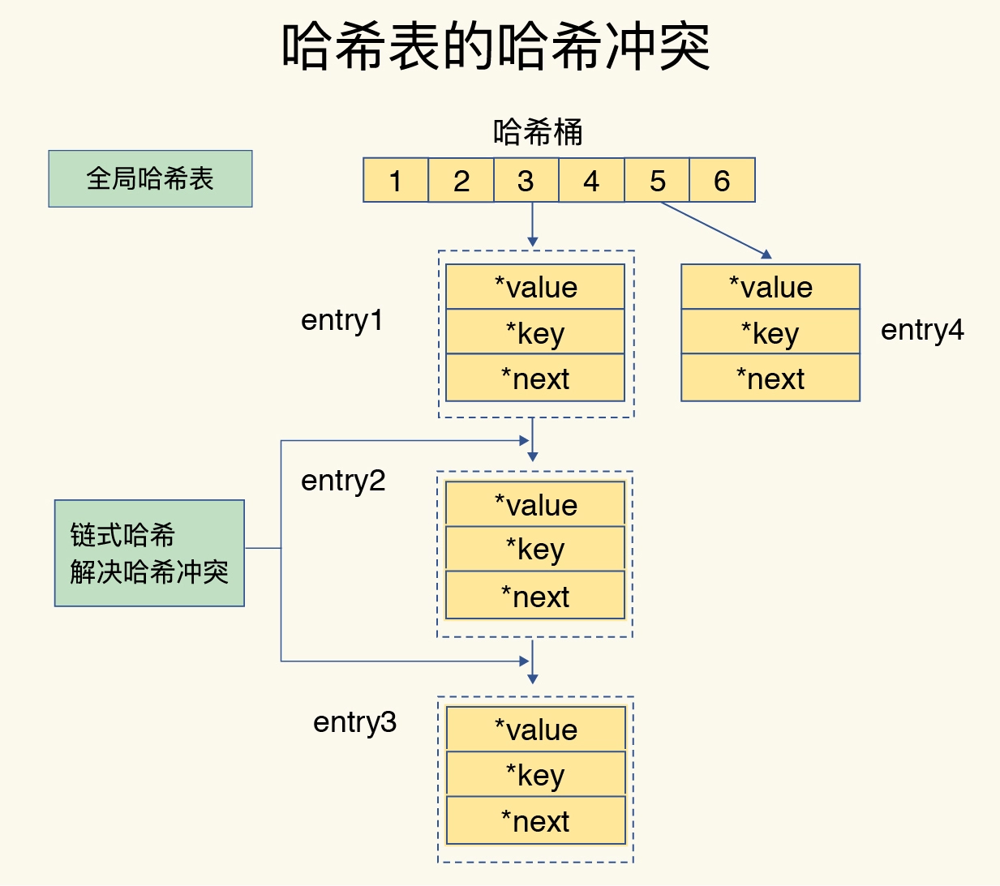
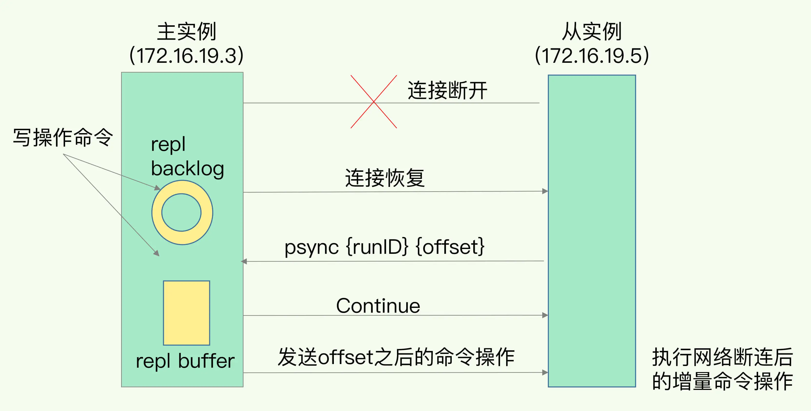
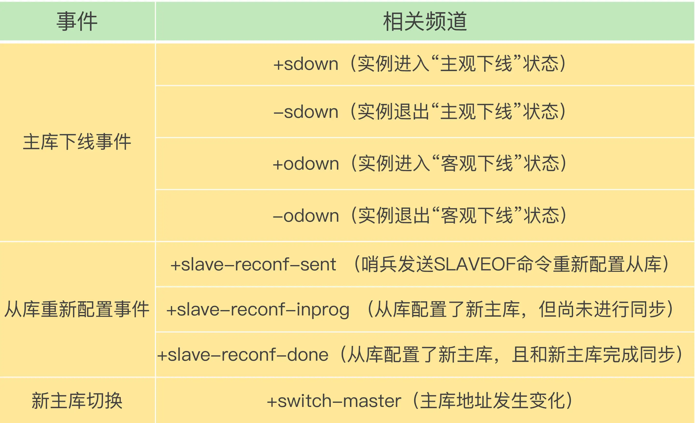
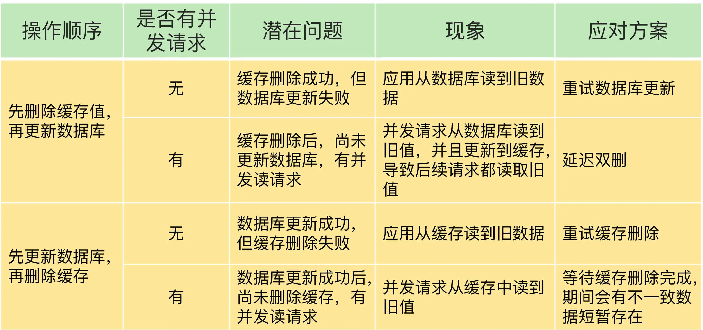

## 01 | 基本架构：一个键值数据库包含什么？

### 可以存哪些数据？

不同键值数据库支持的 key 类型一般差异不大，而 value 类型则有较大差别。我们在对键值数据库进行选型时，一个重要的考虑因素是它支持的 value 类型。例如，Memcached 支持的 value 类型仅为 String 类型，而 Redis 支持的 value 类型包括了 String、哈希表、列表、集合等。Redis 能够在实际业务场景中得到广泛的应用，就是得益于支持多样化类型的 value。从使用的角度来说，不同 value 类型的实现，不仅可以支撑不同业务的数据需求，而且也隐含着不同数据结构在性能、空间效率等方面的差异，从而导致不同的 value 操作之间存在着差异

### 可以对数据做什么操作？
PUT/GET/DELETE/SCAN 是一个键值数据库的基本操作集合。当一个键值数据库的 value 类型多样化时，就需要包含相应的操作接口。不同操作对 Redis 访问效率的影响。 

### 键值对保存在内存还是外存？
保存在内存的好处是读写很快，毕竟内存的访问速度一般都在百 ns 级别。但是，潜在的风险是一旦掉电，所有的数据都会丢失。保存在外存，虽然可以避免数据丢失，但是受限于磁盘的慢速读写（通常在几 ms 级别），键值数据库的整体性能会被拉低。因此，如何进行设计选择，我们通常需要考虑键值数据库的主要应用场景。

### 基本组件
大体来说，一个键值数据库包括了访问框架、索引模块、操作模块和存储模块四部分

### 采用什么访问模式？

访问模式通常有两种：一种是通过函数库调用的方式供外部应用使用，另一种是通过网络框架以 Socket 通信的形式对外提供键值对操作，这种形式可以提供广泛的键值存储服务。不同的键值数据库服务器和客户端交互的协议并不相同，我们在对键值数据库进行二次开发、新增功能时，必须要了解和掌握键值数据库的通信协议，这样才能开发出兼容的客户端。

通过网络框架提供键值存储服务，一方面扩大了键值数据库的受用面，但另一方面，也给键值数据库的性能、运行模型提供了不同的设计选择，带来了一些潜在的问题。我们会遇到一个系统设计上的问题，简单来说，就是网络连接的处理、网络请求的解析，以及数据存取的处理，是用一个线程、多个线程，还是多个进程来交互处理呢？该如何进行设计和取舍呢？我们一般把这个问题称为 I/O 模型设计。不同的 I/O 模型对键值数据库的性能和可扩展性会有不同的影响。

### 如何定位键值对的位置？

索引的作用是让键值数据库根据 key 找到相应 value 的存储位置，进而执行操作。索引的类型有很多，常见的有哈希表、B+ 树、字典树等。不同的索引结构在性能、空间消耗、并发控制等方面具有不同的特征。如果你看过其他键值数据库，就会发现，不同键值数据库采用的索引并不相同，例如，Memcached 和 Redis 采用哈希表作为 key-value 索引，而 RocksDB 则采用跳表作为内存中 key-value 的索引。一般而言，内存键值数据库（例如 Redis）采用哈希表作为索引，很大一部分原因在于，其键值数据基本都是保存在内存中的，而内存的高性能随机访问特性可以很好地与哈希表 O(1) 的操作复杂度相匹配。

### 不同操作的具体逻辑是怎样的？

对于 GET/SCAN 操作而言，此时根据 value 的存储位置返回 value 值即可；对于 PUT 一个新的键值对数据而言，SimpleKV 需要为该键值对分配内存空间；对于 DELETE 操作，SimpleKV 需要删除键值对，并释放相应的内存空间，这个过程由分配器完成。

### 如何实现重启后快速提供服务？

SimpleKV 采用了常用的内存分配器 glibc 的 malloc 和 free，因此，SimpleKV 并不需要特别考虑内存空间的管理问题。但是，键值数据库的键值对通常大小不一，glibc 的分配器在处理随机的大小内存块分配时，表现并不好。一旦保存的键值对数据规模过大，就可能会造成较严重的内存碎片问题。因此，分配器是键值数据库中的一个关键因素

### 持久化,何时将内存中的键值数据保存

一种方式是，对于每一个键值对，SimpleKV 都对其进行落盘保存，这虽然让 SimpleKV 的数据更加可靠，但是，因为每次都要写盘，SimpleKV 的性能会受到很大影响。另一种方式是，SimpleKV 只是周期性地把内存中的键值数据保存到文件中，这样可以避免频繁写盘操作的性能影响。但是，一个潜在的代价是 SimpleKV 的数据仍然有丢失的风险。

### 架构对比和思考

Redis 主要通过网络框架进行访问，而不再是动态库了，这也使得 Redis 可以作为一个基础性的网络服务进行访问，扩大了 Redis 的应用范围。

Redis 数据模型中的 value 类型很丰富，因此也带来了更多的操作接口，例如面向列表的 LPUSH/LPOP，面向集合的 SADD/SREM 等。

Redis 的持久化模块能支持两种方式：日志（AOF）和快照（RDB），这两种持久化方式具有不同的优劣势，影响到 Redis 的访问性能和可靠性。

SimpleKV 是个简单的单机键值数据库，但是，Redis 支持高可靠集群和高可扩展集群，因此，Redis 中包含了相应的集群功能支撑模块。

## 02 | 数据结构：快速的Redis有哪些慢操作？

数据库这么多，为啥 Redis 能有这么突出的表现呢？一方面，这是因为它是内存数据库，所有操作都在内存上完成，内存的访问速度本身就很快。另一方面，这要归功于它的数据结构。

简单来说，底层数据结构一共有 6 种，分别是简单动态字符串、双向链表、压缩列表、哈希表、跳表和整数数组。它们和数据类型的对应关系如下图所示：

### 键和值用什么结构组织？

为了实现从键到值的快速访问，Redis 使用了一个哈希表来保存所有键值对。一个哈希表，其实就是一个数组，数组的每个元素称为一个哈希桶。所以，我们常说，一个哈希表是由多个哈希桶组成的，每个哈希桶中保存了键值对数据。不管值是 String，还是集合类型，哈希桶中的元素都是指向它们的指针。

哈希桶中的 entry 元素中保存了*key和*value指针，分别指向了实际的键和值，这样一来，即使值是一个集合，也可以通过*value指针被查找到。

哈希表的最大好处很明显，就是让我们可以用 O(1) 的时间复杂度来快速查找到键值对——我们只需要计算键的哈希值，就可以知道它所对应的哈希桶位置，然后就可以访问相应的 entry 元素。这个查找过程主要依赖于哈希计算，和数据量的多少并没有直接关系。

如果你只是了解了哈希表的 O(1) 复杂度和快速查找特性，那么，当你往 Redis 中写入大量数据后，就可能发现操作有时候会突然变慢了。这其实是因为你忽略了一个潜在的风险点，那就是哈希表的冲突问题和 rehash 可能带来的操作阻塞。

### 为什么哈希表操作变慢了？

哈希桶的个数通常要少于 key 的数量，这也就是说，难免会有一些 key 的哈希值对应到了同一个哈希桶中。Redis 解决哈希冲突的方式，就是链式哈希。链式哈希也很容易理解，就是指同一个哈希桶中的多个元素用一个链表来保存，它们之间依次用指针连接。

这里依然存在一个问题，哈希冲突链上的元素只能通过指针逐一查找再操作。如果哈希表里写入的数据越来越多，哈希冲突可能也会越来越多，这就会导致某些哈希冲突链过长，进而导致这个链上的元素查找耗时长，效率降低。

rehash 也就是增加现有的哈希桶数量，让逐渐增多的 entry 元素能在更多的桶之间分散保存，减少单个桶中的元素数量，从而减少单个桶中的冲突。

为了使 rehash 操作更高效，Redis 默认使用了两个全局哈希表：哈希表 1 和哈希表 2。一开始，当你刚插入数据时，默认使用哈希表 1，此时的哈希表 2 并没有被分配空间。随着数据逐步增多，Redis 开始执行 rehash，这个过程分为三步：给哈希表 2 分配更大的空间，例如是当前哈希表 1 大小的两倍；把哈希表 1 中的数据重新映射并拷贝到哈希表 2 中；释放哈希表 1 的空间。

这个过程看似简单，但是第二步涉及大量的数据拷贝，如果一次性把哈希表 1 中的数据都迁移完，会造成 Redis 线程阻塞，无法服务其他请求。此时，Redis 就无法快速访问数据了。为了避免这个问题，Redis 采用了渐进式 rehash。

简单来说就是在第二步拷贝数据时，Redis 仍然正常处理客户端请求，每处理一个请求时，从哈希表 1 中的第一个索引位置开始，顺带着将这个索引位置上的所有 entries 拷贝到哈希表 2 中；等处理下一个请求时，再顺带拷贝哈希表 1 中的下一个索引位置的 entries。如下图所示：

这样就巧妙地把一次性大量拷贝的开销，分摊到了多次处理请求的过程中，避免了耗时操作，保证了数据的快速访问。

### 集合数据操作效率

对于集合类型来说，即使找到哈希桶了，还要在集合中再进一步操作

和 String 类型不同，一个集合类型的值，第一步是通过全局哈希表找到对应的哈希桶位置，第二步是在集合中再增删改查。那么，集合的操作效率和哪些因素相关呢？首先，与集合的底层数据结构有关。例如，使用哈希表实现的集合，要比使用链表实现的集合访问效率更高。其次，操作效率和这些操作本身的执行特点有关，比如读写一个元素的操作要比读写所有元素的效率高。

哈希表的操作特点我们刚刚已经学过了；整数数组和双向链表也很常见，它们的操作特征都是顺序读写，也就是通过数组下标或者链表的指针逐个元素访问，操作复杂度基本是 O(N)，操作效率比较低；压缩列表和跳表我们平时接触得可能不多，但它们也是 Redis 重要的数据结构，所以我来重点解释一下。压缩列表实际上类似于一个数组，数组中的每一个元素都对应保存一个数据。和数组不同的是，压缩列表在表头有三个字段 zlbytes、zltail 和 zllen，分别表示列表长度、列表尾的偏移量和列表中的 entry 个数；压缩列表在表尾还有一个 zlend，表示列表结束

在压缩列表中，如果我们要查找定位第一个元素和最后一个元素，可以通过表头三个字段的长度直接定位，复杂度是 O(1)。而查找其他元素时，就没有这么高效了，只能逐个查找，此时的复杂度就是 O(N) 了。

有序链表只能逐一查找元素，导致操作起来非常缓慢，于是就出现了跳表。具体来说，跳表在链表的基础上，增加了多级索引，通过索引位置的几个跳转，实现数据的快速定位

如果我们要在链表中查找 33 这个元素，只能从头开始遍历链表，查找 6 次，直到找到 33 为止。此时，复杂度是 O(N)，查找效率很低。为了提高查找速度，我们来增加一级索引：从第一个元素开始，每两个元素选一个出来作为索引。这些索引再通过指针指向原始的链表。例如，从前两个元素中抽取元素 1 作为一级索引，从第三、四个元素中抽取元素 11 作为一级索引。此时，我们只需要 4 次查找就能定位到元素 33 了。如果我们还想再快，可以再增加二级索引：从一级索引中，再抽取部分元素作为二级索引。例如，从一级索引中抽取 1、27、100 作为二级索引，二级索引指向一级索引。这样，我们只需要 3 次查找，就能定位到元素 33 了。可以看到，这个查找过程就是在多级索引上跳来跳去，最后定位到元素。这也正好符合“跳”表的叫法。当数据量很大时，跳表的查找复杂度就是 O(logN)。

### 不同操作的复杂度

单元素操作是基础；范围操作非常耗时；统计操作通常高效；例外情况只有几个。

第一，单元素操作，是指每一种集合类型对单个数据实现的增删改查操作。例如，Hash 类型的 HGET、HSET 和 HDEL，Set 类型的 SADD、SREM、SRANDMEMBER 等。这些操作的复杂度由集合采用的数据结构决定，例如，HGET、HSET 和 HDEL 是对哈希表做操作，所以它们的复杂度都是 O(1)；Set 类型用哈希表作为底层数据结构时，它的 SADD、SREM、SRANDMEMBER 复杂度也是 O(1)。这里，有个地方你需要注意一下，集合类型支持同时对多个元素进行增删改查，例如 Hash 类型的 HMGET 和 HMSET，Set 类型的 SADD 也支持同时增加多个元素。此时，这些操作的复杂度，就是由单个元素操作复杂度和元素个数决定的。例如，HMSET 增加 M 个元素时，复杂度就从 O(1) 变成 O(M) 了。第二，范围操作，是指集合类型中的遍历操作，可以返回集合中的所有数据，比如 Hash 类型的 HGETALL 和 Set 类型的 SMEMBERS，或者返回一个范围内的部分数据，比如 List 类型的 LRANGE 和 ZSet 类型的 ZRANGE。这类操作的复杂度一般是 O(N)，比较耗时，我们应该尽量避免。不过，Redis 从 2.8 版本开始提供了 SCAN 系列操作（包括 HSCAN，SSCAN 和 ZSCAN），这类操作实现了渐进式遍历，每次只返回有限数量的数据。这样一来，相比于 HGETALL、SMEMBERS 这类操作来说，就避免了一次性返回所有元素而导致的 Redis 阻塞。第三，统计操作，是指集合类型对集合中所有元素个数的记录，例如 LLEN 和 SCARD。这类操作复杂度只有 O(1)，这是因为当集合类型采用压缩列表、双向链表、整数数组这些数据结构时，这些结构中专门记录了元素的个数统计，因此可以高效地完成相关操作。第四，例外情况，是指某些数据结构的特殊记录，例如压缩列表和双向链表都会记录表头和表尾的偏移量。这样一来，对于 List 类型的 LPOP、RPOP、LPUSH、RPUSH 这四个操作来说，它们是在列表的头尾增删元素，这就可以通过偏移量直接定位，所以它们的复杂度也只有 O(1)，可以实现快速操作。

Redis 之所以能快速操作键值对，一方面是因为 O(1) 复杂度的哈希表被广泛使用，包括 String、Hash 和 Set，它们的操作复杂度基本由哈希表决定，另一方面，Sorted Set 也采用了 O(logN) 复杂度的跳表。不过，集合类型的范围操作，因为要遍历底层数据结构，复杂度通常是 O(N)。这里，我的建议是：用其他命令来替代，例如可以用 SCAN 来代替，避免在 Redis 内部产生费时的全集合遍历操作。当然，我们不能忘了复杂度较高的 List 类型，它的两种底层实现结构：双向链表和压缩列表的操作复杂度都是 O(N)。因此，我的建议是：因地制宜地使用 List 类型。例如，既然它的 POP/PUSH 效率很高，那么就将它主要用于 FIFO 队列场景，而不是作为一个可以随机读写的集合。Redis 数据类型丰富，每个类型的操作繁多，我们通常无法一下子记住所有操作的复杂度。所以，最好的办法就是掌握原理，以不变应万变。这里，你可以看到，一旦掌握了数据结构基本原理，你可以从原理上推断不同操作的复杂度，即使这个操作你不一定熟悉。这样一来，你不用死记硬背，也能快速合理地做出选择了。

## 03 | 高性能IO模型：为什么单线程Redis能那么快？

我们通常说，Redis 是单线程，主要是指 Redis 的网络 IO 和键值对读写是由一个线程来完成的，这也是 Redis 对外提供键值存储服务的主要流程。但 Redis 的其他功能，比如持久化、异步删除、集群数据同步等，其实是由额外的线程执行的。

要弄明白这个问题，我们就要深入地学习下 Redis 的单线程设计机制以及多路复用机制。之后你在调优 Redis 性能时，也能更有针对性地避免会导致 Redis 单线程阻塞的操作，例如执行复杂度高的命令。

### Redis 为什么用单线程？

多线程编程模式面临的共享资源的并发访问控制问题。如果没有精细的设计，比如说，只是简单地采用一个粗粒度互斥锁，就会出现不理想的结果：即使增加了线程，大部分线程也在等待获取访问共享资源的互斥锁，并行变串行，系统吞吐率并没有随着线程的增加而增加。而且，采用多线程开发一般会引入同步原语来保护共享资源的并发访问，这也会降低系统代码的易调试性和可维护性

### 单线程 Redis 为什么那么快？

一方面，Redis 的大部分操作在内存上完成，再加上它采用了高效的数据结构，例如哈希表和跳表，这是它实现高性能的一个重要原因。另一方面，就是 Redis 采用了多路复用机制，使其在网络 IO 操作中能并发处理大量的客户端请求，实现高吞吐率

### 基本 IO 模型与阻塞点

在这里的网络 IO 操作中，有潜在的阻塞点，分别是 accept() 和 recv()。当 Redis 监听到一个客户端有连接请求，但一直未能成功建立起连接时，会阻塞在 accept() 函数这里，导致其他客户端无法和 Redis 建立连接。类似的，当 Redis 通过 recv() 从一个客户端读取数据时，如果数据一直没有到达，Redis 也会一直阻塞在 recv()。这就导致 Redis 整个线程阻塞，无法处理其他客户端请求，效率很低。不过，幸运的是，socket 网络模型本身支持非阻塞模式。

### 非阻塞模式

Socket 网络模型的非阻塞模式设置，主要体现在三个关键的函数调用上，如果想要使用 socket 非阻塞模式，就必须要了解这三个函数的调用返回类型和设置模式

在 socket 模型中，不同操作调用后会返回不同的套接字类型。socket() 方法会返回主动套接字，然后调用 listen() 方法，将主动套接字转化为监听套接字，此时，可以监听来自客户端的连接请求。最后，调用 accept() 方法接收到达的客户端连接，并返回已连接套接字

针对监听套接字，我们可以设置非阻塞模式：当 Redis 调用 accept() 但一直未有连接请求到达时，Redis 线程可以返回处理其他操作，而不用一直等待。但是，你要注意的是，调用 accept() 时，已经存在监听套接字了。虽然 Redis 线程可以不用继续等待，但是总得有机制继续在监听套接字上等待后续连接请求，并在有请求时通知 Redis。类似的，我们也可以针对已连接套接字设置非阻塞模式：Redis 调用 recv() 后，如果已连接套接字上一直没有数据到达，Redis 线程同样可以返回处理其他操作。我们也需要有机制继续监听该已连接套接字，并在有数据达到时通知 Redis。这样才能保证 Redis 线程，既不会像基本 IO 模型中一直在阻塞点等待，也不会导致 Redis 无法处理实际到达的连接请求或数据。到此，Linux 中的 IO 多路复用机制就要登场了。

### 基于多路复用的高性能 I/O 模型

Linux 中的 IO 多路复用机制是指一个线程处理多个 IO 流，就是我们经常听到的 select/epoll 机制。简单来说，在 Redis 只运行单线程的情况下，该机制允许内核中，同时存在多个监听套接字和已连接套接字。内核会一直监听这些套接字上的连接请求或数据请求。一旦有请求到达，就会交给 Redis 线程处理，这就实现了一个 Redis 线程处理多个 IO 流的效果。

下图就是基于多路复用的 Redis IO 模型。图中的多个 FD 就是刚才所说的多个套接字。Redis 网络框架调用 epoll 机制，让内核监听这些套接字。此时，Redis 线程不会阻塞在某一个特定的监听或已连接套接字上，也就是说，不会阻塞在某一个特定的客户端请求处理上。正因为此，Redis 可以同时和多个客户端连接并处理请求，从而提升并发性

为了在请求到达时能通知到 Redis 线程，select/epoll 提供了基于事件的回调机制，即针对不同事件的发生，调用相应的处理函数。那么，回调机制是怎么工作的呢？其实，select/epoll 一旦监测到 FD 上有请求到达时，就会触发相应的事件。这些事件会被放进一个事件队列，Redis 单线程对该事件队列不断进行处理。这样一来，Redis 无需一直轮询是否有请求实际发生，这就可以避免造成 CPU 资源浪费。同时，Redis 在对事件队列中的事件进行处理时，会调用相应的处理函数，这就实现了基于事件的回调。因为 Redis 一直在对事件队列进行处理，所以能及时响应客户端请求，提升 Redis 的响应性能。

## 04 | AOF日志：宕机了，Redis如何避免数据丢失？

Redis 的持久化主要有两大机制，即 AOF（Append Only File）日志和 RDB 快照。

### AOF 日志是如何实现的？

说到日志，我们比较熟悉的是数据库的写前日志（Write Ahead Log, WAL），也就是说，在实际写数据前，先把修改的数据记到日志文件中，以便故障时进行恢复。不过，AOF 日志正好相反，它是写后日志，“写后”的意思是 Redis 是先执行命令，把数据写入内存，然后才记录日志

传统数据库的日志，例如 redo log（重做日志），记录的是修改后的数据，而 AOF 里记录的是 Redis 收到的每一条命令，这些命令是以文本形式保存的。

我们以 Redis 收到“set testkey testvalue”命令后记录的日志为例，看看 AOF 日志的内容。其中，“*3”表示当前命令有三个部分，每部分都是由“$+数字”开头，后面紧跟着具体的命令、键或值。这里，“数字”表示这部分中的命令、键或值一共有多少字节。例如，“$3 set”表示这部分有 3 个字节，也就是“set”命令。

为了避免额外的检查开销，Redis 在向 AOF 里面记录日志的时候，并不会先去对这些命令进行语法检查。所以，如果先记日志再执行命令的话，日志中就有可能记录了错误的命令，Redis 在使用日志恢复数据时，就可能会出错。而写后日志这种方式，就是先让系统执行命令，只有命令能执行成功，才会被记录到日志中，否则，系统就会直接向客户端报错。所以，Redis 使用写后日志这一方式的一大好处是，可以避免出现记录错误命令的情况。

不过，AOF 也有两个潜在的风险。首先，如果刚执行完一个命令，还没有来得及记日志就宕机了，那么这个命令和相应的数据就有丢失的风险。如果此时 Redis 是用作缓存，还可以从后端数据库重新读入数据进行恢复，但是，如果 Redis 是直接用作数据库的话，此时，因为命令没有记入日志，所以就无法用日志进行恢复了。其次，AOF 虽然避免了对当前命令的阻塞，但可能会给下一个操作带来阻塞风险。这是因为，AOF 日志也是在主线程中执行的，如果在把日志文件写入磁盘时，磁盘写压力大，就会导致写盘很慢，进而导致后续的操作也无法执行了。仔细分析的话，你就会发现，这两个风险都是和 AOF 写回磁盘的时机相关的。这也就意味着，如果我们能够控制一个写命令执行完后 AOF 日志写回磁盘的时机，这两个风险就解除了。

### 三种写回策略

其实，对于这个问题，AOF 机制给我们提供了三个选择，也就是 AOF 配置项 appendfsync 的三个可选值。

Always，同步写回：每个写命令执行完，立马同步地将日志写回磁盘；

Everysec，每秒写回：每个写命令执行完，只是先把日志写到 AOF 文件的内存缓冲区，每隔一秒把缓冲区中的内容写入磁盘；

No，操作系统控制的写回：每个写命令执行完，只是先把日志写到 AOF 文件的内存缓冲区，由操作系统决定何时将缓冲区内容写回磁盘。

针对避免主线程阻塞和减少数据丢失问题，这三种写回策略都无法做到两全其美。我们来分析下其中的原因。“同步写回”可以做到基本不丢数据，但是它在每一个写命令后都有一个慢速的落盘操作，不可避免地会影响主线程性能；虽然“操作系统控制的写回”在写完缓冲区后，就可以继续执行后续的命令，但是落盘的时机已经不在 Redis 手中了，只要 AOF 记录没有写回磁盘，一旦宕机对应的数据就丢失了；“每秒写回”采用一秒写回一次的频率，避免了“同步写回”的性能开销，虽然减少了对系统性能的影响，但是如果发生宕机，上一秒内未落盘的命令操作仍然会丢失。所以，这只能算是，在避免影响主线程性能和避免数据丢失两者间取了个折中

我们就可以根据系统对高性能和高可靠性的要求，来选择使用哪种写回策略了。总结一下就是：想要获得高性能，就选择 No 策略；如果想要得到高可靠性保证，就选择 Always 策略；如果允许数据有一点丢失，又希望性能别受太大影响的话，那么就选择 Everysec 策略。

但是，按照系统的性能需求选定了写回策略，并不是“高枕无忧”了。毕竟，AOF 是以文件的形式在记录接收到的所有写命令。随着接收的写命令越来越多，AOF 文件会越来越大。这也就意味着，我们一定要小心 AOF 文件过大带来的性能问题。这里的“性能问题”，主要在于以下三个方面：一是，文件系统本身对文件大小有限制，无法保存过大的文件；二是，如果文件太大，之后再往里面追加命令记录的话，效率也会变低；三是，如果发生宕机，AOF 中记录的命令要一个个被重新执行，用于故障恢复，如果日志文件太大，整个恢复过程就会非常缓慢，这就会影响到 Redis 的正常使用。所以，我们就要采取一定的控制手段，这个时候，AOF 重写机制就登场了。

### 日志文件太大了怎么办？

简单来说，AOF 重写机制就是在重写时，Redis 根据数据库的现状创建一个新的 AOF 文件，也就是说，读取数据库中的所有键值对，然后对每一个键值对用一条命令记录它的写入。比如说，当读取了键值对“testkey”: “testvalue”之后，重写机制会记录 set testkey testvalue 这条命令。这样，当需要恢复时，可以重新执行该命令，实现“testkey”: “testvalue”的写入。为什么重写机制可以把日志文件变小呢? 实际上，重写机制具有“多变一”功能。所谓的“多变一”，也就是说，旧日志文件中的多条命令，在重写后的新日志中变成了一条命令。我们知道，AOF 文件是以追加的方式，逐一记录接收到的写命令的。当一个键值对被多条写命令反复修改时，AOF 文件会记录相应的多条命令。但是，在重写的时候，是根据这个键值对当前的最新状态，为它生成对应的写入命令。这样一来，一个键值对在重写日志中只用一条命令就行了，而且，在日志恢复时，只用执行这条命令，就可以直接完成这个键值对的写入了。

不过，虽然 AOF 重写后，日志文件会缩小，但是，要把整个数据库的最新数据的操作日志都写回磁盘，仍然是一个非常耗时的过程。这时，我们就要继续关注另一个问题了：重写会不会阻塞主线程？

### AOF 重写会阻塞吗?

和 AOF 日志由主线程写回不同，重写过程是由后台子进程 bgrewriteaof 来完成的，这也是为了避免阻塞主线程，导致数据库性能下降。我把重写的过程总结为“一个拷贝，两处日志”。“一个拷贝”就是指，每次执行重写时，主线程 fork 出后台的 bgrewriteaof 子进程。此时，fork 会把主线程的内存拷贝一份给 bgrewriteaof 子进程，这里面就包含了数据库的最新数据。然后，bgrewriteaof 子进程就可以在不影响主线程的情况下，逐一把拷贝的数据写成操作，记入重写日志。“两处日志”又是什么呢？因为主线程未阻塞，仍然可以处理新来的操作。此时，如果有写操作，第一处日志就是指正在使用的 AOF 日志，Redis 会把这个操作写到它的缓冲区。这样一来，即使宕机了，这个 AOF 日志的操作仍然是齐全的，可以用于恢复。而第二处日志，就是指新的 AOF 重写日志。这个操作也会被写到重写日志的缓冲区。这样，重写日志也不会丢失最新的操作。等到拷贝数据的所有操作记录重写完成后，重写日志记录的这些最新操作也会写入新的 AOF 文件，以保证数据库最新状态的记录。此时，我们就可以用新的 AOF 文件替代旧文件了。

总结来说，每次 AOF 重写时，Redis 会先执行一个内存拷贝，用于重写；然后，使用两个日志保证在重写过程中，新写入的数据不会丢失。而且，因为 Redis 采用额外的线程进行数据重写，所以，这个过程并不会阻塞主线程。

Redis 用于避免数据丢失的 AOF 方法。这个方法通过逐一记录操作命令，在恢复时再逐一执行命令的方式，保证了数据的可靠性。这个方法看似“简单”，但也是充分考虑了对 Redis 性能的影响。总结来说，它提供了 AOF 日志的三种写回策略，分别是 Always、Everysec 和 No，这三种策略在可靠性上是从高到低，而在性能上则是从低到高。此外，为了避免日志文件过大，Redis 还提供了 AOF 重写机制，直接根据数据库里数据的最新状态，生成这些数据的插入命令，作为新日志。这个过程通过后台线程完成，避免了对主线程的阻塞。其中，三种写回策略体现了系统设计中的一个重要原则 ，即 trade-off，或者称为“取舍”，指的就是在性能和可靠性保证之间做取舍。我认为，这是做系统设计和开发的一个关键哲学，我也非常希望，你能充分地理解这个原则，并在日常开发中加以应用。不过，你可能也注意到了，落盘时机和重写机制都是在“记日志”这一过程中发挥作用的。例如，落盘时机的选择可以避免记日志时阻塞主线程，重写可以避免日志文件过大。但是，在“用日志”的过程中，也就是使用 AOF 进行故障恢复时，我们仍然需要把所有的操作记录都运行一遍。再加上 Redis 的单线程设计，这些命令操作只能一条一条按顺序执行，这个“重放”的过程就会很慢了。那么，有没有既能避免数据丢失，又能更快地恢复的方法呢？当然有，那就是 RDB 快照了。

## 05 | 内存快照：宕机后，Redis如何实现快速恢复？

Redis 避免数据丢失的 AOF 方法。这个方法的好处，是每次执行只需要记录操作命令，需要持久化的数据量不大。一般而言，只要你采用的不是 always 的持久化策略，就不会对性能造成太大影响。但是，也正因为记录的是操作命令，而不是实际的数据，所以，用 AOF 方法进行故障恢复的时候，需要逐一把操作日志都执行一遍。如果操作日志非常多，Redis 就会恢复得很缓慢，影响到正常使用

另一种持久化方法：内存快照。所谓内存快照，就是指内存中的数据在某一个时刻的状态记录。

对 Redis 来说，它实现类似照片记录效果的方式，就是把某一时刻的状态以文件的形式写到磁盘上，也就是快照。这样一来，即使宕机，快照文件也不会丢失，数据的可靠性也就得到了保证。这个快照文件就称为 RDB 文件，其中，RDB 就是 Redis DataBase 的缩写。

和 AOF 相比，RDB 记录的是某一时刻的数据，并不是操作，所以，在做数据恢复时，我们可以直接把 RDB 文件读入内存，很快地完成恢复。听起来好像很不错，但内存快照也并不是最优选项。为什么这么说呢？我们还要考虑两个关键问题：对哪些数据做快照？这关系到快照的执行效率问题；做快照时，数据还能被增删改吗？这关系到 Redis 是否被阻塞，能否同时正常处理请求。

### 给哪些内存数据做快照？

Redis 的数据都在内存中，为了提供所有数据的可靠性保证，它执行的是全量快照，也就是说，把内存中的所有数据都记录到磁盘中

同样，给内存的全量数据做快照，把它们全部写入磁盘也会花费很多时间。而且，全量数据越多，RDB 文件就越大，往磁盘上写数据的时间开销就越大。对于 Redis 而言，它的单线程模型就决定了，我们要尽量避免所有会阻塞主线程的操作，所以，针对任何操作，我们都会提一个灵魂之问：“它会阻塞主线程吗?”RDB 文件的生成是否会阻塞主线程，这就关系到是否会降低 Redis 的性能。Redis 提供了两个命令来生成 RDB 文件，分别是 save 和 bgsave。save：在主线程中执行，会导致阻塞；bgsave：创建一个子进程，专门用于写入 RDB 文件，避免了主线程的阻塞，这也是 Redis RDB 文件生成的默认配置。

这个时候，我们就可以通过 bgsave 命令来执行全量快照，这既提供了数据的可靠性保证，也避免了对 Redis 的性能影响。

### 快照时数据能修改吗?

为了快照而暂停写操作，肯定是不能接受的。所以这个时候，Redis 就会借助操作系统提供的写时复制技术（Copy-On-Write, COW），在执行快照的同时，正常处理写操作。简单来说，bgsave 子进程是由主线程 fork 生成的，可以共享主线程的所有内存数据。bgsave 子进程运行后，开始读取主线程的内存数据，并把它们写入 RDB 文件。

此时，如果主线程对这些数据也都是读操作（例如图中的键值对 A），那么，主线程和 bgsave 子进程相互不影响。但是，如果主线程要修改一块数据（例如图中的键值对 C），那么，这块数据就会被复制一份，生成该数据的副本（键值对 C’）。然后，主线程在这个数据副本上进行修改。同时，bgsave 子进程可以继续把原来的数据（键值对 C）写入 RDB 文件。

这既保证了快照的完整性，也允许主线程同时对数据进行修改，避免了对正常业务的影响

### 可以每秒做一次快照吗？

，如果频繁地执行全量快照，也会带来两方面的开销。一方面，频繁将全量数据写入磁盘，会给磁盘带来很大压力，多个快照竞争有限的磁盘带宽，前一个快照还没有做完，后一个又开始做了，容易造成恶性循环。另一方面，bgsave 子进程需要通过 fork 操作从主线程创建出来。虽然，子进程在创建后不会再阻塞主线程，但是，fork 这个创建过程本身会阻塞主线程，而且主线程的内存越大，阻塞时间越长。如果频繁 fork 出 bgsave 子进程，这就会频繁阻塞主线程了（所以，在 Redis 中如果有一个 bgsave 在运行，就不会再启动第二个 bgsave 子进程）。那么，有什么其他好方法吗？此时，我们可以做增量快照，所谓增量快照，就是指，做了一次全量快照后，后续的快照只对修改的数据进行快照记录，这样可以避免每次全量快照的开销。

在第一次做完全量快照后，T1 和 T2 时刻如果再做快照，我们只需要将被修改的数据写入快照文件就行。但是，这么做的前提是，我们需要记住哪些数据被修改了。你可不要小瞧这个“记住”功能，它需要我们使用额外的元数据信息去记录哪些数据被修改了，这会带来额外的空间开销问题

如果我们对每一个键值对的修改，都做个记录，那么，如果有 1 万个被修改的键值对，我们就需要有 1 万条额外的记录。而且，有的时候，键值对非常小，比如只有 32 字节，而记录它被修改的元数据信息，可能就需要 8 字节，这样的画，为了“记住”修改，引入的额外空间开销比较大。这对于内存资源宝贵的 Redis 来说，有些得不偿失。到这里，你可以发现，虽然跟 AOF 相比，快照的恢复速度快，但是，快照的频率不好把握，如果频率太低，两次快照间一旦宕机，就可能有比较多的数据丢失。如果频率太高，又会产生额外开销，那么，还有什么方法既能利用 RDB 的快速恢复，又能以较小的开销做到尽量少丢数据呢？

Redis 4.0 中提出了一个混合使用 AOF 日志和内存快照的方法。简单来说，内存快照以一定的频率执行，在两次快照之间，使用 AOF 日志记录这期间的所有命令操作。这样一来，快照不用很频繁地执行，这就避免了频繁 fork 对主线程的影响。而且，AOF 日志也只用记录两次快照间的操作，也就是说，不需要记录所有操作了，因此，就不会出现文件过大的情况了，也可以避免重写开销。

最后，关于 AOF 和 RDB 的选择问题，我想再给你提三点建议：数据不能丢失时，内存快照和 AOF 的混合使用是一个很好的选择；如果允许分钟级别的数据丢失，可以只使用 RDB；如果只用 AOF，优先使用 everysec 的配置选项，因为它在可靠性和性能之间取了一个平衡。

## 06 | 数据同步：主从库如何实现数据一致？
我们总说的 Redis 具有高可靠性，又是什么意思呢？其实，这里有两层含义：一是数据尽量少丢失，二是服务尽量少中断。AOF 和 RDB 保证了前者，而对于后者，Redis 的做法就是增加副本冗余量，将一份数据同时保存在多个实例上。即使有一个实例出现了故障，需要过一段时间才能恢复，其他实例也可以对外提供服务，不会影响业务使用.Redis 提供了主从库模式，以保证数据副本的一致，主从库之间采用的是读写分离的方式。读操作：主库、从库都可以接收；写操作：首先到主库执行，然后，主库将写操作同步给从库。

### 主从库间如何进行第一次同步？
当我们启动多个 Redis 实例的时候，它们相互之间就可以通过 replicaof（Redis 5.0 之前使用 slaveof）命令形成主库和从库的关系，之后会按照三个阶段完成数据的第一次同步

第一阶段是主从库间建立连接、协商同步的过程，主要是为全量复制做准备。在这一步，从库和主库建立起连接，并告诉主库即将进行同步，主库确认回复后，主从库间就可以开始同步了。具体来说，从库给主库发送 psync 命令，表示要进行数据同步，主库根据这个命令的参数来启动复制。psync 命令包含了主库的 runID 和复制进度 offset 两个参数。runID，是每个 Redis 实例启动时都会自动生成的一个随机 ID，用来唯一标记这个实例。当从库和主库第一次复制时，因为不知道主库的 runID，所以将 runID 设为“？”。offset，此时设为 -1，表示第一次复制。主库收到 psync 命令后，会用 FULLRESYNC 响应命令带上两个参数：主库 runID 和主库目前的复制进度 offset，返回给从库。从库收到响应后，会记录下这两个参数。这里有个地方需要注意，FULLRESYNC 响应表示第一次复制采用的全量复制，也就是说，主库会把当前所有的数据都复制给从库。在第二阶段，主库将所有数据同步给从库。从库收到数据后，在本地完成数据加载。这个过程依赖于内存快照生成的 RDB 文件。具体来说，主库执行 bgsave 命令，生成 RDB 文件，接着将文件发给从库。从库接收到 RDB 文件后，会先清空当前数据库，然后加载 RDB 文件。这是因为从库在通过 replicaof 命令开始和主库同步前，可能保存了其他数据。为了避免之前数据的影响，从库需要先把当前数据库清空。在主库将数据同步给从库的过程中，主库不会被阻塞，仍然可以正常接收请求。否则，Redis 的服务就被中断了。但是，这些请求中的写操作并没有记录到刚刚生成的 RDB 文件中。为了保证主从库的数据一致性，主库会在内存中用专门的 replication buffer，记录 RDB 文件生成后收到的所有写操作。最后，也就是第三个阶段，主库会把第二阶段执行过程中新收到的写命令，再发送给从库。具体的操作是，当主库完成 RDB 文件发送后，就会把此时 replication buffer 中的修改操作发给从库，从库再重新执行这些操作。这样一来，主从库就实现同步了。

### 主从级联模式分担全量复制时的主库压力
如果从库数量很多，而且都要和主库进行全量复制的话，就会导致主库忙于 fork 子进程生成 RDB 文件，进行数据全量同步。fork 这个操作会阻塞主线程处理正常请求，从而导致主库响应应用程序的请求速度变慢。此外，传输 RDB 文件也会占用主库的网络带宽，同样会给主库的资源使用带来压力
通过“主 - 从 - 从”模式将主库生成 RDB 和传输 RDB 的压力，以级联的方式分散到从库上。简单来说，我们在部署主从集群的时候，可以手动选择一个从库（比如选择内存资源配置较高的从库），用于级联其他的从库。然后，我们可以再选择一些从库（例如三分之一的从库），在这些从库上执行如下命令，让它们和刚才所选的从库，建立起主从关系
一旦主从库完成了全量复制，它们之间就会一直维护一个网络连接，主库会通过这个连接将后续陆续收到的命令操作再同步给从库，这个过程也称为基于长连接的命令传播，可以避免频繁建立连接的开销。
这个过程中存在着风险点，最常见的就是网络断连或阻塞。如果网络断连，主从库之间就无法进行命令传播了，从库的数据自然也就没办法和主库保持一致了，客户端就可能从从库读到旧数据。
### 主从库间网络断了怎么办？
在 Redis 2.8 之前，如果主从库在命令传播时出现了网络闪断，那么，从库就会和主库重新进行一次全量复制，开销非常大。从 Redis 2.8 开始，网络断了之后，主从库会采用增量复制的方式继续同步。听名字大概就可以猜到它和全量复制的不同：全量复制是同步所有数据，而增量复制只会把主从库网络断连期间主库收到的命令，同步给从库。那么，增量复制时，主从库之间具体是怎么保持同步的呢？这里的奥妙就在于 repl_backlog_buffer 这个缓冲区。我们先来看下它是如何用于增量命令的同步的。当主从库断连后，主库会把断连期间收到的写操作命令，写入 replication buffer，同时也会把这些操作命令也写入 repl_backlog_buffer 这个缓冲区。repl_backlog_buffer 是一个环形缓冲区，主库会记录自己写到的位置，从库则会记录自己已经读到的位置。
刚开始的时候，主库和从库的写读位置在一起，这算是它们的起始位置。随着主库不断接收新的写操作，它在缓冲区中的写位置会逐步偏离起始位置，我们通常用偏移量来衡量这个偏移距离的大小，对主库来说，对应的偏移量就是 master_repl_offset。主库接收的新写操作越多，这个值就会越大。同样，从库在复制完写操作命令后，它在缓冲区中的读位置也开始逐步偏移刚才的起始位置，此时，从库已复制的偏移量 slave_repl_offset 也在不断增加。正常情况下，这两个偏移量基本相等。

主从库的连接恢复之后，从库首先会给主库发送 psync 命令，并把自己当前的 slave_repl_offset 发给主库，主库会判断自己的 master_repl_offset 和 slave_repl_offset 之间的差距。在网络断连阶段，主库可能会收到新的写操作命令，所以，一般来说，master_repl_offset 会大于 slave_repl_offset。此时，主库只用把 master_repl_offset 和 slave_repl_offset 之间的命令操作同步给从库就行。就像刚刚示意图的中间部分，主库和从库之间相差了 put d e 和 put d f 两个操作，在增量复制时，主库只需要把它们同步给从库，就行了。

因为 repl_backlog_buffer 是一个环形缓冲区，所以在缓冲区写满后，主库会继续写入，此时，就会覆盖掉之前写入的操作。如果从库的读取速度比较慢，就有可能导致从库还未读取的操作被主库新写的操作覆盖了，这会导致主从库间的数据不一致。因此，我们要想办法避免这一情况，一般而言，我们可以调整 repl_backlog_size 这个参数。这个参数和所需的缓冲空间大小有关。缓冲空间的计算公式是：缓冲空间大小 = 主库写入命令速度 * 操作大小 - 主从库间网络传输命令速度 * 操作大小。在实际应用中，考虑到可能存在一些突发的请求压力，我们通常需要把这个缓冲空间扩大一倍，即 repl_backlog_size = 缓冲空间大小 * 2，这也就是 repl_backlog_size 的最终值。

举个例子，如果主库每秒写入 2000 个操作，每个操作的大小为 2KB，网络每秒能传输 1000 个操作，那么，有 1000 个操作需要缓冲起来，这就至少需要 2MB 的缓冲空间。否则，新写的命令就会覆盖掉旧操作了。为了应对可能的突发压力，我们最终把 repl_backlog_size 设为 4MB。这样一来，增量复制时主从库的数据不一致风险就降低了。不过，如果并发请求量非常大，连两倍的缓冲空间都存不下新操作请求的话，此时，主从库数据仍然可能不一致。针对这种情况，一方面，你可以根据 Redis 所在服务器的内存资源再适当增加 repl_backlog_size 值，比如说设置成缓冲空间大小的 4 倍，另一方面，你可以考虑使用切片集群来分担单个主库的请求压力。

Redis 的主从库同步的基本原理，总结来说，有三种模式：全量复制、基于长连接的命令传播，以及增量复制。全量复制虽然耗时，但是对于从库来说，如果是第一次同步，全量复制是无法避免的，所以，我给你一个小建议：一个 Redis 实例的数据库不要太大，一个实例大小在几 GB 级别比较合适，这样可以减少 RDB 文件生成、传输和重新加载的开销。另外，为了避免多个从库同时和主库进行全量复制，给主库过大的同步压力，我们也可以采用“主 - 从 - 从”这一级联模式，来缓解主库的压力。长连接复制是主从库正常运行后的常规同步阶段。在这个阶段中，主从库之间通过命令传播实现同步。不过，这期间如果遇到了网络断连，增量复制就派上用场了。我特别建议你留意一下 repl_backlog_size 这个配置参数。如果它配置得过小，在增量复制阶段，可能会导致从库的复制进度赶不上主库，进而导致从库重新进行全量复制。所以，通过调大这个参数，可以减少从库在网络断连时全量复制的风险。

## 07 | 哨兵机制：主库挂了，如何不间断服务？
如果主库挂了，我们就需要运行一个新主库，比如说把一个从库切换为主库，把它当成主库。这就涉及到三个问题：主库真的挂了吗？该选择哪个从库作为主库？怎么把新主库的相关信息通知给从库和客户端呢？
在 Redis 主从集群中，哨兵机制是实现主从库自动切换的关键机制，它有效地解决了主从复制模式下故障转移的这三个问题

### 哨兵机制的基本流程
哨兵其实就是一个运行在特殊模式下的 Redis 进程，主从库实例运行的同时，它也在运行。哨兵主要负责的就是三个任务：监控、选主（选择主库）和通知。
监控是指哨兵进程在运行时，周期性地给所有的主从库发送 PING 命令，检测它们是否仍然在线运行。如果从库没有在规定时间内响应哨兵的 PING 命令，哨兵就会把它标记为“下线状态”；同样，如果主库也没有在规定时间内响应哨兵的 PING 命令，哨兵就会判定主库下线，然后开始自动切换主库的流程。

选主。主库挂了以后，哨兵就需要从很多个从库里，按照一定的规则选择一个从库实例，把它作为新的主库。这一步完成后，现在的集群里就有了新主库。

通知。在执行通知任务时，哨兵会把新主库的连接信息发给其他从库，让它们执行 replicaof 命令，和新主库建立连接，并进行数据复制。同时，哨兵会把新主库的连接信息通知给客户端，让它们把请求操作发到新主库上。

在监控任务中，哨兵需要判断主库是否处于下线状态；在选主任务中，哨兵也要决定选择哪个从库实例作为主库

### 主观下线和客观下线
哨兵进程会使用 PING 命令检测它自己和主、从库的网络连接情况，用来判断实例的状态。如果哨兵发现主库或从库对 PING 命令的响应超时了，那么，哨兵就会先把它标记为“主观下线”。如果检测的是从库，那么，哨兵简单地把它标记为“主观下线”就行了，因为从库的下线影响一般不太大，集群的对外服务不会间断。但是，如果检测的是主库，那么，哨兵还不能简单地把它标记为“主观下线”，开启主从切换。因为很有可能存在这么一个情况：那就是哨兵误判了，其实主库并没有故障。可是，一旦启动了主从切换，后续的选主和通知操作都会带来额外的计算和通信开销。

通常会采用多实例组成的集群模式进行部署，这也被称为哨兵集群。引入多个哨兵实例一起来判断，就可以避免单个哨兵因为自身网络状况不好，而误判主库下线的情况。同时，多个哨兵的网络同时不稳定的概率较小，由它们一起做决策，误判率也能降低。

在判断主库是否下线时，不能由一个哨兵说了算，只有大多数的哨兵实例，都判断主库已经“主观下线”了，主库才会被标记为“客观下线”，这个叫法也是表明主库下线成为一个客观事实了。这个判断原则就是：少数服从多数。同时，这会进一步触发哨兵开始主从切换流程。“客观下线”的标准就是，当有 N 个哨兵实例时，最好要有 N/2 + 1 个实例判断主库为“主观下线”，才能最终判定主库为“客观下线”。

### 如何选定新主库？
哨兵选择新主库的过程称为“筛选 + 打分”。简单来说，我们在多个从库中，先按照一定的筛选条件，把不符合条件的从库去掉。然后，我们再按照一定的规则，给剩下的从库逐个打分，将得分最高的从库选为新主库

在选主时，除了要检查从库的当前在线状态，还要判断它之前的网络连接状态。如果从库总是和主库断连，而且断连次数超出了一定的阈值，我们就有理由相信，这个从库的网络状况并不是太好，就可以把这个从库筛掉了.具体怎么判断呢？你使用配置项 down-after-milliseconds * 10。其中，down-after-milliseconds 是我们认定主从库断连的最大连接超时时间。如果在 down-after-milliseconds 毫秒内，主从节点都没有通过网络联系上，我们就可以认为主从节点断连了。如果发生断连的次数超过了 10 次，就说明这个从库的网络状况不好，不适合作为新主库。

。我们可以分别按照三个规则依次进行三轮打分，这三个规则分别是从库优先级、从库复制进度以及从库 ID 号。只要在某一轮中，有从库得分最高，那么它就是主库了，选主过程到此结束。如果没有出现得分最高的从库，那么就继续进行下一轮。
第一轮：优先级最高的从库得分高。用户可以通过 slave-priority 配置项，给不同的从库设置不同优先级。比如，你有两个从库，它们的内存大小不一样，你可以手动给内存大的实例设置一个高优先级。在选主时，哨兵会给优先级高的从库打高分，如果有一个从库优先级最高，那么它就是新主库了。如果从库的优先级都一样，那么哨兵开始第二轮打分。
第二轮：和旧主库同步程度最接近的从库得分高。这个规则的依据是，如果选择和旧主库同步最接近的那个从库作为主库，那么，这个新主库上就有最新的数据。如何判断从库和旧主库间的同步进度呢？上节课我向你介绍过，主从库同步时有个命令传播的过程。在这个过程中，主库会用 master_repl_offset 记录当前的最新写操作在 repl_backlog_buffer 中的位置，而从库会用 slave_repl_offset 这个值记录当前的复制进度。此时，我们想要找的从库，它的 slave_repl_offset 需要最接近 master_repl_offset。如果在所有从库中，有从库的 slave_repl_offset 最接近 master_repl_offset，那么它的得分就最高，可以作为新主库。

第三轮：ID 号小的从库得分高。每个实例都会有一个 ID，这个 ID 就类似于这里的从库的编号。目前，Redis 在选主库时，有一个默认的规定：在优先级和复制进度都相同的情况下，ID 号最小的从库得分最高，会被选为新主库。

哨兵集群中有实例挂了，怎么办，会影响主库状态判断和选主吗？哨兵集群多数实例达成共识，判断出主库“客观下线”后，由哪个实例来执行主从切换呢？

## 08 | 哨兵集群：哨兵挂了，主从库还能切换吗？
实际上，一旦多个实例组成了哨兵集群，即使有哨兵实例出现故障挂掉了，其他哨兵还能继续协作完成主从库切换的工作，包括判定主库是不是处于下线状态，选择新主库，以及通知从库和客户端。
在配置哨兵的信息时，我们只需要用到下面的这个配置项，设置主库的 IP 和端口，并没有配置其他哨兵的连接信息。
sentinel monitor <master-name> <ip> <redis-port> <quorum> 
这些哨兵实例既然都不知道彼此的地址，又是怎么组成集群的呢？

### 基于 pub/sub 机制的哨兵集群组成
哨兵只要和主库建立起了连接，就可以在主库上发布消息了，比如说发布它自己的连接信息（IP 和端口）。同时，它也可以从主库上订阅消息，获得其他哨兵发布的连接信息。当多个哨兵实例都在主库上做了发布和订阅操作后，它们之间就能知道彼此的 IP 地址和端口

除了哨兵实例，我们自己编写的应用程序也可以通过 Redis 进行消息的发布和订阅。所以，为了区分不同应用的消息，Redis 会以频道的形式，对这些消息进行分门别类的管理。所谓的频道，实际上就是消息的类别。当消息类别相同时，它们就属于同一个频道。反之，就属于不同的频道。只有订阅了同一个频道的应用，才能通过发布的消息进行信息交换

在主从集群中，主库上有一个名为“__sentinel__:hello”的频道，不同哨兵就是通过它来相互发现，实现互相通信的。

哨兵除了彼此之间建立起连接形成集群外，还需要和从库建立连接。这是因为，在哨兵的监控任务中，它需要对主从库都进行心跳判断，而且在主从库切换完成后，它还需要通知从库，让它们和新主库进行同步

哨兵是如何知道从库的 IP 地址和端口的呢？这是由哨兵向主库发送 INFO 命令来完成的。哨兵 2 给主库发送 INFO 命令，主库接受到这个命令后，就会把从库列表返回给哨兵。接着，哨兵就可以根据从库列表中的连接信息，和每个从库建立连接，并在这个连接上持续地对从库进行监控。哨兵 1 和 3 可以通过相同的方法和从库建立连接

但是，哨兵不能只和主、从库连接。因为，主从库切换后，客户端也需要知道新主库的连接信息，才能向新主库发送请求操作。所以，哨兵还需要完成把新主库的信息告诉客户端这个任务。而且，在实际使用哨兵时，我们有时会遇到这样的问题：如何在客户端通过监控了解哨兵进行主从切换的过程呢？比如说，主从切换进行到哪一步了？这其实就是要求，客户端能够获取到哨兵集群在监控、选主、切换这个过程中发生的各种事件。

从本质上说，哨兵就是一个运行在特定模式下的 Redis 实例，只不过它并不服务请求操作，只是完成监控、选主和通知的任务。所以，每个哨兵实例也提供 pub/sub 机制，客户端可以从哨兵订阅消息。哨兵提供的消息订阅频道有很多，不同频道包含了主从库切换过程中的不同关键事件。

### 由哪个哨兵执行主从切换？
任何一个实例只要自身判断主库“主观下线”后，就会给其他实例发送 is-master-down-by-addr 命令。接着，其他实例会根据自己和主库的连接情况，做出 Y 或 N 的响应，Y 相当于赞成票，N 相当于反对票。一个哨兵获得了仲裁所需的赞成票数后，就可以标记主库为“客观下线”。这个所需的赞成票数是通过哨兵配置文件中的 quorum 配置项设定的。例如，现在有 5 个哨兵，quorum 配置的是 3，那么，一个哨兵需要 3 张赞成票，就可以标记主库为“客观下线”了。这 3 张赞成票包括哨兵自己的一张赞成票和另外两个哨兵的赞成票。
此时，这个哨兵就可以再给其他哨兵发送命令，表明希望由自己来执行主从切换，并让所有其他哨兵进行投票。这个投票过程称为“Leader 选举”。因为最终执行主从切换的哨兵称为 Leader，投票过程就是确定 Leader。
在投票过程中，任何一个想成为 Leader 的哨兵，要满足两个条件：第一，拿到半数以上的赞成票；第二，拿到的票数同时还需要大于等于哨兵配置文件中的 quorum 值。以 3 个哨兵为例，假设此时的 quorum 设置为 2，那么，任何一个想成为 Leader 的哨兵只要拿到 2 张赞成票，就可以了。
这轮投票如果没有产生 Leader。哨兵集群会等待一段时间（也就是哨兵故障转移超时时间的 2 倍），再重新选举

如果哨兵集群只有 2 个实例，此时，一个哨兵要想成为 Leader，必须获得 2 票，而不是 1 票。所以，如果有个哨兵挂掉了，那么，此时的集群是无法进行主从库切换的。因此，通常我们至少会配置 3 个哨兵实例。
要保证所有哨兵实例的配置是一致的，尤其是主观下线的判断值 down-after-milliseconds。

## 09 | 切片集群：数据增多了，是该加内存还是加实例？
切片集群，也叫分片集群，就是指启动多个 Redis 实例组成一个集群，然后按照一定的规则，把收到的数据划分成多份，每一份用一个实例来保存
为了保存大量数据，我们使用了大内存云主机和切片集群两种方法。实际上，这两种方法分别对应着 Redis 应对数据量增多的两种方案：纵向扩展（scale up）和横向扩展（scale out）。纵向扩展：升级单个 Redis 实例的资源配置，包括增加内存容量、增加磁盘容量、使用更高配置的 CPU。就像下图中，原来的实例内存是 8GB，硬盘是 50GB，纵向扩展后，内存增加到 24GB，磁盘增加到 150GB。横向扩展：横向增加当前 Redis 实例的个数，就像下图中，原来使用 1 个 8GB 内存、50GB 磁盘的实例，现在使用三个相同配置的实例。
纵向扩展的好处是，实施起来简单、直接。不过，这个方案也面临两个潜在的问题。第一个问题是，当使用 RDB 对数据进行持久化时，如果数据量增加，需要的内存也会增加，主线程 fork 子进程时就可能会阻塞（比如刚刚的例子中的情况）。不过，如果你不要求持久化保存 Redis 数据，那么，纵向扩展会是一个不错的选择。
你还要面对第二个问题：纵向扩展会受到硬件和成本的限制。这很容易理解，毕竟，把内存从 32GB 扩展到 64GB 还算容易，但是，要想扩充到 1TB，就会面临硬件容量和成本上的限制了。

与纵向扩展相比，横向扩展是一个扩展性更好的方案。这是因为，要想保存更多的数据，采用这种方案的话，只用增加 Redis 的实例个数就行了，不用担心单个实例的硬件和成本限制。在面向百万、千万级别的用户规模时，横向扩展的 Redis 切片集群会是一个非常好的选择。
不过，在只使用单个实例的时候，数据存在哪儿，客户端访问哪儿，都是非常明确的，但是，切片集群不可避免地涉及到多个实例的分布式管理问题。要想把切片集群用起来，我们就需要解决两大问题：数据切片后，在多个实例之间如何分布？客户端怎么确定想要访问的数据在哪个实例上？

### 数据切片和实例的对应分布关系
切片集群是一种保存大量数据的通用机制，这个机制可以有不同的实现方案。在 Redis 3.0 之前，官方并没有针对切片集群提供具体的方案。从 3.0 开始，官方提供了一个名为 Redis Cluster 的方案，用于实现切片集群。Redis Cluster 方案中就规定了数据和实例的对应规则。
具体来说，Redis Cluster 方案采用哈希槽（Hash Slot，接下来我会直接称之为 Slot），来处理数据和实例之间的映射关系。在 Redis Cluster 方案中，一个切片集群共有 16384 个哈希槽，这些哈希槽类似于数据分区，每个键值对都会根据它的 key，被映射到一个哈希槽中。具体的映射过程分为两大步：首先根据键值对的 key，按照CRC16 算法计算一个 16 bit 的值；然后，再用这个 16bit 值对 16384 取模，得到 0~16383 范围内的模数，每个模数代表一个相应编号的哈希槽。关于 CRC16 算法，不是这节课的重点，你简单看下链接中的资料就可以了。那么，这些哈希槽又是如何被映射到具体的 Redis 实例上的呢？我们在部署 Redis Cluster 方案时，可以使用 cluster create 命令创建集群，此时，Redis 会自动把这些槽平均分布在集群实例上。例如，如果集群中有 N 个实例，那么，每个实例上的槽个数为 16384/N 个。当然， 我们也可以使用 cluster meet 命令手动建立实例间的连接，形成集群，再使用 cluster addslots 命令，指定每个实例上的哈希槽个数。举个例子，假设集群中不同 Redis 实例的内存大小配置不一，如果把哈希槽均分在各个实例上，在保存相同数量的键值对时，和内存大的实例相比，内存小的实例就会有更大的容量压力。遇到这种情况时，你可以根据不同实例的资源配置情况，使用 cluster addslots 命令手动分配哈希槽。

示意图中的切片集群一共有 3 个实例，同时假设有 5 个哈希槽，我们首先可以通过下面的命令手动分配哈希槽：实例 1 保存哈希槽 0 和 1，实例 2 保存哈希槽 2 和 3，实例 3 保存哈希槽 4
redis-cli -h 172.16.19.3 –p 6379 cluster addslots 0,1
redis-cli -h 172.16.19.4 –p 6379 cluster addslots 2,3
redis-cli -h 172.16.19.5 –p 6379 cluster addslots 4
，在手动分配哈希槽时，需要把 16384 个槽都分配完，否则 Redis 集群无法正常工作。

### 客户端如何定位数据
在定位键值对数据时，它所处的哈希槽是可以通过计算得到的，这个计算可以在客户端发送请求时来执行。但是，要进一步定位到实例，还需要知道哈希槽分布在哪个实例上。一般来说，客户端和集群实例建立连接后，实例就会把哈希槽的分配信息发给客户端。但是，在集群刚刚创建的时候，每个实例只知道自己被分配了哪些哈希槽，是不知道其他实例拥有的哈希槽信息的。那么，客户端为什么可以在访问任何一个实例时，都能获得所有的哈希槽信息呢？这是因为，Redis 实例会把自己的哈希槽信息发给和它相连接的其它实例，来完成哈希槽分配信息的扩散。当实例之间相互连接后，每个实例就有所有哈希槽的映射关系了。客户端收到哈希槽信息后，会把哈希槽信息缓存在本地。当客户端请求键值对时，会先计算键所对应的哈希槽，然后就可以给相应的实例发送请求了。但是，在集群中，实例和哈希槽的对应关系并不是一成不变的，最常见的变化有两个：在集群中，实例有新增或删除，Redis 需要重新分配哈希槽；为了负载均衡，Redis 需要把哈希槽在所有实例上重新分布一遍。此时，实例之间还可以通过相互传递消息，获得最新的哈希槽分配信息，但是，客户端是无法主动感知这些变化的。这就会导致，它缓存的分配信息和最新的分配信息就不一致了，那该怎么办呢？Redis Cluster 方案提供了一种重定向机制，所谓的“重定向”，就是指，客户端给一个实例发送数据读写操作时，这个实例上并没有相应的数据，客户端要再给一个新实例发送操作命令。那客户端又是怎么知道重定向时的新实例的访问地址呢？当客户端把一个键值对的操作请求发给一个实例时，如果这个实例上并没有这个键值对映射的哈希槽，那么，这个实例就会给客户端返回下面的 MOVED 命令响应结果，这个结果中就包含了新实例的访问地址。

GET hello:key
(error) MOVED 13320 172.16.19.5:6379
其中，MOVED 命令表示，客户端请求的键值对所在的哈希槽 13320，实际是在 172.16.19.5 这个实例上。通过返回的 MOVED 命令，就相当于把哈希槽所在的新实例的信息告诉给客户端了。这样一来，客户端就可以直接和 172.16.19.5 连接，并发送操作请求了。

当客户端给实例 2 发送命令时，Slot 2 中的数据已经全部迁移到了实例 3。在实际应用时，如果 Slot 2 中的数据比较多，就可能会出现一种情况：客户端向实例 2 发送请求，但此时，Slot 2 中的数据只有一部分迁移到了实例 3，还有部分数据没有迁移。在这种迁移部分完成的情况下，客户端就会收到一条 ASK 报错信息，如下所示：

GET hello:key
(error) ASK 13320 172.16.19.5:6379

这个结果中的 ASK 命令就表示，客户端请求的键值对所在的哈希槽 13320，在 172.16.19.5 这个实例上，但是这个哈希槽正在迁移。此时，客户端需要先给 172.16.19.5 这个实例发送一个 ASKING 命令。这个命令的意思是，让这个实例允许执行客户端接下来发送的命令。然后，客户端再向这个实例发送 GET 命令，以读取数据。看起来好像有点复杂，我再借助图片来解释一下。在下图中，Slot 2 正在从实例 2 往实例 3 迁移，key1 和 key2 已经迁移过去，key3 和 key4 还在实例 2。客户端向实例 2 请求 key2 后，就会收到实例 2 返回的 ASK 命令。ASK 命令表示两层含义：第一，表明 Slot 数据还在迁移中；第二，ASK 命令把客户端所请求数据的最新实例地址返回给客户端，此时，客户端需要给实例 3 发送 ASKING 命令，然后再发送操作命令。
和 MOVED 命令不同，ASK 命令并不会更新客户端缓存的哈希槽分配信息。所以，在上图中，如果客户端再次请求 Slot 2 中的数据，它还是会给实例 2 发送请求。这也就是说，ASK 命令的作用只是让客户端能给新实例发送一次请求，而不像 MOVED 命令那样，会更改本地缓存，让后续所有命令都发往新实例

## 11 | “万金油”的String，为什么不好用了？
String 类型并不是适用于所有场合的，它有一个明显的短板，就是它保存数据时所消耗的内存空间较多。同时，我还仔细研究了集合类型的数据结构。我发现，集合类型有非常节省内存空间的底层实现结构，但是，集合类型保存的数据模式，是一个键对应一系列值，并不适合直接保存单值的键值对。所以，我们就使用二级编码的方法，实现了用集合类型保存单值键值对，Redis 实例的内存空间消耗明显下降了

### 为什么 String 类型内存开销大？
除了记录实际数据，String 类型还需要额外的内存空间记录数据长度、空间使用等信息，这些信息也叫作元数据。当实际保存的数据较小时，元数据的空间开销就显得比较大了，有点“喧宾夺主”的意思
当你保存 64 位有符号整数时，String 类型会把它保存为一个 8 字节的 Long 类型整数，这种保存方式通常也叫作 int 编码方式。但是，当你保存的数据中包含字符时，String 类型就会用简单动态字符串（Simple Dynamic String，SDS）结构体来保存
### 如何用集合类型保存单值的键值对
在保存单值的键值对时，可以采用基于 Hash 类型的二级编码方法。这里说的二级编码，就是把一个单值的数据拆分成两部分，前一部分作为 Hash 集合的 key，后一部分作为 Hash 集合的 value，这样一来，我们就可以把单值数据保存到 Hash 集合中了。以图片 ID 1101000060 和图片存储对象 ID 3302000080 为例，我们可以把图片 ID 的前 7 位（1101000）作为 Hash 类型的键，把图片 ID 的最后 3 位（060）和图片存储对象 ID 分别作为 Hash 类型值中的 key 和 value。按照这种设计方法，我在 Redis 中插入了一组图片 ID 及其存储对象 ID 的记录，并且用 info 命令查看了内存开销，我发现，增加一条记录后，内存占用只增加了 16 字节，如下所示：

127.0.0.1:6379> info memory
# Memory
used_memory:1039120
127.0.0.1:6379> hset 1101000 060 3302000080
(integer) 1
127.0.0.1:6379> info memory
# Memory
used_memory:1039136

你可能也会有疑惑：“二级编码一定要把图片 ID 的前 7 位作为 Hash 类型的键，把最后 3 位作为 Hash 类型值中的 key 吗？”其实，二级编码方法中采用的 ID 长度是有讲究的。
Redis Hash 类型的两种底层实现结构，分别是压缩列表和哈希表。那么，Hash 类型底层结构什么时候使用压缩列表，什么时候使用哈希表呢？其实，Hash 类型设置了用压缩列表保存数据时的两个阈值，一旦超过了阈值，Hash 类型就会用哈希表来保存数据了。这两个阈值分别对应以下两个配置项：hash-max-ziplist-entries：表示用压缩列表保存时哈希集合中的最大元素个数。hash-max-ziplist-value：表示用压缩列表保存时哈希集合中单个元素的最大长度。
如果我们往 Hash 集合中写入的元素个数超过了 hash-max-ziplist-entries，或者写入的单个元素大小超过了 hash-max-ziplist-value，Redis 就会自动把 Hash 类型的实现结构由压缩列表转为哈希表。一旦从压缩列表转为了哈希表，Hash 类型就会一直用哈希表进行保存，而不会再转回压缩列表了。在节省内存空间方面，哈希表就没有压缩列表那么高效了。
为了能充分使用压缩列表的精简内存布局，我们一般要控制保存在 Hash 集合中的元素个数。所以，在刚才的二级编码中，我们只用图片 ID 最后 3 位作为 Hash 集合的 key，也就保证了 Hash 集合的元素个数不超过 1000，同时，我们把 hash-max-ziplist-entries 设置为 1000，这样一来，Hash 集合就可以一直使用压缩列表来节省内存空间了。

### Redis容量预估
http://www.redis.cn/redis_memory/

## 12 | 有一亿个keys要统计，应该用哪种集合？
Redis 集合类型的特点就是一个键对应一系列的数据，所以非常适合用来存取这些数据。但是，在这些场景中，除了记录信息，我们往往还需要对集合中的数据进行统计，
要想选择合适的集合，我们就得了解常用的集合统计模式。这节课，我就给你介绍集合类型常见的四种统计模式，包括聚合统计、排序统计、二值状态统计和基数统计。我会以刚刚提到的这四个场景为例，和你聊聊在这些统计模式下，什么集合类型能够更快速地完成统计，而且还节省内存空间。掌握了今天的内容，之后再遇到集合元素统计问题时，你就能很快地选出合适的集合类型了。
### 聚合统计 (每日新增等场景)
所谓的聚合统计，就是指统计多个集合元素的聚合结果，包括：统计多个集合的共有元素（交集统计）；把两个集合相比，统计其中一个集合独有的元素（差集统计）；统计多个集合的所有元素（并集统计）。

当你需要对多个集合进行聚合计算时，Set 类型会是一个非常不错的选择。不过，我要提醒你一下，这里有一个潜在的风险。Set 的差集、并集和交集的计算复杂度较高，在数据量较大的情况下，如果直接执行这些计算，会导致 Redis 实例阻塞。所以，我给你分享一个小建议：你可以从主从集群中选择一个从库，让它专门负责聚合计算，或者是把数据读取到客户端，在客户端来完成聚合统计，这样就可以规避阻塞主库实例和其他从库实例的风险了。

### 排序统计 (最新评论等场景)
在 Redis 常用的 4 个集合类型中（List、Hash、Set、Sorted Set），List 和 Sorted Set 就属于有序集合。List 是按照元素进入 List 的顺序进行排序的，而 Sorted Set 可以根据元素的权重来排序，我们可以自己来决定每个元素的权重值。比如说，我们可以根据元素插入 Sorted Set 的时间确定权重值，先插入的元素权重小，后插入的元素权重大。
我先说说用 List 的情况。每个商品对应一个 List，这个 List 包含了对这个商品的所有评论，而且会按照评论时间保存这些评论，每来一个新评论，就用 LPUSH 命令把它插入 List 的队头。在只有一页评论的时候，我们可以很清晰地看到最新的评论，但是，在实际应用中，网站一般会分页显示最新的评论列表，一旦涉及到分页操作，List 就可能会出现问题了.关键原因就在于，List 是通过元素在 List 中的位置来排序的，当有一个新元素插入时，原先的元素在 List 中的位置都后移了一位，比如说原来在第 1 位的元素现在排在了第 2 位。所以，对比新元素插入前后，List 相同位置上的元素就会发生变化，用 LRANGE 读取时，就会读到旧元素。
和 List 相比，Sorted Set 就不存在这个问题，因为它是根据元素的实际权重来排序和获取数据的。我们可以按评论时间的先后给每条评论设置一个权重值，然后再把评论保存到 Sorted Set 中。Sorted Set 的 ZRANGEBYSCORE 命令就可以按权重排序后返回元素。这样的话，即使集合中的元素频繁更新，Sorted Set 也能通过 ZRANGEBYSCORE 命令准确地获取到按序排列的数据。假设越新的评论权重越大，目前最新评论的权重是 N，我们执行下面的命令时，就可以获得最新的 10 条评论：，
在面对需要展示最新列表、排行榜等场景时，如果数据更新频繁或者需要分页显示，建议你优先考虑使用 Sorted Set。

### 二值状态统计 (签到打卡)
这里的二值状态就是指集合元素的取值就只有 0 和 1 两种。
在签到统计时，每个用户一天的签到用 1 个 bit 位就能表示，一个月（假设是 31 天）的签到情况用 31 个 bit 位就可以，而一年的签到也只需要用 365 个 bit 位，根本不用太复杂的集合类型。这个时候，我们就可以选择 Bitmap。这是 Redis 提供的扩展数据类型
Bitmap 本身是用 String 类型作为底层数据结构实现的一种统计二值状态的数据类型。String 类型是会保存为二进制的字节数组，所以，Redis 就把字节数组的每个 bit 位利用起来，用来表示一个元素的二值状态。你可以把 Bitmap 看作是一个 bit 数组。
Bitmap 提供了 GETBIT/SETBIT 操作，使用一个偏移值 offset 对 bit 数组的某一个 bit 位进行读和写。不过，需要注意的是，Bitmap 的偏移量是从 0 开始算的，也就是说 offset 的最小值是 0。当使用 SETBIT 对一个 bit 位进行写操作时，这个 bit 位会被设置为 1。Bitmap 还提供了 BITCOUNT 操作，用来统计这个 bit 数组中所有“1”的个数。

如果记录了 1 亿个用户 10 天的签到情况，你有办法统计出这 10 天连续签到的用户总数吗？
Bitmap 支持用 BITOP 命令对多个 Bitmap 按位做“与”“或”“异或”的操作，操作的结果会保存到一个新的 Bitmap 中。
在统计 1 亿个用户连续 10 天的签到情况时，你可以把每天的日期作为 key，每个 key 对应一个 1 亿位的 Bitmap，每一个 bit 对应一个用户当天的签到情况。接下来，我们对 10 个 Bitmap 做“与”操作，得到的结果也是一个 Bitmap。在这个 Bitmap 中，只有 10 天都签到的用户对应的 bit 位上的值才会是 1。最后，我们可以用 BITCOUNT 统计下 Bitmap 中的 1 的个数，这就是连续签到 10 天的用户总数了。
如果只需要统计数据的二值状态，例如商品有没有、用户在不在等，就可以使用 Bitmap，因为它只用一个 bit 位就能表示 0 或 1。在记录海量数据时，Bitmap 能够有效地节省内存空间。

### 基数统计
基数统计就是指统计一个集合中不重复的元素个数。
在 Redis 的集合类型中，Set 类型默认支持去重，所以看到有去重需求时，我们可能第一时间就会想到用 Set 类型。
如果 page1 非常火爆，UV 达到了千万，这个时候，一个 Set 就要记录千万个用户 ID。对于一个搞大促的电商网站而言，这样的页面可能有成千上万个，如果每个页面都用这样的一个 Set，就会消耗很大的内存空间
你也可以用 Hash 类型记录 UV。例如，你可以把用户 ID 作为 Hash 集合的 key，当用户访问页面时，就用 HSET 命令（用于设置 Hash 集合元素的值），对这个用户 ID 记录一个值“1”，表示一个独立访客，用户 1 访问 page1 后，我们就记录为 1 个独立访客

HSET page1:uv user1 1
使用户 1 多次访问页面，重复执行这个 HSET 命令，也只会把 user1 的值设置为 1，仍然只记为 1 个独立访客。当要统计 UV 时，我们可以用 HLEN 命令统计 Hash 集合中的所有元素个数。但是，和 Set 类型相似，当页面很多时，Hash 类型也会消耗很大的内存空间。

HyperLogLog 是一种用于统计基数的数据集合类型，它的最大优势就在于，当集合元素数量非常多时，它计算基数所需的空间总是固定的，而且还很小。
Redis 中，每个 HyperLogLog 只需要花费 12 KB 内存，就可以计算接近 2^64 个元素的基数
在统计 UV 时，你可以用 PFADD 命令（用于向 HyperLogLog 中添加新元素）把访问页面的每个用户都添加到 HyperLogLog 中。

PFADD page1:uv user1 user2 user3 user4 user5
接下来，就可以用 PFCOUNT 命令直接获得 page1 的 UV 值了，这个命令的作用就是返回 HyperLogLog 的统计结果。

PFCOUNT page1:uv
HyperLogLog 的统计规则是基于概率完成的，所以它给出的统计结果是有一定误差的，标准误算率是 0.81%。这也就意味着，你使用 HyperLogLog 统计的 UV 是 100 万，但实际的 UV 可能是 101 万。虽然误差率不算大，但是，如果你需要精确统计结果的话，最好还是继续用 Set 或 Hash 类型。小结

可以看到，Set 和 Sorted Set 都支持多种聚合统计，不过，对于差集计算来说，只有 Set 支持。Bitmap 也能做多个 Bitmap 间的聚合计算，包括与、或和异或操作。当需要进行排序统计时，List 中的元素虽然有序，但是一旦有新元素插入，原来的元素在 List 中的位置就会移动，那么，按位置读取的排序结果可能就不准确了。而 Sorted Set 本身是按照集合元素的权重排序，可以准确地按序获取结果，所以建议你优先使用它。如果我们记录的数据只有 0 和 1 两个值的状态，Bitmap 会是一个很好的选择，这主要归功于 Bitmap 对于一个数据只用 1 个 bit 记录，可以节省内存。对于基数统计来说，如果集合元素量达到亿级别而且不需要精确统计时，我建议你使用 HyperLogLog。当然，Redis 的应用场景非常多，这张表中的总结不一定能覆盖到所有场景。我建议你也试着自己画一张表，把你遇到的其他场景添加进去。长久积累下来，你一定能够更加灵活地把集合类型应用到合适的实践项目中。

## 13 | GEO是什么？还可以定义新的数据类型吗？
### 面向 LBS 应用的 GEO 数据类型
在日常生活中，我们越来越依赖搜索“附近的餐馆”、在打车软件上叫车，这些都离不开基于位置信息服务（Location-Based Service，LBS）的应用。LBS 应用访问的数据是和人或物关联的一组经纬度信息，而且要能查询相邻的经纬度范围，GEO 就非常适合应用在 LBS 服务的场景中，我们来看一下它的底层结构。

### GEO 的底层结构

### GeoHash 的编码方法
为了能高效地对经纬度进行比较，Redis 采用了业界广泛使用的 GeoHash 编码方法，这个方法的基本原理就是“二分区间，区间编码”。当我们要对一组经纬度进行 GeoHash 编码时，我们要先对经度和纬度分别编码，然后再把经纬度各自的编码组合成一个最终编码。首先，我们来看下经度和纬度的单独编码过程。对于一个地理位置信息来说，它的经度范围是[-180,180]。GeoHash 编码会把一个经度值编码成一个 N 位的二进制值，我们来对经度范围[-180,180]做 N 次的二分区操作，其中 N 可以自定义。在进行第一次二分区时，经度范围[-180,180]会被分成两个子区间：[-180,0) 和[0,180]（我称之为左、右分区）。此时，我们可以查看一下要编码的经度值落在了左分区还是右分区。如果是落在左分区，我们就用 0 表示；如果落在右分区，就用 1 表示。这样一来，每做完一次二分区，我们就可以得到 1 位编码值。然后，我们再对经度值所属的分区再做一次二分区，同时再次查看经度值落在了二分区后的左分区还是右分区，按照刚才的规则再做 1 位编码。当做完 N 次的二分区后，经度值就可以用一个 N bit 的数来表示了。举个例子，假设我们要编码的经度值是 116.37，我们用 5 位编码值（也就是 N=5，做 5 次分区）。我们先做第一次二分区操作，把经度区间[-180,180]分成了左分区[-180,0) 和右分区[0,180]，此时，经度值 116.37 是属于右分区[0,180]，所以，我们用 1 表示第一次二分区后的编码值。接下来，我们做第二次二分区：把经度值 116.37 所属的[0,180]区间，分成[0,90) 和[90, 180]。此时，经度值 116.37 还是属于右分区[90,180]，所以，第二次分区后的编码值仍然为 1。等到第三次对[90,180]进行二分区，经度值 116.37 落在了分区后的左分区[90, 135) 中，所以，第三次分区后的编码值就是 0。按照这种方法，做完 5 次分区后，我们把经度值 116.37 定位在[112.5, 123.75]这个区间，并且得到了经度值的 5 位编码值，即 11010
在使用 GEO 类型时，我们经常会用到两个命令，分别是 GEOADD 和 GEORADIUS。GEOADD 命令：用于把一组经纬度信息和相对应的一个 ID 记录到 GEO 类型集合中；GEORADIUS 命令：会根据输入的经纬度位置，查找以这个经纬度为中心的一定范围内的其他元素。当然，我们可以自己定义这个范围。

### 如何自定义数据类型？
为了实现自定义数据类型，首先，我们需要了解 Redis 的基本对象结构 RedisObject，因为 Redis 键值对中的每一个值都是用 RedisObject 保存的。
RedisObject 包括元数据和指针。其中，元数据的一个功能就是用来区分不同的数据类型，指针用来指向具体的数据类型的值。所以，要想开发新数据类型，我们就先来了解下 RedisObject 的元数据和指针

## 14 | 如何在Redis中保存时间序列数据
### 时间序列数据的读写特点
在实际应用中，时间序列数据通常是持续高并发写入的，例如，需要连续记录数万个设备的实时状态值。同时，时间序列数据的写入主要就是插入新数据，而不是更新一个已存在的数据，也就是说，一个时间序列数据被记录后通常就不会变了，因为它就代表了一个设备在某个时刻的状态值（例如，一个设备在某个时刻的温度测量值，一旦记录下来，这个值本身就不会再变了）。所以，这种数据的写入特点很简单，就是插入数据快，这就要求我们选择的数据类型，在进行数据插入时，复杂度要低，尽量不要阻塞

那用一个词概括时间序列数据的“读”，就是查询模式多。我们在查询时间序列数据时，既有对单条记录的查询（例如查询某个设备在某一个时刻的运行状态信息，对应的就是这个设备的一条记录），也有对某个时间范围内的数据的查询（例如每天早上 8 点到 10 点的所有设备的状态信息）。除此之外，还有一些更复杂的查询，比如对某个时间范围内的数据做聚合计算。这里的聚合计算，就是对符合查询条件的所有数据做计算，包括计算均值、最大 / 最小值、求和等。例如，我们要计算某个时间段内的设备压力的最大值，来判断是否有故障发生。

### 基于 Hash 和 Sorted Set 保存时间序列数据

如何保证写入 Hash 和 Sorted Set 是一个原子性的操作呢？这里就涉及到了 Redis 用来实现简单的事务的 MULTI 和 EXEC 命令。当多个命令及其参数本身无误时，MULTI 和 EXEC 命令可以保证执行这些命令时的原子性
MULTI 命令：表示一系列原子性操作的开始。收到这个命令后，Redis 就知道，接下来再收到的命令需要放到一个内部队列中，后续一起执行，保证原子性。EXEC 命令：表示一系列原子性操作的结束。一旦 Redis 收到了这个命令，就表示所有要保证原子性的命令操作都已经发送完成了。此时，Redis 开始执行刚才放到内部队列中的所有命令操作。

### 如何对时间序列数据进行聚合计算？

### 于 RedisTimeSeries 模块保存时间序列数据

## 15 | 消息队列的考验：Redis有哪些解决方案？
消息队列在存取消息时，必须要满足三个需求，分别是消息保序、处理重复的消息和保证消息可靠性。
Redis 的 List 和 Streams 两种数据类型，就可以满足消息队列的这三个需求。
### 基于 List 的消息队列解决方案
List 本身就是按先进先出的顺序对数据进行存取的，所以，如果使用 List 作为消息队列保存消息的话，就已经能满足消息保序的需求了。
生产者可以使用 LPUSH 命令把要发送的消息依次写入 List，而消费者则可以使用 RPOP 命令，从 List 的另一端按照消息的写入顺序，依次读取消息并进行处理。
不过，在消费者读取数据时，有一个潜在的性能风险点。在生产者往 List 中写入数据时，List 并不会主动地通知消费者有新消息写入，如果消费者想要及时处理消息，就需要在程序中不停地调用 RPOP 命令（比如使用一个 while(1) 循环）。如果有新消息写入，RPOP 命令就会返回结果，否则，RPOP 命令返回空值，再继续循环。所以，即使没有新消息写入 List，消费者也要不停地调用 RPOP 命令，这就会导致消费者程序的 CPU 一直消耗在执行 RPOP 命令上，带来不必要的性能损失。
为了解决这个问题，Redis 提供了 BRPOP 命令。BRPOP 命令也称为阻塞式读取，客户端在没有读到队列数据时，自动阻塞，直到有新的数据写入队列，再开始读取新数据。和消费者程序自己不停地调用 RPOP 命令相比，这种方式能节省 CPU 开销
我们还需要考虑解决重复消息处理的问题，这里其实有一个要求：消费者程序本身能对重复消息进行判断。一方面，消息队列要能给每一个消息提供全局唯一的 ID 号；另一方面，消费者程序要把已经处理过的消息的 ID 号记录下来。
当收到一条消息后，消费者程序就可以对比收到的消息 ID 和记录的已处理过的消息 ID，来判断当前收到的消息有没有经过处理。如果已经处理过，那么，消费者程序就不再进行处理了。这种处理特性也称为幂等性，幂等性就是指，对于同一条消息，消费者收到一次的处理结果和收到多次的处理结果是一致的。不过，List 本身是不会为每个消息生成 ID 号的，所以，消息的全局唯一 ID 号就需要生产者程序在发送消息前自行生成。生成之后，我们在用 LPUSH 命令把消息插入 List 时，需要在消息中包含这个全局唯一 ID。
最后，我们再来看下，List 类型是如何保证消息可靠性的。当消费者程序从 List 中读取一条消息后，List 就不会再留存这条消息了。所以，如果消费者程序在处理消息的过程出现了故障或宕机，就会导致消息没有处理完成，那么，消费者程序再次启动后，就没法再次从 List 中读取消息了。为了留存消息，List 类型提供了 BRPOPLPUSH 命令，这个命令的作用是让消费者程序从一个 List 中读取消息，同时，Redis 会把这个消息再插入到另一个 List（可以叫作备份 List）留存。这样一来，如果消费者程序读了消息但没能正常处理，等它重启后，就可以从备份 List 中重新读取消息并进行处理了。

在用 List 做消息队列时，我们还可能遇到过一个问题：生产者消息发送很快，而消费者处理消息的速度比较慢，这就导致 List 中的消息越积越多，给 Redis 的内存带来很大压力。
这个时候，我们希望启动多个消费者程序组成一个消费组，一起分担处理 List 中的消息。但是，List 类型并不支持消费组的实现。那么，还有没有更合适的解决方案呢？这就要说到 Redis 从 5.0 版本开始提供的 Streams 数据类型了。和 List 相比，Streams 同样能够满足消息队列的三大需求。而且，它还支持消费组形式的消息读取。

### 基于 Streams 的消息队列解决方案
Streams 是 Redis 专门为消息队列设计的数据类型，它提供了丰富的消息队列操作命令。XADD：插入消息，保证有序，可以自动生成全局唯一 ID；XREAD：用于读取消息，可以按 ID 读取数据；XREADGROUP：按消费组形式读取消息；XPENDING 和 XACK：XPENDING 命令可以用来查询每个消费组内所有消费者已读取但尚未确认的消息，而 XACK 命令用于向消息队列确认消息处理已完成。

XADD 命令可以往消息队列中插入新消息，消息的格式是键 - 值对形式。对于插入的每一条消息，Streams 可以自动为其生成一个全局唯一的 ID。
比如说，我们执行下面的命令，就可以往名称为 mqstream 的消息队列中插入一条消息，消息的键是 repo，值是 5。其中，消息队列名称后面的*，表示让 Redis 为插入的数据自动生成一个全局唯一的 ID，例如“1599203861727-0”。当然，我们也可以不用*，直接在消息队列名称后自行设定一个 ID 号，只要保证这个 ID 号是全局唯一的就行。不过，相比自行设定 ID 号，使用*会更加方便高效。

XADD mqstream * repo 5
"1599203861727-0"

可以看到，消息的全局唯一 ID 由两部分组成，第一部分“1599203861727”是数据插入时，以毫秒为单位计算的当前服务器时间，第二部分表示插入消息在当前毫秒内的消息序号，这是从 0 开始编号的。例如，“1599203861727-0”就表示在“1599203861727”毫秒内的第 1 条消息。当消费者需要读取消息时，可以直接使用 XREAD 命令从消息队列中读取。XREAD 在读取消息时，可以指定一个消息 ID，并从这个消息 ID 的下一条消息开始进行读取。

XREAD BLOCK 100 STREAMS  mqstream 1599203861727-0
1) 1) "mqstream"
   2) 1) 1) "1599274912765-0"
         2) 1) "repo"
            2) "3"
      2) 1) "1599274925823-0"
         2) 1) "repo"
            2) "2"
      3) 1) "1599274927910-0"
         2) 1) "repo"
            2) "1"

另外，消费者也可以在调用 XRAED 时设定 block 配置项，实现类似于 BRPOP 的阻塞读取操作。当消息队列中没有消息时，一旦设置了 block 配置项，XREAD 就会阻塞，阻塞的时长可以在 block 配置项进行设置。

Streams 本身可以使用 XGROUP 创建消费组，创建消费组之后，Streams 可以使用 XREADGROUP 命令让消费组内的消费者读取消息

我们执行下面的命令，创建一个名为 group1 的消费组，这个消费组消费的消息队列是 mqstream。
XGROUP create mqstream group1 0
OK

我们再执行一段命令，让 group1 消费组里的消费者 consumer1 从 mqstream 中读取所有消息，其中，命令最后的参数“>”，表示从第一条尚未被消费的消息开始读取

XREADGROUP group group1 consumer1 streams mqstream >
1) 1) "mqstream"
   2) 1) 1) "1599203861727-0"
         2) 1) "repo"
            2) "5"
      2) 1) "1599274912765-0"
         2) 1) "repo"
            2) "3"
      3) 1) "1599274925823-0"
         2) 1) "repo"
            2) "2"
      4) 1) "1599274927910-0"
         2) 1) "repo"
            2) "1"

消息队列中的消息一旦被消费组里的一个消费者读取了，就不能再被该消费组内的其他消费者读取了。

使用消费组的目的是让组内的多个消费者共同分担读取消息，所以，我们通常会让每个消费者读取部分消息，从而实现消息读取负载在多个消费者间是均衡分布的

为了保证消费者在发生故障或宕机再次重启后，仍然可以读取未处理完的消息，Streams 会自动使用内部队列（也称为 PENDING List）留存消费组里每个消费者读取的消息，直到消费者使用 XACK 命令通知 Streams“消息已经处理完成”。如果消费者没有成功处理消息，它就不会给 Streams 发送 XACK 命令，消息仍然会留存。此时，消费者可以在重启后，用 XPENDING 命令查看已读取、但尚未确认处理完成的消息。

Redis 是一个非常轻量级的键值数据库，部署一个 Redis 实例就是启动一个进程，部署 Redis 集群，也就是部署多个 Redis 实例。而 Kafka、RabbitMQ 部署时，涉及额外的组件，例如 Kafka 的运行就需要再部署 ZooKeeper。相比 Redis 来说，Kafka 和 RabbitMQ 一般被认为是重量级的消息队列。所以，关于是否用 Redis 做消息队列的问题，不能一概而论，我们需要考虑业务层面的数据体量，以及对性能、可靠性、可扩展性的需求。如果分布式系统中的组件消息通信量不大，那么，Redis 只需要使用有限的内存空间就能满足消息存储的需求，而且，Redis 的高性能特性能支持快速的消息读写，不失为消息队列的一个好的解决方案。

## 影响 Redis 性能的 5 大方面的潜在因素
影响 Redis 性能的 5 大方面的潜在因素，分别是：Redis 内部的阻塞式操作；CPU 核和 NUMA 架构的影响；Redis 关键系统配置；Redis 内存碎片；Redis 缓冲区。
## 16 | 异步机制：如何避免单线程模型的阻塞？
Redis 的网络 IO 和键值对读写是由主线程完成的。那么，如果在主线程上执行的操作消耗的时间太长，就会引起主线程阻塞。但是，Redis 既有服务客户端请求的键值对增删改查操作，也有保证可靠性的持久化操作，还有进行主从复制时的数据同步操作，等等。操作这么多，究竟哪些会引起阻塞呢？
### Redis 实例有哪些阻塞点？
Redis 实例在运行时，要和许多对象进行交互，这些不同的交互就会涉及不同的操作，下面我们来看看和 Redis 实例交互的对象，以及交互时会发生的操作。客户端：网络 IO，键值对增删改查操作，数据库操作；磁盘：生成 RDB 快照，记录 AOF 日志，AOF 日志重写；主从节点：主库生成、传输 RDB 文件，从库接收 RDB 文件、清空数据库、加载 RDB 文件；切片集群实例：向其他实例传输哈希槽信息，数据迁移。

1. 和客户端交互时的阻塞点
    网络 IO 有时候会比较慢，但是 Redis 使用了 IO 多路复用机制，避免了主线程一直处在等待网络连接或请求到来的状态，所以，网络 IO 不是导致 Redis 阻塞的因素。
    键值对的增删改查操作是 Redis 和客户端交互的主要部分，也是 Redis 主线程执行的主要任务。所以，复杂度高的增删改查操作肯定会阻塞 Redis.怎么判断操作复杂度是不是高呢？这里有一个最基本的标准，就是看操作的复杂度是否为 O(N)。
    Redis 中涉及集合的操作复杂度通常为 O(N)，我们要在使用时重视起来。例如集合元素全量查询操作 HGETALL、SMEMBERS，以及集合的聚合统计操作，例如求交、并和差集。这些操作可以作为 Redis 的第一个阻塞点：集合全量查询和聚合操作。
    除此之外，集合自身的删除操作同样也有潜在的阻塞风险.删除操作的本质是要释放键值对占用的内存空间。你可不要小瞧内存的释放过程。释放内存只是第一步，为了更加高效地管理内存空间，在应用程序释放内存时，操作系统需要把释放掉的内存块插入一个空闲内存块的链表，以便后续进行管理和再分配。这个过程本身需要一定时间，而且会阻塞当前释放内存的应用程序，所以，如果一下子释放了大量内存，空闲内存块链表操作时间就会增加，相应地就会造成 Redis 主线程的阻塞。
，什么时候会释放大量内存呢？其实就是在删除大量键值对数据的时候，最典型的就是删除包含了大量元素的集合，也称为 bigkey 删除。为了让你对 bigkey 的删除性能有一个直观的印象，我测试了不同元素数量的集合在进行删除操作时所消耗的时间
当元素数量从 10 万增加到 100 万时，4 大集合类型的删除时间的增长幅度从 5 倍上升到了近 20 倍；集合元素越大，删除所花费的时间就越长；当删除有 100 万个元素的集合时，最大的删除时间绝对值已经达到了 1.98s（Hash 类型）。Redis 的响应时间一般在微秒级别，所以，一个操作达到了近 2s，不可避免地会阻塞主线程。
经过刚刚的分析，很显然，bigkey 删除操作就是 Redis 的第二个阻塞点。删除操作对 Redis 实例性能的负面影响很大，而且在实际业务开发时容易被忽略，所以一定要重视它。
在 Redis 的数据库级别操作中，清空数据库（例如 FLUSHDB 和 FLUSHALL 操作）必然也是一个潜在的阻塞风险，因为它涉及到删除和释放所有的键值对。所以，这就是 Redis 的第三个阻塞点：清空数据库。
2. 和磁盘交互时的阻塞点
磁盘 IO 一般都是比较费时费力的，需要重点关注。幸运的是，Redis 开发者早已认识到磁盘 IO 会带来阻塞，所以就把 Redis 进一步设计为采用子进程的方式生成 RDB 快照文件，以及执行 AOF 日志重写操作。这样一来，这两个操作由子进程负责执行，慢速的磁盘 IO 就不会阻塞主线程了。但是，Redis 直接记录 AOF 日志时，会根据不同的写回策略对数据做落盘保存。一个同步写磁盘的操作的耗时大约是 1～2ms，如果有大量的写操作需要记录在 AOF 日志中，并同步写回的话，就会阻塞主线程了。这就得到了 Redis 的第四个阻塞点了：AOF 日志同步写。
3. 主从节点交互时的阻塞点
在主从集群中，主库需要生成 RDB 文件，并传输给从库。主库在复制的过程中，创建和传输 RDB 文件都是由子进程来完成的，不会阻塞主线程。但是，对于从库来说，它在接收了 RDB 文件后，需要使用 FLUSHDB 命令清空当前数据库，这就正好撞上了刚才我们分析的第三个阻塞点。此外，从库在清空当前数据库后，还需要把 RDB 文件加载到内存，这个过程的快慢和 RDB 文件的大小密切相关，RDB 文件越大，加载过程越慢，所以，加载 RDB 文件就成为了 Redis 的第五个阻塞点。
4. 切片集群实例交互时的阻塞点
当我们部署 Redis 切片集群时，每个 Redis 实例上分配的哈希槽信息需要在不同实例间进行传递，同时，当需要进行负载均衡或者有实例增删时，数据会在不同的实例间进行迁移。不过，哈希槽的信息量不大，而数据迁移是渐进式执行的，所以，一般来说，这两类操作对 Redis 主线程的阻塞风险不大。不过，如果你使用了 Redis Cluster 方案，而且同时正好迁移的是 bigkey 的话，就会造成主线程的阻塞，因为 Redis Cluster 使用了同步迁移。我将在第 33 讲中向你介绍不同切片集群方案对数据迁移造成的阻塞的解决方法，这里你只需要知道，当没有 bigkey 时，切片集群的各实例在进行交互时不会阻塞主线程，就可以了。

总结下刚刚找到的五个阻塞点：集合全量查询和聚合操作；bigkey 删除；清空数据库；AOF 日志同步写；从库加载 RDB 文件。

对于 Redis 的五大阻塞点来说，除了“集合全量查询和聚合操作”和“从库加载 RDB 文件”，其他三个阻塞点涉及的操作都不在关键路径上，所以，我们可以使用 Redis 的异步子线程机制来实现 bigkey 删除，清空数据库，以及 AOF 日志同步写。

### 哪些阻塞点可以异步执行？
如果一个操作能被异步执行，就意味着，它并不是 Redis 主线程的关键路径上的操作。我再解释下关键路径上的操作是啥。这就是说，客户端把请求发送给 Redis 后，等着 Redis 返回数据结果的操作。
### 异步的子线程机制
Redis 主线程启动后，会使用操作系统提供的 pthread_create 函数创建 3 个子线程，分别由它们负责 AOF 日志写操作、键值对删除以及文件关闭的异步执行。主线程通过一个链表形式的任务队列和子线程进行交互。当收到键值对删除和清空数据库的操作时，主线程会把这个操作封装成一个任务，放入到任务队列中，然后给客户端返回一个完成信息，表明删除已经完成。但实际上，这个时候删除还没有执行，等到后台子线程从任务队列中读取任务后，才开始实际删除键值对，并释放相应的内存空间。因此，我们把这种异步删除也称为惰性删除（lazy free）。此时，删除或清空操作不会阻塞主线程，这就避免了对主线程的性能影响。和惰性删除类似，当 AOF 日志配置成 everysec 选项后，主线程会把 AOF 写日志操作封装成一个任务，也放到任务队列中。后台子线程读取任务后，开始自行写入 AOF 日志，这样主线程就不用一直等待 AOF 日志写完了。

这里有个地方需要你注意一下，异步的键值对删除和数据库清空操作是 Redis 4.0 后提供的功能，Redis 也提供了新的命令来执行这两个操作。键值对删除：当你的集合类型中有大量元素（例如有百万级别或千万级别元素）需要删除时，我建议你使用 UNLINK 命令。清空数据库：可以在 FLUSHDB 和 FLUSHALL 命令后加上 ASYNC 选项，这样就可以让后台子线程异步地清空数据库
集合全量查询和聚合操作、从库加载 RDB 文件是在关键路径上，无法使用异步操作来完成。对于这两个阻塞点，我也给你两个小建议。集合全量查询和聚合操作：可以使用 SCAN 命令，分批读取数据，再在客户端进行聚合计算；从库加载 RDB 文件：把主库的数据量大小控制在 2~4GB 左右，以保证 RDB 文件能以较快的速度加载。

## 17 | 为什么CPU结构也会影响Redis的性能？
很多人都认为 Redis 和 CPU 的关系很简单，就是 Redis 的线程在 CPU 上运行，CPU 快，Redis 处理请求的速度也很快。这种认知其实是片面的。CPU 的多核架构以及多 CPU 架构，也会影响到 Redis 的性能。如果不了解 CPU 对 Redis 的影响，在对 Redis 的性能进行调优时，就可能会遗漏一些调优方法，不能把 Redis 的性能发挥到极限。

一个 CPU 处理器中一般有多个运行核心，我们把一个运行核心称为一个物理核，每个物理核都可以运行应用程序。每个物理核都拥有私有的一级缓存（Level 1 cache，简称 L1 cache），包括一级指令缓存和一级数据缓存，以及私有的二级缓存（Level 2 cache，简称 L2 cache）。这里提到了一个概念，就是物理核的私有缓存。它其实是指缓存空间只能被当前的这个物理核使用，其他的物理核无法对这个核的缓存空间进行数据存取。我们来看一下 CPU 物理核的架构。

因为 L1 和 L2 缓存是每个物理核私有的，所以，当数据或指令保存在 L1、L2 缓存时，物理核访问它们的延迟不超过 10 纳秒，速度非常快。那么，如果 Redis 把要运行的指令或存取的数据保存在 L1 和 L2 缓存的话，就能高速地访问这些指令和数据。但是，这些 L1 和 L2 缓存的大小受限于处理器的制造技术，一般只有 KB 级别，存不下太多的数据。如果 L1、L2 缓存中没有所需的数据，应用程序就需要访问内存来获取数据。而应用程序的访存延迟一般在百纳秒级别，是访问 L1、L2 缓存的延迟的近 10 倍，不可避免地会对性能造成影响。所以，不同的物理核还会共享一个共同的三级缓存（Level 3 cache，简称为 L3 cache）。L3 缓存能够使用的存储资源比较多，所以一般比较大，能达到几 MB 到几十 MB，这就能让应用程序缓存更多的数据。当 L1、L2 缓存中没有数据缓存时，可以访问 L3，尽可能避免访问内存。

另外，现在主流的 CPU 处理器中，每个物理核通常都会运行两个超线程，也叫作逻辑核。同一个物理核的逻辑核会共享使用 L1、L2 缓存。

在主流的服务器上，一个 CPU 处理器会有 10 到 20 多个物理核。同时，为了提升服务器的处理能力，服务器上通常还会有多个 CPU 处理器（也称为多 CPU Socket），每个处理器有自己的物理核（包括 L1、L2 缓存），L3 缓存，以及连接的内存，同时，不同处理器间通过总线连接。

多 CPU 架构上，应用程序可以在不同的处理器上运行。在刚才的图中，Redis 可以先在 Socket 1 上运行一段时间，然后再被调度到 Socket 2 上运行。但是，有个地方需要你注意一下：如果应用程序先在一个 Socket 上运行，并且把数据保存到了内存，然后被调度到另一个 Socket 上运行，此时，应用程序再进行内存访问时，就需要访问之前 Socket 上连接的内存，这种访问属于远端内存访问。和访问 Socket 直接连接的内存相比，远端内存访问会增加应用程序的延迟。
在多 CPU 架构下，一个应用程序访问所在 Socket 的本地内存和访问远端内存的延迟并不一致，所以，我们也把这个架构称为非统一内存访问架构（Non-Uniform Memory Access，NUMA 架构）。

L1、L2 缓存中的指令和数据的访问速度很快，所以，充分利用 L1、L2 缓存，可以有效缩短应用程序的执行时间；在 NUMA 架构下，如果应用程序从一个 Socket 上调度到另一个 Socket 上，就可能会出现远端内存访问的情况，这会直接增加应用程序的执行时间。
### CPU 多核对 Redis 性能的影响
在一个 CPU 核上运行时，应用程序需要记录自身使用的软硬件资源信息（例如栈指针、CPU 核的寄存器值等），我们把这些信息称为运行时信息。同时，应用程序访问最频繁的指令和数据还会被缓存到 L1、L2 缓存上，以便提升执行速度。但是，在多核 CPU 的场景下，一旦应用程序需要在一个新的 CPU 核上运行，那么，运行时信息就需要重新加载到新的 CPU 核上。而且，新的 CPU 核的 L1、L2 缓存也需要重新加载数据和指令，这会导致程序的运行时间增加。

如果在 CPU 多核场景下，Redis 实例被频繁调度到不同 CPU 核上运行的话，那么，对 Redis 实例的请求处理时间影响就更大了。每调度一次，一些请求就会受到运行时信息、指令和数据重新加载过程的影响，这就会导致某些请求的延迟明显高于其他请求。分析到这里，我们就知道了刚刚的例子中 99% 尾延迟的值始终降不下来的原因。所以，我们要避免 Redis 总是在不同 CPU 核上来回调度执行。于是，我们尝试着把 Redis 实例和 CPU 核绑定了，让一个 Redis 实例固定运行在一个 CPU 核上。我们可以使用 taskset 命令把一个程序绑定在一个核上运行。

taskset -c 0 ./redis-server

### CPU 的 NUMA 架构对 Redis 性能的影响
在实际应用 Redis 时，我经常看到一种做法，为了提升 Redis 的网络性能，把操作系统的网络中断处理程序和 CPU 核绑定。这个做法可以避免网络中断处理程序在不同核上来回调度执行，的确能有效提升 Redis 的网络处理性能。但是，网络中断程序是要和 Redis 实例进行网络数据交互的，一旦把网络中断程序绑核后，我们就需要注意 Redis 实例是绑在哪个核上了，这会关系到 Redis 访问网络数据的效率高低。
我们先来看下 Redis 实例和网络中断程序的数据交互：网络中断处理程序从网卡硬件中读取数据，并把数据写入到操作系统内核维护的一块内存缓冲区。内核会通过 epoll 机制触发事件，通知 Redis 实例，Redis 实例再把数据从内核的内存缓冲区拷贝到自己的内存空间
那么，在 CPU 的 NUMA 架构下，当网络中断处理程序、Redis 实例分别和 CPU 核绑定后，就会有一个潜在的风险：如果网络中断处理程序和 Redis 实例各自所绑的 CPU 核不在同一个 CPU Socket 上，那么，Redis 实例读取网络数据时，就需要跨 CPU Socket 访问内存，这个过程会花费较多时间。
在 CPU 的 NUMA 架构下，对 CPU 核的编号规则，并不是先把一个 CPU Socket 中的所有逻辑核编完，再对下一个 CPU Socket 中的逻辑核编码，而是先给每个 CPU Socket 中每个物理核的第一个逻辑核依次编号，再给每个 CPU Socket 中的物理核的第二个逻辑核依次编号。
假设有 2 个 CPU Socket，每个 Socket 上有 6 个物理核，每个物理核又有 2 个逻辑核，总共 24 个逻辑核。我们可以执行 lscpu 命令，查看到这些核的编号
在 CPU 多核的场景下，用 taskset 命令把 Redis 实例和一个核绑定，可以减少 Redis 实例在不同核上被来回调度执行的开销，避免较高的尾延迟；在多 CPU 的 NUMA 架构下，如果你对网络中断程序做了绑核操作，建议你同时把 Redis 实例和网络中断程序绑在同一个 CPU Socket 的不同核上，这样可以避免 Redis 跨 Socket 访问内存中的网络数据的时间开销。不过，“硬币都是有两面的”，绑核也存在一定的风险。接下来，我们就来了解下它的潜在风险点和解决方案。
### 绑核的风险和解决方案
当我们把 Redis 实例绑到一个 CPU 逻辑核上时，就会导致子进程、后台线程和 Redis 主线程竞争 CPU 资源，一旦子进程或后台线程占用 CPU 时，主线程就会被阻塞，导致 Redis 请求延迟增加。针对这种情况，我来给你介绍两种解决方案，分别是一个 Redis 实例对应绑一个物理核和优化 Redis 源码。
### 方案一：一个 Redis 实例对应绑一个物理核
在给 Redis 实例绑核时，我们不要把一个实例和一个逻辑核绑定，而要和一个物理核绑定，也就是说，把一个物理核的 2 个逻辑核都用上。和只绑一个逻辑核相比，把 Redis 实例和物理核绑定，可以让主线程、子进程、后台线程共享使用 2 个逻辑核，可以在一定程度上缓解 CPU 资源竞争。但是，因为只用了 2 个逻辑核，它们相互之间的 CPU 竞争仍然还会存在。

### 方案二：优化 Redis 源码
这个方案就是通过修改 Redis 源码，把子进程和后台线程绑到不同的 CPU 核上。

## 18 | 波动的响应延迟：如何应对变慢的Redis？
### Redis 真的变慢了吗？
一个最直接的方法，就是查看 Redis 的响应延迟。
大部分时候，Redis 延迟很低，但是在某些时刻，有些 Redis 实例会出现很高的响应延迟，甚至能达到几秒到十几秒，不过持续时间不长，这也叫延迟“毛刺”。当你发现 Redis 命令的执行时间突然就增长到了几秒，基本就可以认定Redis 变慢了
这种方法是看 Redis 延迟的绝对值，但是，在不同的软硬件环境下，Redis 本身的绝对性能并不相同。比如，在我的环境中，当延迟为 1ms 时，我判定 Redis 变慢了，但是你的硬件配置高，那么，在你的运行环境下，可能延迟是 0.2ms 的时候，你就可以认定 Redis 变慢了。

基于当前环境下的 Redis 基线性能做判断。所谓的基线性能呢，也就是一个系统在低压力、无干扰下的基本性能，这个性能只由当前的软硬件配置决定。

redis-cli 命令提供了–intrinsic-latency 选项，可以用来监测和统计测试期间内的最大延迟，这个延迟可以作为 Redis 的基线性能。其中，测试时长可以用–intrinsic-latency 选项的参数来指定。一般来说，你要把运行时延迟和基线性能进行对比，如果你观察到的 Redis 运行时延迟是其基线性能的 2 倍及以上，就可以认定 Redis 变慢了。

如果你想了解网络对 Redis 性能的影响，一个简单的方法是用 iPerf 这样的工具，测量从 Redis 客户端到服务器端的网络延迟。如果这个延迟有几十毫秒甚至是几百毫秒，就说明，Redis 运行的网络环境中很可能有大流量的其他应用程序在运行，导致网络拥塞了。这个时候，你就需要协调网络运维，调整网络的流量分配了。

### Redis 自身操作特性的影响
1. 慢查询命令
当你发现 Redis 性能变慢时，可以通过 Redis 日志，或者是 latency monitor 工具，查询变慢的请求，根据请求对应的具体命令以及官方文档，确认下是否采用了复杂度高的慢查询命令。如果的确有大量的慢查询命令，有两种处理方式：用其他高效命令代替。比如说，如果你需要返回一个 SET 中的所有成员时，不要使用 SMEMBERS 命令，而是要使用 SSCAN 多次迭代返回，避免一次返回大量数据，造成线程阻塞。当你需要执行排序、交集、并集操作时，可以在客户端完成，而不要用 SORT、SUNION、SINTER 这些命令，以免拖慢 Redis 实例。
2. 过期 key 操作
Redis 键值对的 key 可以设置过期时间。默认情况下，Redis 每 100 毫秒会删除一些过期 key，具体的算法如下：采样 ACTIVE_EXPIRE_CYCLE_LOOKUPS_PER_LOOP 个数的 key，并将其中过期的 key 全部删除；如果超过 25% 的 key 过期了，则重复删除的过程，直到过期 key 的比例降至 25% 以下。ACTIVE_EXPIRE_CYCLE_LOOKUPS_PER_LOOP 是 Redis 的一个参数，默认是 20，那么，一秒内基本有 200 个过期 key 会被删除。这一策略对清除过期 key、释放内存空间很有帮助。如果每秒钟删除 200 个过期 key，并不会对 Redis 造成太大影响。但是，如果触发了上面这个算法的第二条，Redis 就会一直删除以释放内存空间。注意，删除操作是阻塞的（Redis 4.0 后可以用异步线程机制来减少阻塞影响）。所以，一旦该条件触发，Redis 的线程就会一直执行删除，这样一来，就没办法正常服务其他的键值操作了，就会进一步引起其他键值操作的延迟增加，Redis 就会变慢。那么，算法的第二条是怎么被触发的呢？其中一个重要来源，就是频繁使用带有相同时间参数的 EXPIREAT 命令设置过期 key，
你首先要根据实际业务的使用需求，决定 EXPIREAT 和 EXPIRE 的过期时间参数。其次，如果一批 key 的确是同时过期，你还可以在 EXPIREAT 和 EXPIRE 的过期时间参数上，加上一个一定大小范围内的随机数，这样，既保证了 key 在一个邻近时间范围内被删除，又避免了同时过期造成的压力。

关注影响性能的其他机制了，也就是文件系统和操作系统。Redis 会持久化保存数据到磁盘，这个过程要依赖文件系统来完成，所以，文件系统将数据写回磁盘的机制，会直接影响到 Redis 持久化的效率。而且，在持久化的过程中，Redis 也还在接收其他请求，持久化的效率高低又会影响到 Redis 处理请求的性能。另一方面，Redis 是内存数据库，内存操作非常频繁，所以，操作系统的内存机制会直接影响到 Redis 的处理效率。比如说，如果 Redis 的内存不够用了，操作系统会启动 swap 机制，这就会直接拖慢 Redis。

在使用 everysec 时，Redis 允许丢失一秒的操作记录，所以，Redis 主线程并不需要确保每个操作记录日志都写回磁盘。而且，fsync 的执行时间很长，如果是在 Redis 主线程中执行 fsync，就容易阻塞主线程。所以，当写回策略配置为 everysec 时，Redis 会使用后台的子线程异步完成 fsync 的操作。而对于 always 策略来说，Redis 需要确保每个操作记录日志都写回磁盘，如果用后台子线程异步完成，主线程就无法及时地知道每个操作是否已经完成了，这就不符合 always 策略的要求了。所以，always 策略并不使用后台子线程来执行。另外，在使用 AOF 日志时，为了避免日志文件不断增大，Redis 会执行 AOF 重写，生成体量缩小的新的 AOF 日志文件。AOF 重写本身需要的时间很长，也容易阻塞 Redis 主线程，所以，Redis 使用子进程来进行 AOF 重写。

但是，这里有一个潜在的风险点：AOF 重写会对磁盘进行大量 IO 操作，同时，fsync 又需要等到数据写到磁盘后才能返回，所以，当 AOF 重写的压力比较大时，就会导致 fsync 被阻塞。虽然 fsync 是由后台子线程负责执行的，但是，主线程会监控 fsync 的执行进度。当主线程使用后台子线程执行了一次 fsync，需要再次把新接收的操作记录写回磁盘时，如果主线程发现上一次的 fsync 还没有执行完，那么它就会阻塞。所以，如果后台子线程执行的 fsync 频繁阻塞的话（比如 AOF 重写占用了大量的磁盘 IO 带宽），主线程也会阻塞，导致 Redis 性能变慢。

如果 AOF 写回策略使用了 everysec 或 always 配置，请先确认下业务方对数据可靠性的要求，明确是否需要每一秒或每一个操作都记日志。有的业务方不了解 Redis AOF 机制，很可能就直接使用数据可靠性最高等级的 always 配置了。其实，在有些场景中（例如 Redis 用于缓存），数据丢了还可以从后端数据库中获取，并不需要很高的数据可靠性。如果业务应用对延迟非常敏感，但同时允许一定量的数据丢失，那么，可以把配置项 no-appendfsync-on-rewrite 设置为 yes
如果的确需要高性能，同时也需要高可靠数据保证，我建议你考虑采用高速的固态硬盘作为 AOF 日志的写入设备
内存 swap 是操作系统里将内存数据在内存和磁盘间来回换入和换出的机制，涉及到磁盘的读写，所以，一旦触发 swap，无论是被换入数据的进程，还是被换出数据的进程，其性能都会受到慢速磁盘读写的影响。Redis 是内存数据库，内存使用量大，如果没有控制好内存的使用量，或者和其他内存需求大的应用一起运行了，就可能受到 swap 的影响，而导致性能变慢。
通常，触发 swap 的原因主要是物理机器内存不足，对于 Redis 而言，有两种常见的情况：Redis 实例自身使用了大量的内存，导致物理机器的可用内存不足；和 Redis 实例在同一台机器上运行的其他进程，在进行大量的文件读写操作。文件读写本身会占用系统内存，这会导致分配给 Redis 实例的内存量变少，进而触发 Redis 发生 swap
针对这个问题，我也给你提供一个解决思路：增加机器的内存或者使用 Redis 集群。

除了内存 swap，还有一个和内存相关的因素，即内存大页机制（Transparent Huge Page, THP），也会影响 Redis 性能。
虽然内存大页可以给 Redis 带来内存分配方面的收益，但是，不要忘了，Redis 为了提供数据可靠性保证，需要将数据做持久化保存。这个写入过程由额外的线程执行，所以，此时，Redis 主线程仍然可以接收客户端写请求。客户端的写请求可能会修改正在进行持久化的数据。在这一过程中，Redis 就会采用写时复制机制，也就是说，一旦有数据要被修改，Redis 并不会直接修改内存中的数据，而是将这些数据拷贝一份，然后再进行修改。如果采用了内存大页，那么，即使客户端请求只修改 100B 的数据，Redis 也需要拷贝 2MB 的大页。相反，如果是常规内存页机制，只用拷贝 4KB。两者相比，你可以看到，当客户端请求修改或新写入数据较多时，内存大页机制将导致大量的拷贝，这就会影响 Redis 正常的访存操作，最终导致性能变慢。那该怎么办呢？很简单，关闭内存大页，就行了。

## 20 | 删除数据后，为什么内存占用率还是很高？
当数据删除后，Redis 释放的内存空间会由内存分配器管理，并不会立即返回给操作系统。
这往往会伴随一个潜在的风险点：Redis 释放的内存空间可能并不是连续的，那么，这些不连续的内存空间很有可能处于一种闲置的状态。这就会导致一个问题：虽然有空闲空间，Redis 却无法用来保存数据，不仅会减少 Redis 能够实际保存的数据量，还会降低 Redis 运行机器的成本回报率。

### 什么是内存碎片？
虽然操作系统的剩余内存空间总量足够，但是，应用申请的是一块连续地址空间的 N 字节，但在剩余的内存空间中，没有大小为 N 字节的连续空间了，那么，这些剩余空间就是内存碎片
### 内存碎片是如何形成的？
内存碎片的形成有内因和外因两个层面的原因。简单来说，内因是操作系统的内存分配机制，外因是 Redis 的负载特征。

内存分配器的分配策略就决定了操作系统无法做到“按需分配”。这是因为，内存分配器一般是按固定大小来分配内存，而不是完全按照应用程序申请的内存空间大小给程序分配。Redis 可以使用 libc、jemalloc、tcmalloc 多种内存分配器来分配内存，默认使用 jemalloc。
jemalloc 的分配策略之一，是按照一系列固定的大小划分内存空间，例如 8 字节、16 字节、32 字节、48 字节，…, 2KB、4KB、8KB 等。当程序申请的内存最接近某个固定值时，jemalloc 会给它分配相应大小的空间。这样的分配方式本身是为了减少分配次数。例如，Redis 申请一个 20 字节的空间保存数据，jemalloc 就会分配 32 字节，此时，如果应用还要写入 10 字节的数据，Redis 就不用再向操作系统申请空间了，因为刚才分配的 32 字节已经够用了，这就避免了一次分配操作。但是，如果 Redis 每次向分配器申请的内存空间大小不一样，这种分配方式就会有形成碎片的风险，而这正好来源于 Redis 的外因了。

外因：键值对大小不一样和删改操作,包括了大小不一的键值对和键值对修改删除带来的内存空间变化

### 如何判断是否有内存碎片？

INFO memory
# Memory
used_memory:1073741736
used_memory_human:1024.00M
used_memory_rss:1997159792
used_memory_rss_human:1.86G
…
mem_fragmentation_ratio:1.86

这里有一个 mem_fragmentation_ratio 的指标，它表示的就是 Redis 当前的内存碎片率。那么，这个碎片率是怎么计算的呢？其实，就是上面的命令中的两个指标 used_memory_rss 和 used_memory 相除的结果。
mem_fragmentation_ratio 大于 1 但小于 1.5。这种情况是合理的。这是因为，刚才我介绍的那些因素是难以避免的。毕竟，内因的内存分配器是一定要使用的，分配策略都是通用的，不会轻易修改；而外因由 Redis 负载决定，也无法限制。所以，存在内存碎片也是正常的。mem_fragmentation_ratio 大于 1.5 。这表明内存碎片率已经超过了 50%。一般情况下，这个时候，我们就需要采取一些措施来降低内存碎片率了

### 如何清理内存碎片？
当 Redis 发生内存碎片后，一个“简单粗暴”的方法就是重启 Redis 实例。当然，这并不是一个“优雅”的方法，毕竟，重启 Redis 会带来两个后果：如果 Redis 中的数据没有持久化，那么，数据就会丢失；即使 Redis 数据持久化了，我们还需要通过 AOF 或 RDB 进行恢复，恢复时长取决于 AOF 或 RDB 的大小，如果只有一个 Redis 实例，恢复阶段无法提供服务。
从 4.0-RC3 版本以后，Redis 自身提供了一种内存碎片自动清理的方法，我们先来看这个方法的基本机制。内存碎片清理，简单来说，就是“搬家让位，合并空间”

碎片清理是有代价的，操作系统需要把多份数据拷贝到新位置，把原有空间释放出来，这会带来时间开销。因为 Redis 是单线程，在数据拷贝时，Redis 只能等着，这就导致 Redis 无法及时处理请求，性能就会降低。而且，有的时候，数据拷贝还需要注意顺序，就像刚刚说的清理内存碎片的例子，操作系统需要先拷贝 D，并释放 D 的空间后，才能拷贝 B。这种对顺序性的要求，会进一步增加 Redis 的等待时间，导致性能降低。

首先，Redis 需要启用自动内存碎片清理，可以把 activedefrag 配置项设置为 yes
具体什么时候清理，会受到下面这两个参数的控制。这两个参数分别设置了触发内存清理的一个条件，如果同时满足这两个条件，就开始清理。在清理的过程中，只要有一个条件不满足了，就停止自动清理。active-defrag-ignore-bytes 100mb：表示内存碎片的字节数达到 100MB 时，开始清理；active-defrag-threshold-lower 10：表示内存碎片空间占操作系统分配给 Redis 的总空间比例达到 10% 时，开始清理。
为了尽可能减少碎片清理对 Redis 正常请求处理的影响，自动内存碎片清理功能在执行时，还会监控清理操作占用的 CPU 时间，而且还设置了两个参数，分别用于控制清理操作占用的 CPU 时间比例的上、下限，既保证清理工作能正常进行，又避免了降低 Redis 性能。这两个参数具体如下：active-defrag-cycle-min 25： 表示自动清理过程所用 CPU 时间的比例不低于 25%，保证清理能正常开展；active-defrag-cycle-max 75：表示自动清理过程所用 CPU 时间的比例不高于 75%，一旦超过，就停止清理，从而避免在清理时，大量的内存拷贝阻塞 Redis，导致响应延迟升高。
Redis 的内存空间效率问题，这里面的一个关键技术点就是要识别和处理内存碎片。简单来说，就是“三个一”：info memory 命令是一个好工具，可以帮助你查看碎片率的情况；碎片率阈值是一个好经验，可以帮忙你有效地判断是否要进行碎片清理了；内存碎片自动清理是一个好方法，可以避免因为碎片导致 Redis 的内存实际利用率降低，提升成本收益率。内存碎片并不可怕，我们要做的就是了解它，重视它，并借用高效的方法解决它。最后，我再给你提供一个小贴士：内存碎片自动清理涉及内存拷贝，这对 Redis 而言，是个潜在的风险。如果你在实践过程中遇到 Redis 性能变慢，记得通过日志看下是否正在进行碎片清理。如果 Redis 的确正在清理碎片，那么，我建议你调小 active-defrag-cycle-max 的值，以减轻对正常请求处理的影响。

### 21 | 缓冲区：一个可能引发“惨案”的地方
缓冲区的功能其实很简单，主要就是用一块内存空间来暂时存放命令数据，以免出现因为数据和命令的处理速度慢于发送速度而导致的数据丢失和性能问题。但因为缓冲区的内存空间有限，如果往里面写入数据的速度持续地大于从里面读取数据的速度，就会导致缓冲区需要越来越多的内存来暂存数据。当缓冲区占用的内存超出了设定的上限阈值时，就会出现缓冲区溢出。如果发生了溢出，就会丢数据了。那是不是不给缓冲区的大小设置上限，就可以了呢？显然不是，随着累积的数据越来越多，缓冲区占用内存空间越来越大，一旦耗尽了 Redis 实例所在机器的可用内存，就会导致 Redis 实例崩溃。

Redis 是典型的 client-server 架构，所有的操作命令都需要通过客户端发送给服务器端。所以，缓冲区在 Redis 中的一个主要应用场景，就是在客户端和服务器端之间进行通信时，用来暂存客户端发送的命令数据，或者是服务器端返回给客户端的数据结果。此外，缓冲区的另一个主要应用场景，是在主从节点间进行数据同步时，用来暂存主节点接收的写命令和数据。

### 客户端输入和输出缓冲区
为了避免客户端和服务器端的请求发送和处理速度不匹配，服务器端给每个连接的客户端都设置了一个输入缓冲区和输出缓冲区，我们称之为客户端输入缓冲区和输出缓冲区。输入缓冲区会先把客户端发送过来的命令暂存起来，Redis 主线程再从输入缓冲区中读取命令，进行处理。当 Redis 主线程处理完数据后，会把结果写入到输出缓冲区，再通过输出缓冲区返回给客户端

如何应对输入缓冲区溢出？
输入缓冲区就是用来暂存客户端发送的请求命令的，所以可能导致溢出的情况主要是下面两种：写入了 bigkey，比如一下子写入了多个百万级别的集合类型数据；服务器端处理请求的速度过慢，例如，Redis 主线程出现了间歇性阻塞，无法及时处理正常发送的请求，导致客户端发送的请求在缓冲区越积越多。
要查看和服务器端相连的每个客户端对输入缓冲区的使用情况，我们可以使用 CLIENT LIST 命令：
CLIENT 命令返回的信息虽然很多，但我们只需要重点关注两类信息就可以了。一类是与服务器端连接的客户端的信息。这个案例展示的是一个客户端的输入缓冲区情况，如果有多个客户端，输出结果中的 addr 会显示不同客户端的 IP 和端口号。另一类是与输入缓冲区相关的三个参数：cmd，表示客户端最新执行的命令。这个例子中执行的是 CLIENT 命令。qbuf，表示输入缓冲区已经使用的大小。这个例子中的 CLIENT 命令已使用了 26 字节大小的缓冲区。qbuf-free，表示输入缓冲区尚未使用的大小。这个例子中的 CLIENT 命令还可以使用 32742 字节的缓冲区。qbuf 和 qbuf-free 的总和就是，Redis 服务器端当前为已连接的这个客户端分配的缓冲区总大小。这个例子中总共分配了 26 + 32742 = 32768 字节，也就是 32KB 的缓冲区。有了 CLIENT LIST 命令，我们就可以通过输出结果来判断客户端输入缓冲区的内存占用情况了。如果 qbuf 很大，而同时 qbuf-free 很小，就要引起注意了，因为这时候输入缓冲区已经占用了很多内存，而且没有什么空闲空间了。此时，客户端再写入大量命令的话，就会引起客户端输入缓冲区溢出，Redis 的处理办法就是把客户端连接关闭，结果就是业务程序无法进行数据存取了。通常情况下，Redis 服务器端不止服务一个客户端，当多个客户端连接占用的内存总量，超过了 Redis 的 maxmemory 配置项时（例如 4GB），就会触发 Redis 进行数据淘汰。一旦数据被淘汰出 Redis，再要访问这部分数据，就需要去后端数据库读取，这就降低了业务应用的访问性能。此外，更糟糕的是，如果使用多个客户端，导致 Redis 内存占用过大，也会导致内存溢出（out-of-memory）问题，进而会引起 Redis 崩溃，给业务应用造成严重影响。所以，我们必须得想办法避免输入缓冲区溢出。我们可以从两个角度去考虑如何避免，一是把缓冲区调大，二是从数据命令的发送和处理速度入手。我们先看看，到底有没有办法通过参数调整输入缓冲区的大小呢？答案是没有。Redis 的客户端输入缓冲区大小的上限阈值，在代码中就设定为了 1GB。也就是说，Redis 服务器端允许为每个客户端最多暂存 1GB 的命令和数据。1GB 的大小，对于一般的生产环境已经是比较合适的了。一方面，这个大小对于处理绝大部分客户端的请求已经够用了；另一方面，如果再大的话，Redis 就有可能因为客户端占用了过多的内存资源而崩溃。所以，Redis 并没有提供参数让我们调节客户端输入缓冲区的大小。如果要避免输入缓冲区溢出，那我们就只能从数据命令的发送和处理速度入手，也就是前面提到的避免客户端写入 bigkey，以及避免 Redis 主线程阻塞。

如何应对输出缓冲区溢出？
Redis 的输出缓冲区暂存的是 Redis 主线程要返回给客户端的数据。一般来说，主线程返回给客户端的数据，既有简单且大小固定的 OK 响应（例如，执行 SET 命令）或报错信息，也有大小不固定的、包含具体数据的执行结果（例如，执行 HGET 命令）。因此，Redis 为每个客户端设置的输出缓冲区也包括两部分：一部分，是一个大小为 16KB 的固定缓冲空间，用来暂存 OK 响应和出错信息；另一部分，是一个可以动态增加的缓冲空间，用来暂存大小可变的响应结果。那什么情况下会发生输出缓冲区溢出呢？ 我为你总结了三种：服务器端返回 bigkey 的大量结果；执行了 MONITOR 命令；缓冲区大小设置得不合理。
MONITOR 命令是用来监测 Redis 执行的。执行这个命令之后，就会持续输出监测到的各个命令操作.MONITOR 的输出结果会持续占用输出缓冲区，并越占越多，最后的结果就是发生溢出。所以，我要给你一个小建议：MONITOR 命令主要用在调试环境中，不要在线上生产环境中持续使用 MONITOR。当然，如果在线上环境中偶尔使用 MONITOR 检查 Redis 的命令执行情况，是没问题的。
接下来，我们看下输出缓冲区大小设置的问题。和输入缓冲区不同，我们可以通过 client-output-buffer-limit 配置项，来设置缓冲区的大小。具体设置的内容包括两方面：设置缓冲区大小的上限阈值；设置输出缓冲区持续写入数据的数量上限阈值，和持续写入数据的时间的上限阈值。
在具体使用 client-output-buffer-limit 来设置缓冲区大小的时候，我们需要先区分下客户端的类型。对于和 Redis 实例进行交互的应用程序来说，主要使用两类客户端和 Redis 服务器端交互，分别是常规和 Redis 服务器端进行读写命令交互的普通客户端，以及订阅了 Redis 频道的订阅客户端。此外，在 Redis 主从集群中，主节点上也有一类客户端（从节点客户端）用来和从节点进行数据同步

给普通客户端设置缓冲区大小时，通常可以在 Redis 配置文件中进行这样的设置：

client-output-buffer-limit normal 0 0 0
normal 表示当前设置的是普通客户端，第 1 个 0 设置的是缓冲区大小限制，第 2 个 0 和第 3 个 0 分别表示缓冲区持续写入量限制和持续写入时间限制。对于普通客户端来说，它每发送完一个请求，会等到请求结果返回后，再发送下一个请求，这种发送方式称为阻塞式发送。在这种情况下，如果不是读取体量特别大的 bigkey，服务器端的输出缓冲区一般不会被阻塞的。所以，我们通常把普通客户端的缓冲区大小限制，以及持续写入量限制、持续写入时间限制都设置为 0，也就是不做限制。
对于订阅客户端来说，一旦订阅的 Redis 频道有消息了，服务器端都会通过输出缓冲区把消息发给客户端。所以，订阅客户端和服务器间的消息发送方式，不属于阻塞式发送。不过，如果频道消息较多的话，也会占用较多的输出缓冲区空间。因此，我们会给订阅客户端设置缓冲区大小限制、缓冲区持续写入量限制，以及持续写入时间限制，可以在 Redis 配置文件中这样设置：

client-output-buffer-limit pubsub 8mb 2mb 60
其中，pubsub 参数表示当前是对订阅客户端进行设置；8mb 表示输出缓冲区的大小上限为 8MB，一旦实际占用的缓冲区大小要超过 8MB，服务器端就会直接关闭客户端的连接；2mb 和 60 表示，如果连续 60 秒内对输出缓冲区的写入量超过 2MB 的话，服务器端也会关闭客户端连接。
如何应对输出缓冲区溢出：避免 bigkey 操作返回大量数据结果；避免在线上环境中持续使用 MONITOR 命令。使用 client-output-buffer-limit 设置合理的缓冲区大小上限，或是缓冲区连续写入时间和写入量上限。

### 主从集群中的缓冲区
主从集群间的数据复制包括全量复制和增量复制两种。全量复制是同步所有数据，而增量复制只会把主从库网络断连期间主库收到的命令，同步给从库。无论在哪种形式的复制中，为了保证主从节点的数据一致，都会用到缓冲区。但是，这两种复制场景下的缓冲区，在溢出影响和大小设置方面并不一样

全量复制时，从节点接收和加载 RDB 较慢，同时主节点接收到了大量的写命令，写命令在复制缓冲区中就会越积越多，最终导致溢出。其实，主节点上的复制缓冲区，本质上也是一个用于和从节点连接的客户端（我们称之为从节点客户端），使用的输出缓冲区。复制缓冲区一旦发生溢出，主节点也会直接关闭和从节点进行复制操作的连接，导致全量复制失败。那如何避免复制缓冲区发生溢出呢？一方面，我们可以控制主节点保存的数据量大小。按通常的使用经验，我们会把主节点的数据量控制在 2~4GB，这样可以让全量同步执行得更快些，避免复制缓冲区累积过多命令。另一方面，我们可以使用 client-output-buffer-limit 配置项，来设置合理的复制缓冲区大小。设置的依据，就是主节点的数据量大小、主节点的写负载压力和主节点本身的内存大小。

我们通过一个具体的例子，来学习下具体怎么设置。在主节点执行如下命令：
config set client-output-buffer-limit slave 512mb 128mb 60
其中，slave 参数表明该配置项是针对复制缓冲区的。512mb 代表将缓冲区大小的上限设置为 512MB；128mb 和 60 代表的设置是，如果连续 60 秒内的写入量超过 128MB 的话，也会触发缓冲区溢出。
我们再继续看看这个设置对我们有啥用。假设一条写命令数据是 1KB，那么，复制缓冲区可以累积 512K 条（512MB/1KB = 512K）写命令。同时，主节点在全量复制期间，可以承受的写命令速率上限是 2000 条 /s（128MB/1KB/60 约等于 2000）。这样一来，我们就得到了一种方法：在实际应用中设置复制缓冲区的大小时，可以根据写命令数据的大小和应用的实际负载情况（也就是写命令速率），来粗略估计缓冲区中会累积的写命令数据量；然后，再和所设置的复制缓冲区大小进行比较，判断设置的缓冲区大小是否足够支撑累积的写命令数据量。关于复制缓冲区，我们还会遇到一个问题。主节点上复制缓冲区的内存开销，会是每个从节点客户端输出缓冲区占用内存的总和。如果集群中的从节点数非常多的话，主节点的内存开销就会非常大。所以，我们还必须得控制和主节点连接的从节点个数，不要使用大规模的主从集群。好了，我们先总结一下这部分的内容。为了避免复制缓冲区累积过多命令造成溢出，引发全量复制失败，我们可以控制主节点保存的数据量大小，并设置合理的复制缓冲区大小。同时，我们需要控制从节点的数量，来避免主节点中复制缓冲区占用过多内存的问题。

### 复制积压缓冲区的溢出问题
增量复制时使用的缓冲区，这个缓冲区称为复制积压缓冲区(repl_backlog_buffer)。主节点在把接收到的写命令同步给从节点时，同时会把这些写命令写入复制积压缓冲区。一旦从节点发生网络闪断，再次和主节点恢复连接后，从节点就会从复制积压缓冲区中，读取断连期间主节点接收到的写命令，进而进行增量同步
复制积压缓冲区是一个大小有限的环形缓冲区。当主节点把复制积压缓冲区写满后，会覆盖缓冲区中的旧命令数据。如果从节点还没有同步这些旧命令数据，就会造成主从节点间重新开始执行全量复制。其次，为了应对复制积压缓冲区的溢出问题，我们可以调整复制积压缓冲区的大小，也就是设置 repl_backlog_size 这个参数的值

## 23 | 旁路缓存：Redis是如何工作的？
正因为 Redis 用作缓存的普遍性以及它在业务应用中的重要作用，所以，我们需要系统地掌握缓存的一系列内容，包括工作原理、替换策略、异常处理和扩展机制。具体来说，我们需要解决四个关键问题：Redis 缓存具体是怎么工作的？Redis 缓存如果满了，该怎么办？为什么会有缓存一致性、缓存穿透、缓存雪崩、缓存击穿等异常，该如何应对？Redis 的内存毕竟有限，如果用快速的固态硬盘来保存数据，可以增加缓存的数据量，那么，Redis 缓存可以使用快速固态硬盘吗？

### Redis 缓存处理请求的两种情况
把 Redis 用作缓存时，我们会把 Redis 部署在数据库的前端，业务应用在访问数据时，会先查询 Redis 中是否保存了相应的数据。此时，根据数据是否存在缓存中，会有两种情况。缓存命中：Redis 中有相应数据，就直接读取 Redis，性能非常快。缓存缺失：Redis 中没有保存相应数据，就从后端数据库中读取数据，性能就会变慢。而且，一旦发生缓存缺失，为了让后续请求能从缓存中读取到数据，我们需要把缺失的数据写入 Redis，这个过程叫作缓存更新。缓存更新操作会涉及到保证缓存和数据库之间的数据一致性问题

### 缓存的类型
按照 Redis 缓存是否接受写请求，我们可以把它分成只读缓存和读写缓存。先来了解下只读缓存。

只读缓存
当 Redis 用作只读缓存时，应用要读取数据的话，会先调用 Redis GET 接口，查询数据是否存在。而所有的数据写请求，会直接发往后端的数据库，在数据库中增删改。对于删改的数据来说，如果 Redis 已经缓存了相应的数据，应用需要把这些缓存的数据删除，Redis 中就没有这些数据了。当应用再次读取这些数据时，会发生缓存缺失，应用会把这些数据从数据库中读出来，并写到缓存中。这样一来，这些数据后续再被读取时，就可以直接从缓存中获取了，能起到加速访问的效果。
只读缓存直接在数据库中更新数据的好处是，所有最新的数据都在数据库中，而数据库是提供数据可靠性保障的，这些数据不会有丢失的风险。当我们需要缓存图片、短视频这些用户只读的数据时，就可以使用只读缓存这个类型了。

读写缓存
对于读写缓存来说，除了读请求会发送到缓存进行处理（直接在缓存中查询数据是否存在)，所有的写请求也会发送到缓存，在缓存中直接对数据进行增删改操作。此时，得益于 Redis 的高性能访问特性，数据的增删改操作可以在缓存中快速完成，处理结果也会快速返回给业务应用，这就可以提升业务应用的响应速度。但是，和只读缓存不一样的是，在使用读写缓存时，最新的数据是在 Redis 中，而 Redis 是内存数据库，一旦出现掉电或宕机，内存中的数据就会丢失。这也就是说，应用的最新数据可能会丢失，给应用业务带来风险。所以，根据业务应用对数据可靠性和缓存性能的不同要求，我们会有同步直写和异步写回两种策略。其中，同步直写策略优先保证数据可靠性，而异步写回策略优先提供快速响应。学习了解这两种策略，可以帮助我们根据业务需求，做出正确的设计选择

同步直写是指，写请求发给缓存的同时，也会发给后端数据库进行处理，等到缓存和数据库都写完数据，才给客户端返回。这样，即使缓存宕机或发生故障，最新的数据仍然保存在数据库中，这就提供了数据可靠性保证。不过，同步直写会降低缓存的访问性能。这是因为缓存中处理写请求的速度是很快的，而数据库处理写请求的速度较慢。即使缓存很快地处理了写请求，也需要等待数据库处理完所有的写请求，才能给应用返回结果，这就增加了缓存的响应延迟。

而异步写回策略，则是优先考虑了响应延迟。此时，所有写请求都先在缓存中处理。等到这些增改的数据要被从缓存中淘汰出来时，缓存将它们写回后端数据库。这样一来，处理这些数据的操作是在缓存中进行的，很快就能完成。只不过，如果发生了掉电，而它们还没有被写回数据库，就会有丢失的风险了。

关于是选择只读缓存，还是读写缓存，主要看我们对写请求是否有加速的需求。如果需要对写请求进行加速，我们选择读写缓存；如果写请求很少，或者是只需要提升读请求的响应速度的话，我们选择只读缓存。

## 24 | 替换策略：缓存满了怎么办？
为了保证较高的性价比，缓存的空间容量必然要小于后端数据库的数据总量。不过，内存大小毕竟有限，随着要缓存的数据量越来越大，有限的缓存空间不可避免地会被写满。此时，该怎么办呢？解决这个问题就涉及到缓存系统的一个重要机制，即缓存数据的淘汰机制。简单来说，数据淘汰机制包括两步：第一，根据一定的策略，筛选出对应用访问来说“不重要”的数据；第二，将这些数据从缓存中删除，为新来的数据腾出空间
缓存满了之后的数据淘汰机制。通常，我们也把它叫作缓存替换机制，同时还会讲到一系列选择淘汰数据的具体策略。了解了数据淘汰机制和相应策略，我们才可以选择合理的 Redis 配置，提高缓存命中率，提升应用的访问性能。

### 设置多大的缓存容量合适？
系统的设计选择是一个权衡的过程：大容量缓存是能带来性能加速的收益，但是成本也会更高，而小容量缓存不一定就起不到加速访问的效果。一般来说，我会建议把缓存容量设置为总数据量的 15% 到 30%，兼顾访问性能和内存空间开销。对于 Redis 来说，一旦确定了缓存最大容量，比如 4GB，你就可以使用下面这个命令来设定缓存的大小了：

CONFIG SET maxmemory 4gb
### Redis 缓存有哪些淘汰策略？
Redis 4.0 之前一共实现了 6 种内存淘汰策略，在 4.0 之后，又增加了 2 种策略。我们可以按照是否会进行数据淘汰把它们分成两类：
不进行数据淘汰的策略，只有 noeviction 这一种。会进行淘汰的 7 种其他策略。
会进行淘汰的 7 种策略，我们可以再进一步根据淘汰候选数据集的范围把它们分成两类：在设置了过期时间的数据中进行淘汰，包括 volatile-random、volatile-ttl、volatile-lru、volatile-lfu（Redis 4.0 后新增）四种。在所有数据范围内进行淘汰，包括 allkeys-lru、allkeys-random、allkeys-lfu（Redis 4.0 后新增）三种。

默认情况下，Redis 在使用的内存空间超过 maxmemory 值时，并不会淘汰数据，也就是设定的 noeviction 策略。对应到 Redis 缓存，也就是指，一旦缓存被写满了，再有写请求来时，Redis 不再提供服务，而是直接返回错误。Redis 用作缓存时，实际的数据集通常都是大于缓存容量的，总会有新的数据要写入缓存，这个策略本身不淘汰数据，也就不会腾出新的缓存空间，我们不把它用在 Redis 缓存中。
我们使用 EXPIRE 命令对一批键值对设置了过期时间后，无论是这些键值对的过期时间是快到了，还是 Redis 的内存使用量达到了 maxmemory 阈值，Redis 都会进一步按照 volatile-ttl、volatile-random、volatile-lru、volatile-lfu 这四种策略的具体筛选规则进行淘汰。
volatile-ttl 在筛选时，会针对设置了过期时间的键值对，根据过期时间的先后进行删除，越早过期的越先被删除。
volatile-random 就像它的名称一样，在设置了过期时间的键值对中，进行随机删除。
volatile-lru 会使用 LRU 算法筛选设置了过期时间的键值对
volatile-lfu 会使用 LFU 算法选择设置了过期时间的键值对。

allkeys-random 策略，从所有键值对中随机选择并删除数据；
allkeys-lru 策略，使用 LRU 算法在所有数据中进行筛选。
allkeys-lfu 策略，使用 LFU 算法在所有数据中进行筛选。

LRU 算法的全称是 Least Recently Used，从名字上就可以看出，这是按照最近最少使用的原则来筛选数据，最不常用的数据会被筛选出来，而最近频繁使用的数据会留在缓存中。那具体是怎么筛选的呢？LRU 会把所有的数据组织成一个链表，链表的头和尾分别表示 MRU 端和 LRU 端，分别代表最近最常使用的数据和最近最不常用的数据

不过，LRU 算法在实际实现时，需要用链表管理所有的缓存数据，这会带来额外的空间开销。而且，当有数据被访问时，需要在链表上把该数据移动到 MRU 端，如果有大量数据被访问，就会带来很多链表移动操作，会很耗时，进而会降低 Redis 缓存性能。所以，在 Redis 中，LRU 算法被做了简化，以减轻数据淘汰对缓存性能的影响。具体来说，Redis 默认会记录每个数据的最近一次访问的时间戳（由键值对数据结构 RedisObject 中的 lru 字段记录）。然后，Redis 在决定淘汰的数据时，第一次会随机选出 N 个数据，把它们作为一个候选集合。接下来，Redis 会比较这 N 个数据的 lru 字段，把 lru 字段值最小的数据从缓存中淘汰出去。Redis 提供了一个配置参数 maxmemory-samples，这个参数就是 Redis 选出的数据个数 N。
当需要再次淘汰数据时，Redis 需要挑选数据进入第一次淘汰时创建的候选集合。这儿的挑选标准是：能进入候选集合的数据的 lru 字段值必须小于候选集合中最小的 lru 值。当有新数据进入候选数据集后，如果候选数据集中的数据个数达到了 maxmemory-samples，Redis 就把候选数据集中 lru 字段值最小的数据淘汰出去。这样一来，Redis 缓存不用为所有的数据维护一个大链表，也不用在每次数据访问时都移动链表项，提升了缓存的性能。

三个使用建议。
优先使用 allkeys-lru 策略。这样，可以充分利用 LRU 这一经典缓存算法的优势，把最近最常访问的数据留在缓存中，提升应用的访问性能。如果你的业务数据中有明显的冷热数据区分，我建议你使用 allkeys-lru 策略。如果业务应用中的数据访问频率相差不大，没有明显的冷热数据区分，建议使用 allkeys-random 策略，随机选择淘汰的数据就行。如果你的业务中有置顶的需求，比如置顶新闻、置顶视频，那么，可以使用 volatile-lru 策略，同时不给这些置顶数据设置过期时间。这样一来，这些需要置顶的数据一直不会被删除，而其他数据会在过期时根据 LRU 规则进行筛选。

### 如何处理被淘汰的数据？
一般来说，一旦被淘汰的数据选定后，如果这个数据是干净数据，那么我们就直接删除；如果这个数据是脏数据，我们需要把它写回数据库.干净数据和脏数据的区别就在于，和最初从后端数据库里读取时的值相比，有没有被修改过。干净数据一直没有被修改，所以后端数据库里的数据也是最新值。在替换时，它可以被直接删除。对于 Redis 来说，它决定了被淘汰的数据后，会把它们删除。即使淘汰的数据是脏数据，Redis 也不会把它们写回数据库。所以，我们在使用 Redis 缓存时，如果数据被修改了，需要在数据修改时就将它写回数据库。

## 25 | 缓存异常（上）：如何解决缓存和数据库的数据不一致问题？
缓存中有数据，那么，缓存的数据值需要和数据库中的值相同；缓存中本身没有数据，那么，数据库中的值必须是最新值。不符合这两种情况的，就属于缓存和数据库的数据不一致问题了。不过，当缓存的读写模式不同时，缓存数据不一致的发生情况不一样，我们的应对方法也会有所不同
对于读写缓存来说，如果要对数据进行增删改，就需要在缓存中进行，同时还要根据采取的写回策略，决定是否同步写回到数据库中。同步直写策略：写缓存时，也同步写数据库，缓存和数据库中的数据一致；异步写回策略：写缓存时不同步写数据库，等到数据从缓存中淘汰时，再写回数据库。使用这种策略时，如果数据还没有写回数据库，缓存就发生了故障，那么，此时，数据库就没有最新的数据了。
对于读写缓存来说，要想保证缓存和数据库中的数据一致，就要采用同步直写策略。如果采用这种策略，就需要同时更新缓存和数据库。所以，我们要在业务应用中使用事务机制，来保证缓存和数据库的更新具有原子性，也就是说，两者要不一起更新，要不都不更新，返回错误信息，进行重试。否则，我们就无法实现同步直写。

对于只读缓存来说，如果有数据新增，会直接写入数据库；而有数据删改时，就需要把只读缓存中的数据标记为无效。这样一来，应用后续再访问这些增删改的数据时，因为缓存中没有相应的数据，就会发生缓存缺失。此时，应用再从数据库中把数据读入缓存，这样后续再访问数据时，就能够直接从缓存中读取了。这个过程中会不会出现数据不一致的情况呢？考虑到新增数据和删改数据的情况不一样，所以我们分开来看。

如果是新增数据，数据会直接写到数据库中，不用对缓存做任何操作，此时，缓存中本身就没有新增数据，而数据库中是最新值，这种情况符合我们刚刚所说的一致性的第 2 种情况，所以，此时，缓存和数据库的数据是一致的。

我们假设应用先删除缓存，再更新数据库，如果缓存删除成功，但是数据库更新失败，那么，应用再访问数据时，缓存中没有数据，就会发生缓存缺失。然后，应用再访问数据库，但是数据库中的值为旧值，应用就访问到旧值了
如果应用先完成了数据库的更新，但是，在删除缓存时失败了，那么，数据库中的值是新值，而缓存中的是旧值，这肯定是不一致的。这个时候，如果有其他的并发请求来访问数据，按照正常的缓存访问流程，就会先在缓存中查询，但此时，就会读到旧值了。

在更新数据库和删除缓存值的过程中，无论这两个操作的执行顺序谁先谁后，只要有一个操作失败了，就会导致客户端读取到旧

### 如何解决数据不一致问题？
首先，我给你介绍一种方法：重试机制。具体来说，可以把要删除的缓存值或者是要更新的数据库值暂存到消息队列中（例如使用 Kafka 消息队列）。当应用没有能够成功地删除缓存值或者是更新数据库值时，可以从消息队列中重新读取这些值，然后再次进行删除或更新。如果能够成功地删除或更新，我们就要把这些值从消息队列中去除，以免重复操作，此时，我们也可以保证数据库和缓存的数据一致了。否则的话，我们还需要再次进行重试。如果重试超过的一定次数，还是没有成功，我们就需要向业务层发送报错信息了。

刚刚说的是在更新数据库和删除缓存值的过程中，其中一个操作失败的情况，实际上，即使这两个操作第一次执行时都没有失败，当有大量并发请求时，应用还是有可能读到不一致的数据。
情况一：先删除缓存，再更新数据库。
假设线程 A 删除缓存值后，还没有来得及更新数据库（比如说有网络延迟），线程 B 就开始读取数据了，那么这个时候，线程 B 会发现缓存缺失，就只能去数据库读取。这会带来两个问题：线程 B 读取到了旧值；线程 B 是在缓存缺失的情况下读取的数据库，所以，它还会把旧值写入缓存，这可能会导致其他线程从缓存中读到旧值。等到线程 B 从数据库读取完数据、更新了缓存后，线程 A 才开始更新数据库，此时，缓存中的数据是旧值，而数据库中的是最新值，两者就不一致了。
一种解决方案(延迟双删)。在线程 A 更新完数据库值以后，我们可以让它先 sleep 一小段时间，再进行一次缓存删除操作。之所以要加上 sleep 的这段时间，就是为了让线程 B 能够先从数据库读取数据，再把缺失的数据写入缓存，然后，线程 A 再进行删除。这样一来，其它线程读取数据时，会发现缓存缺失，所以会从数据库中读取最新值(只有线程b一笔错误了，后续是对的).所以，线程 A sleep 的时间，就需要大于线程 B 读取数据再写入缓存的时间。这个时间怎么确定呢？建议你在业务程序运行的时候，统计下线程读数据和写缓存的操作时间，以此为基础来进行估算。

情况二：先更新数据库值，再删除缓存值。
如果线程 A 删除了数据库中的值，但还没来得及删除缓存值，线程 B 就开始读取数据了，那么此时，线程 B 查询缓存时，发现缓存命中，就会直接从缓存中读取旧值。不过，在这种情况下，如果其他线程并发读缓存的请求不多，那么，就不会有很多请求读取到旧值。而且，线程 A 一般也会很快删除缓存值，这样一来，其他线程再次读取时，就会发生缓存缺失，进而从数据库中读取最新值。所以，这种情况对业务的影响较小。

在大多数业务场景下，我们会把 Redis 作为只读缓存使用。针对只读缓存来说，我们既可以先删除缓存值再更新数据库，也可以先更新数据库再删除缓存。我的建议是，优先使用先更新数据库再删除缓存的方法，原因主要有两个：先删除缓存值再更新数据库，有可能导致请求因缓存缺失而访问数据库，给数据库带来压力；如果业务应用中读取数据库和写缓存的时间不好估算，那么，延迟双删中的等待时间就不好设置。
不过，当使用先更新数据库再删除缓存时，也有个地方需要注意，如果业务层要求必须读取一致的数据，那么，我们就需要在更新数据库时，先在 Redis 缓存客户端暂存并发读请求，等数据库更新完、缓存值删除后，再读取数据，从而保证数据一致性。

